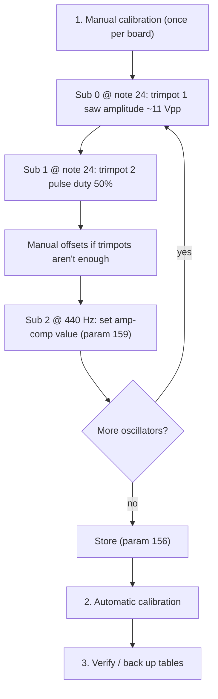

#line 1 "/home/felipe/Documentos/DCO4-REBORN/DCO/_shared/docs/CALIBRATION_PROCEDURE.md"
# DCO Calibration Procedure

The full workflow for bringing up a board's oscillators: the one-time **manual trim** stage that establishes a known-good baseline, and the **automatic calibration** that builds the per-oscillator amp-comp tables from that baseline.

How the algorithms work internally: [`AUTOTUNE.md`](AUTOTUNE.md). Where the results are stored: [`CALIBRATION_STORAGE.md`](CALIBRATION_STORAGE.md).

---

## Overview

The manual stage matters because everything downstream assumes it: the automatic calibration starts from the manually established operating points and extends the curve from there. Once trimmed, the analog side should not drift far, so this is normally done only on first bring-up (or after hardware changes).

| | DCO3-MONOSYNTH | DCO4-REBORN |
|---|---|---|
| Oscillators | 3 | 8 |
| Manual-cal stages (`PARAM_MANUAL_CALIBRATION_STAGE`) | 0..8 (3×3) | 0..27 (packed A4+B3) |
| PW channels | 1 wired (ch 0) | 4 (`cal_pw_channel` = osc / 2) |
| Cal-sense pin | GP6 | GP10 |

> **Note numbers here are calibration note numbers, not MIDI.** `note_to_freq()` reads `sNotePitches[n - 12]`, so a note number names the pitch an octave below the MIDI note of the same number: note 24 is **16.35 Hz** and the 440 Hz reference is note **81**. Details in [`SKETCH_CONTRACT.md`](SKETCH_CONTRACT.md).

## Manual-cal substages

DCO3 walks **saw → pulse → 440 Hz** on every oscillator (`stage = osc × 3 + sub`, 0..8).

DCO4 packs **7 stages per voice pair** (0..27): even (A) oscillators are saw → **triangle** → **pulse with encoder PW_CENTER** → pulse @ 440; odd (B) oscillators stay saw → pulse → 440 (no triangle bit, no PW encoder). `PARAM_MANUAL_CALIBRATION_STEP` (**158**) remains a PC-panel override.

### DCO3 (every osc)

| Sub | Note | Analog | Encoder |
|-----|------|--------|---------|
| **0** (saw) | note 24 (**16.35 Hz**) | Saw path | offset ±20 (param **153**) |
| **1** (pulse) | note 24 | Square path | offset ±20 |
| **2** (440 Hz) | 440 Hz (`manual_cal_reference_note` = 81) | Square path | amp @ 440 (param **159**) |

### DCO4 A (even osc)

| Sub | Note | Analog | Encoder |
|-----|------|--------|---------|
| **0** (saw) | note 24 | `osc1SawPins` closed, A level open | offset ±20 (**153**) |
| **1** (tri) | note 24 | `osc1TriPins` closed, A level open | offset ±20 |
| **2** (pulse PW) | note 24 | both A switches open, A level open | PW_CENTER (**162**, 0..1023) |
| **3** (440 Hz) | 440 Hz | as pulse PW | amp @ 440 (**159**) |

### DCO4 B (odd osc)

| Sub | Note | Analog | Encoder |
|-----|------|--------|---------|
| **0** (saw) | note 24 | `osc2SawPins` closed, B level open | offset ±20 |
| **1** (pulse) | note 24 | `osc2PulsePins` closed, B level open | offset ±20 |
| **2** (440 Hz) | 440 Hz | `osc2PulsePins` closed, B level open | amp @ 440 |

The calibrated oscillator's **level stays open on every one of its substages**: on DCO4 that level is one MCP4728 channel per voice per oscillator and it carries that oscillator's saw, triangle and pulse together, so closing it to hide one wave would take the wave being trimmed with it. What gets muted is the *other* oscillator of the pair and all four subs; the rest of the isolation is the per-voice VCA and filter.

At 440 Hz duty readings need only ~3 waveform periods, so the gap readout refreshes ~50×/s and that substage feels live.

Each substage is soloed as far as the analog allows: only the selected oscillator runs. Every other oscillator is handed a clk_div of 0 and then has its state machine **stopped** (`pio_sm_set_enabled(false)`) with its RANGE PWM at 0 — parked at a divider the SM keeps toggling RESET, which is not silent. The subs are held at 0: their CV is direct (`SubLevelVal * 32`), the opposite polarity of the oscillator levels (`lin_to_log_128[]`, where 4095 is silent), so muting them with the oscillator mute value opened every voice's sub instead. Leaving manual cal puts the stopped SMs and the PW centers back through `pio_defer_request_cal_restore()` → `restore_voice_engine_after_calibration()` on core 1, the same routine auto-cal ends with.

Saw, triangle and sine are switched (DG411s — driven by the Mainboard's 595s on DCO4, by the DCO's own mux on DCO3). On DCO4 A the **pulse has no switch and no level of its own**: the DCO's PW CV for that voice is the only thing that can silence it, which is why the firmware writes PW = 0 to every channel on the saw and triangle substages and only opens the calibrated voice's channel (`cal_pw_channel(osc)`) on the square ones. If the pulse is still audible while trimming A's saw or triangle, that CV is not arriving — see [Troubleshooting](#troubleshooting) for the one-command probe. `PARAM_MANUAL_CALIBRATION_STORE` persists offsets, ampComp440, duty trim, and PW_CENTER.

DCO4 analog (Mainboard): the calibrated oscillator's level channel is opened and the other one of the pair is muted, plus the wave switch for the substage — A = `osc1SawPins` (saw) or `osc1TriPins` (tri), both switches open on pulse-PW / 440 since the pulse is unswitched; B = `osc2SawPins` (saw) or `osc2PulsePins` (pulse / 440). VCA and filter follow `voice = osc / 2`: that voice's VCA (and cutoff) are opened, the other three VCAs muted and their filters closed. The DACs can address each voice separately, but `mcpUpdate()` broadcasts one `OSC1Level`, one `OSC2Level` and one `SubLevel` to all four voices, so the per-voice solo is the VCA, not the level. On exit the Mainboard restores the panel's mixer levels and wave switches.

---

## 1. Manual calibration stage

### Entering manual calibration

- From the panel / Input board UI, or from the DCO-CONTROL-PANEL host tool (Calibration tab → manual cal): send `PARAM_MANUAL_CALIBRATION_FLAG` (**151**) = 1. This always starts at stage 0 (osc 0 saw).
- Walk oscillators and waves with `PARAM_MANUAL_CALIBRATION_STAGE` (**152**): DCO3 0..8, DCO4 0..27 (packed A4+B3). Only that oscillator runs; the others are muted.
- The offset encoder sends **153** (±20) on saw/tri/pulse, **162** (PW_CENTER) on DCO4 A's pulse-PW substage, and **159** on 440 Hz substages. The Mainboard forwards 158 / 159 / 161 / 162 to the DCO.
- While active, the board continuously measures the pulse duty and reports it:
  - USB serial: `[MANUAL_GAP] note=… DCO=… gapUs=… dutyErr(%)≈…` (or `TIMEOUT`),
  - and as `PARAM_GAP_FROM_DCO` (**154**, duty error % × 100) upstream (Input on DCO3, Mainboard on DCO4).

### Sub 0 — saw amplitude

Adjust the first multiturn trimpot until the saw output is **≈11 V peak-to-peak**:

- With a scope: watch the saw output directly.
- Without a scope: feed the saw output into an audio interface and use a software oscilloscope — this repo ships [`duty_cycle_meter.jsfx`](../duty_cycle_meter.jsfx) for Reaper, which draws the waveform as well as reading out duty and frequency. Raise the trimpot until one edge of the saw starts to **clip**, then back it off slightly so the full ramp is visible again.

### Sub 1 — pulse duty 50%

Adjust the second multiturn trimpot until the pulse wave duty cycle is as close to **50%** as possible:

- Easiest: watch the live duty readout (screen "GAP" value or `[MANUAL_GAP] dutyErr(%)` on serial) and trim toward 0.
- Alternatively: scope the pulse output, or feed it into an audio interface and read the duty with [`duty_cycle_meter.jsfx`](../duty_cycle_meter.jsfx) (set its threshold to the middle of the swing; the hysteresis slider rejects edge noise). At 16 Hz a period is 61 ms, so give the readout a moment to settle after every turn of the trimpot.
- The `FREQ_TRACE` auto-calibration re-measures this operating point and prints its deviation from the nominal note in cents (`[FREQ_TRACE_MANUAL] … dev=… cents`), so a trim that has drifted shows up on the next run.

### Sub 0/1, manual offset — when the trimpots aren't enough

If a trimpot runs out of range, or a later calibration needs a small correction without touching the hardware, adjust the per-oscillator **manual calibration offset**:

- `PARAM_MANUAL_CALIBRATION_OFFSET` (**153**) sets the offset for the currently selected stage (added on top of `initManualAmpCompCalibrationVal`).

### Sub 2 — amp-comp value at 440 Hz

The Input stage walk lands here automatically (no need to send **158**). The selected oscillator now runs a **square** at 440 Hz (PW at the calibrated center), so what you hear is the same waveform whose duty the readout measures.

- Adjust `PARAM_AMP_COMP_440` (**159**) — the absolute amp-comp value — until the duty readout is as close to 0 error as possible, exactly like the pulse trim but purely in software. On the Input panel the offset encoder sends 159 (step 10, or 1 with the function key), range **700..2800**.
- On first entry for an oscillator (stored value still 0) the firmware seeds a starting guess by scaling the step-0 operating point with the frequency ratio, so the oscillator starts near 50% rather than dead.
- A measured curve puts a true 440 Hz somewhere around a tenth of `DIV_COUNTER` (14000), so expect four figures — the panel slider spans **700..2800** (`DIV_COUNTER` × 0.05 .. × 0.2) for usable resolution around that. The firmware accepts 0..`DIV_COUNTER`, so a board outside the slider's range can still be driven over MIDI or from a stored table; the panel logs `[cal] osc n amp comp @ 440 Hz is …` when what it recalled does not fit on the slider.
- This value is a **seed**, not a verdict: `FREQ_TRACE` re-measures it at the start of every run and writes back a correction if it was off (`[FREQ_TRACE_ANCHOR] … stored=… refined=…`). Getting it roughly right is enough.

### Optional — duty trim against a scope

Only needed if a scope on the pulse output disagrees with the board's duty readout, which happens because the cal-sense pin is a digital input reading its own thresholds while the scope measures the analog pulse at its own 50% level. A constant offset in a `[CAL_VERIFY]` sweep (see below) is the same symptom.

- With the scope on the pulse output of the selected oscillator, adjust `PARAM_AMP_COMP_DUTY_OFFSET` (**161**, panel slider "Duty trim (0.01%)", range ±5.00% in hundredths of a percent) until the scope reads 50%.
- Both amp-comp methods and the manual duty readout then aim at 50% + this trim, so every point a later auto-cal stores lands at a true 50% on the output. Default 0 = the historical behaviour.

### Repeat per oscillator, then store

Switch `PARAM_MANUAL_CALIBRATION_STAGE` to the next oscillator and repeat both steps. When all oscillators are done:

- `PARAM_MANUAL_CALIBRATION_STORE` (**156**) persists the manual offsets, the 440 Hz values (`ampComp440[]`), the duty trims (`ampCompDutyOffset[]`), and `PW_CENTER[]` to LittleFS. All are loaded at boot; offsets are echoed to the Input board (`PARAM_MANUAL_CALIBRATION_OFFSET_FROM_DCO`, **155**) when entering manual cal.
- Exit manual calibration (**151** = 0).

---

## 2. Automatic calibration

The board runs two independent stages, both blocking on core 1:

- **PW calibration** (once per assigned channel): PW center (50% duty), then low/high PW limits (≈2% / ≈98% duty). Results persist to LittleFS.
- **Amp-comp tables** (per oscillator): builds 22 `[frequency, amp comp]` pairs each and persists them (`update_FS_voice`). The bottom pair is measured, not extrapolated: the oscillator is driven at amp comp **0** and the frequency is bisected until the duty is 50% again, so the curve's low anchor is a real operating point. If there is no usable signal at amp 0, the previous extrapolated estimate is kept. (`FREQ_TRACE` measures it as the last step of its own trace, the classic method right after its table is built.)

Either stage runs on its own. The value of `PARAM_CALIBRATION_FLAG` (**150**) picks which, matching the board's calibration menu tabs:

| Value | Stage | DCO-CONTROL-PANEL button | Board menu tab |
|-------|-------|--------------------------|----------------|
| **1** | Amp-comp tables only | "Amp comp" | AUTO CALIBRATION |
| **2** | PW center + limits only | "PW" | PW CALIBRATION |
| **3** | Both, PW first | "Full" | FULL CALIBRATION |

An amp-only run does not touch PW: it drives the pulse from the PW center already stored in the filesystem, so a PW pass is only needed on first bring-up or after hardware changes. Any run ends by reloading the tables (`init_FS`) and rebuilding the runtime lookup (`precompute_amp_comp_for_engine`).

### Normal and fine runs

The same three stages run at three measurement profiles, chosen by the value: **1/2/3 = normal**, **5/6/7 = fine**, **9/10/11 = fast** (panel: Fast / Normal / Fine radios). The board's own calibration menu always sends 1/2/3.

- **Normal** builds the table from scratch and measures as fast as the hardware allows: a 25 ms averaging window (6..64 segments), 0.05% duty acceptance, and a 2-reading confirm at each converged point. This is what you want for bring-up and after any hardware change.
- **Fine** does not rebuild anything. Every amp-comp value in the stored table is kept and only the frequency it really sits at is re-measured, with a 60 ms window (12..256 segments), 0.02% acceptance and a 5-reading confirm per point. Because each search starts from the previous answer, there is no anchor, no bootstrap and no guessing — it is purely a precision pass over a table that already exists.
- Fine therefore **needs a calibrated board**: on a table that was never calibrated (or only seeded) it prints `[CAL_REFINE_GUARD] … run a normal calibration first` and keeps what is there.
- **Fast** (9/10/11) is a from-scratch build with cheaper readings, for a testing table: a 12 ms window (4..32 segments), 0.1% acceptance, a single confirm reading and no anchor or rung corrections. It skips the live amp-0 hunt (always CALC), uses 2 bootstrap probes instead of 4, and does not force the top endpoint to FINE.
- A run at 1/2/3 sets the profile back to normal.

The usual sequence on a new board is: manual steps, one **Full** run, check `[CAL_REPORT]`, then a **Fine** amp-comp run when you want the last fraction of a percent. Later, a fine run is also the cheapest way to bring a drifted table back without disturbing its shape.

### Cancelling a run

Send `PARAM_CALIBRATION_FLAG` (**150**) = 0 — the **Stop** button beside the run buttons on the panel's Calibration tab. The calibration loops poll the request, so the run stops within about one duty measurement:

- The stage that was interrupted (PW center/limit search, or the current oscillator's amp table) is **discarded** — its previous values are kept.
- Stages that finished before the cancel (e.g. earlier oscillators) keep their new results, which were already persisted.
- The run ends with `[DCO_CAL] cancelled by user` on serial, reloads the persisted tables and returns to normal operation.

Manual calibration mode needs no special handling: unchecking "Manual calibration mode" (param 151 = 0) exits it immediately.

### Amp-comp methods (A/B selectable)

Two methods are available for building an amp-comp table from scratch (a fine run re-measures whatever is stored and ignores the method). Pick one on the DCO-CONTROL-PANEL Calibration tab ("Amp-comp calibration method"), which sends `PARAM_DEBUG_COMMAND` (**160**):

| Debug cmd | Method | How it works |
|-----------|--------|--------------|
| **34** | `CLASSIC` | Per note: fix the frequency, search the integer amp-comp value until duty ≈ 50% (interpolated initial guess, sign-change detection, ±1/±2 stepping) |
| **35** | `FREQ_TRACE` (boot default) | Per point: fix the amp comp, **search the frequency** until duty = 50%. It starts from the two points you set by hand — the trimpot note and the stored `(440 Hz, ampComp440)` anchor, which it re-measures and corrects — adds a cluster of probes above/below the anchor, derives the rung spacing from that model, traces the curve outward in both directions, and measures the full-amp and amp-comp-0 endpoints last. **Requires the 440 Hz substage** (sub 2, `manualCalibrationStep` 1) to have been set and stored — refuses to run (`[FREQ_TRACE_GUARD]`) while the anchor is unset |

`FREQ_TRACE` is faster (the search measures its modelled seed first and then interpolates, so a point usually costs a handful of probes, most of them at mid/high frequencies) and its anchors are exact — frequency resolution from the PIO clock divider is near-continuous, so there is no amp-comp quantization error baked into the stored points. It also verifies the manual trim: the deviation of the trimpot note from its nominal frequency is printed in cents. See the design section in [`AUTOTUNE.md`](AUTOTUNE.md).

The selection is runtime-only: at every boot the board falls back to `AUTOTUNE_AMP_METHOD_DEFAULT` in that sketch’s `DCO.ino` (shipping **FREQ_TRACE**). Send 34/35 again after a reset, and check `amp_cal=` on the profiler `engine:` line (`PARAM_DEBUG_COMMAND` 10) when in doubt.

### What to expect on serial

- The run opens with `[DCO_CAL] scope: AMP|PW|FULL precision: NORMAL|FINE|FAST`, followed (when the amp stage will run) by either `[DCO_CAL] amp-comp method: CLASSIC|FREQ_TRACE …` or, in fine mode, `[DCO_CAL] amp-comp stage: refining the stored tables …` — check these first if the 440 Hz anchor seems ignored (it is only used by `FREQ_TRACE`, and never by a fine run).
- PW stage: `[PW_CENTER_COARSE]` / `[PW_CENTER_BISECT]` / `[PW_CENTER_RESULT]`, then `[PW_LOW_RESULT_V2]` / `[PW_HIGH_RESULT_V2]`.
- Classic amp stage: per-note `Calibration note …` blocks with `[DCO_AMP_SCAN]` lines (debug ≥ 2), ending in `Best calibration voltage`.
- Freq-trace amp stage, in order: the anchor `[FREQ_TRACE]` line; `[FREQ_TRACE_MANUAL] … nominal=… dev=… cents` for the trimpot note (a large deviation means that trim drifted); `[FREQ_TRACE_ANCHOR] … stored=… refined=… dev=… cents` for the re-measured 440 Hz anchor (plus a second line when the stored value was corrected and persisted); four `[FREQ_TRACE_BOOT]` bootstrap-cluster lines (fixed amp, found freq); `[FREQ_TRACE] … ladder interval=N semitones anchorPair=k span=… octaves`, the spacing derived for this oscillator; per-rung `[FREQ_TRACE]` lines (target freq, fixed amp, found freq, plus a `retry` line where a rung was corrected); finally the `top endpoint` and `bottom endpoint` lines. Each carries `gapUs= dutyErr=…% probes=… settle=…` — the error actually achieved at that point, how many duty measurements it took, and how many of those were spent waiting for the waveform to stop moving after a frequency change.
- The classic method instead prints `[LOWEST_FREQ] DCO=n amp=0 freq=… gapUs=…` after its table for the measured bottom anchor (or the reason the previous estimate was kept).
- Fine amp stage: one `[CAL_REFINE] … pair=p amp=… stored=… -> found=… moved=… cents` line per stored pair, then a `measured=N/M`, average duty error and largest-move summary. A pair that moved by a lot is one the previous run got wrong.
- A probe sets its frequency in one write and then waits: stepping toward it would keep changing the frequency before a whole waveform has come out of the previous one, which is what the duty measurement needs. What keeps those writes small is the search itself — it measures its seed first and then moves by at most 100 cents below 100 Hz (200 up to 440, 400 above) until it can interpolate. After a move, each reading is confirmed by a second one before it is used, so a slow oscillator is given as long as it takes. A high `settle=` count means this oscillator is slow to follow; a `[FREQ_SETTLE]` line (autotune debug level 2 or higher) means the readings never agreed within the budget, which is the case for raising `settleMaxChecks` or `settlePeriods` in [`autotune_constants.h`](../autotune_constants.h).
- Underneath all of it, at autotune debug level 2 or higher, every single duty reading prints `[GAP_MEASURE] mode=… note=… freq=… AMP=…`, and every probe of a frequency search prints `[FREQ_BISECT] amp=… f=… gap=… dutyErr=…`. Use `freq=` (the frequency actually driven) to follow a run, not `note=`: during a `FREQ_TRACE` search the note number is left wherever the calibration last set it.
- Each oscillator ends with the 44 raw `calibrationData` values, the `[CAL_REPORT]` table and `DCO n calibration finished.`

### Reading `[CAL_REPORT]`

One block per oscillator: a header with the method and the precision, a row per table pair with the frequency, the amp comp, the duty error achieved when that pair was measured, the raw gap, the one-count floor and where the pair came from (`rung`, `anchor`, `endpoint-full`, `endpoint-amp0`, `manual`, `refined`, `filled`, `sentinel`), then the endpoints/span line and an average/worst line.

- `dutyErr%` of `-` means the pair was never measured (padding or synthetic fill); `measured=N/22` counts the real ones.
- `1cnt%` is how much duty one count of amp comp moves at that point. If `dutyErr%` is already below it, the point is as good as the hardware allows — that is why the lowest notes stay coarse (at ~30 counts of amp comp, one count is over a percent of duty).
- A worst point that stands out is worth a second look at that frequency with `[CAL_VERIFY]`.

### Verification sweep

`PARAM_DEBUG_COMMAND` **36** (panel: Calibration tab → Dev tables → "Verify sweep") replays the stored tables the way the engine uses them: every 3 semitones it takes the amp comp from the runtime lookup (interpolated, not the table row) and measures the duty, printing `[CAL_VERIFY] DCO=n note=… freq=… amp=… dutyErr=…% gapUs=… 1cnt=…%` plus an average/worst line per oscillator. It changes nothing and can be cancelled with `PARAM_CALIBRATION_FLAG` = 0.

- Constant error across the range → frame-of-reference offset; dial the duty trim (**161**) against a scope and re-run auto-cal.
- Error peaking between table breakpoints → interpolation; more calibration points would help.
- Error growing toward the low notes and tracking `1cnt=` → the amp-comp quantization floor; nothing to fix in software.

---

## 3. Verify and back up

- **Back up**: DCO-CONTROL-PANEL → Calibration tab → **Calibration backup → Dump board → file…** pulls all tables into a `dco3-cal` / `dco4-cal` JSON. Keep a known-good dump per board.
- **Compare**: after a new calibration (or firmware change), dump again and compare the amp-comp curves against the known-good file — points should differ only within measurement noise.
- **Restore**: **Load file → board…** bulk-pushes the tables back (useful to recover from a bad run without re-calibrating).

## Troubleshooting

- `[MANUAL_GAP] TIMEOUT` + `[CAL_SENSE]` lines: the cal-sense input isn't seeing a valid signal — see "Cal-sense bench checks" in [`AUTOTUNE.md`](AUTOTUNE.md) for the pin-level decision table.
- **DCO4 A's pulse is audible while trimming its saw or triangle**, or param **162** does not move the pulse width on its pulse-PW substage: both mean the same thing, that the DCO's PW CV is not reaching that voice's pulse comparator — the firmware writes PW = 0 to every channel on saw/tri, and there is no switch or level that could mute the A pulse instead. With manual cal running on that oscillator, send `PARAM_DEBUG_COMMAND` **46** (panel: Calibration tab → Dev tables → "PW CV probe"): it walks every PW channel through 0, ¼, ½, ¾ and full scale and prints `[PW_PROBE] ch=… pin=GP… PW_raw=… duty≈…%` for each, then a per-channel `span≈…pp` and a verdict. The expected channel moving the duty means the CV is live and the problem is downstream in the mix; another channel moving it means `PW_PINS` in `globals.h` does not match the wiring; nothing moving means the CV never reaches the analog board, which no firmware change can fix.
- Auto-cal aborts / `[DCO_AMP_GUARD]` messages: the search hit a guard (no signal, unreachable tolerance). Check the manual trim baseline first — the automatic stage assumes the manual anchor is good.
- `[FREQ_TRACE_GUARD] … 440 Hz anchor not set`: the `FREQ_TRACE` method needs the 440 Hz substage (sub 2) done and stored for that oscillator (params 158/159 then 156). The previous table is kept.
- `[CAL_REFINE_GUARD] … run a normal calibration first`: fine mode found no usable stored table for that oscillator (too few pairs, non-monotonic, or flat/seeded). Run a normal amp-comp pass, then refine.
- Fake tables (`PARAM_DEBUG_COMMAND` 30) are development placeholders only; never a substitute for a real calibration pass.
