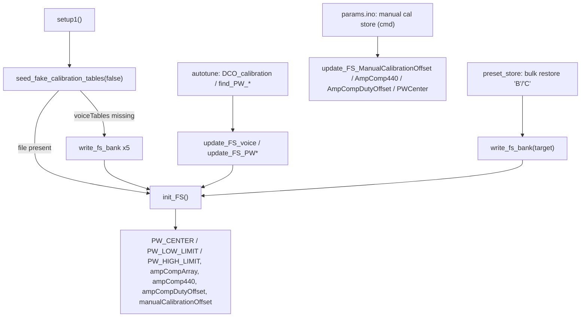

#line 1 "/home/felipe/Documentos/DCO4-REBORN/DCO/_shared/docs/CALIBRATION_STORAGE.md"
# Calibration storage (`FS.h` / `FS_impl.h`)

The LittleFS side of calibration: seven binary banks holding the amp-comp tables,
PW center and limits, and the manual trims. One implementation serves both
boards; everything that differs between them is a count or a compile-time gate.

Algorithms that *produce* these numbers: [`AUTOTUNE.md`](AUTOTUNE.md). Operator
workflow: [`CALIBRATION_PROCEDURE.md`](CALIBRATION_PROCEDURE.md). Include order
and the symbols the sketch must provide: [`SKETCH_CONTRACT.md`](SKETCH_CONTRACT.md).
The partition these banks share with the presets, and the space budget:
[`FILESYSTEM.md`](FILESYSTEM.md).

The preset record store (`pb00`…`pb63`) is a separate subsystem whose code lives in
each sketch, but it reaches in here: a host calibration restore calls
`write_fs_bank()` and a calibration dump reads the banks directly. Both commands are
documented in [`PRESET_STORAGE.md`](PRESET_STORAGE.md), with per-board differences in
each board's `DCO/docs/PRESET_STORE.md`.

**Preset/calibration safety rule for anyone editing this file: the on-flash byte
format is fixed.** Bank sizes are compile-time constants that the host tool, the
bulk-restore path and the boot loader all derive independently. Change one and
existing boards silently read garbage. [Invariants](#invariants--what-must-never-change).

---

## Layout

| File | Role |
|------|------|
| `FS.h` | Sizes, RAM bank buffers, `File` handles, prototypes. Included **from** each sketch's `include_all.h`, so it must not include `include_all.h` itself. |
| `FS_impl.h` | All definitions. Included **exactly once**, from the `DCO/FS.ino` shim. |

Both sketches keep one-line shims:

```cpp
// DCO/FS.h
#include "_shared/FS.h"
// DCO/FS.ino
#include "_shared/FS_impl.h"
```

`FS.ino` sorts first among the sketch `.ino` files, so these definitions precede
the autotune impls in the merged translation unit, which is where most callers
live. Arduino's prototype generator only scans `.ino` files and a one-line shim
gives it nothing, so **every function callable from outside is declared by hand
in `FS.h`** — the same rule as the autotune `*_impl.h` pair. A new function here
that is called from anywhere else needs a prototype added there too.

---

## On-flash format

All banks are flat little-endian arrays with no header, magic or version byte.
Index = oscillator (or PW channel); there is no padding.

| LittleFS file | Element | Count | Size constant | DCO3 | DCO4 |
|---|---|---|---|---|---|
| `voiceTables` | 22 pairs of `[freq_x100:u32][range_pwm:u32]` = 176 B per osc | `NUM_OSCILLATORS` | `FSBankSize` | **528 B** | **1408 B** |
| `PWCenter` | `u16` PW counts | `NUM_PW_CHANNELS` | `FSPWBankSize` | **6 B** | **8 B** |
| `PWHighLimit` | `u16` | `NUM_PW_CHANNELS` | `FSPWBankSize` | 6 B | 8 B |
| `PWLowLimit` | `u16` | `NUM_PW_CHANNELS` | `FSPWBankSize` | 6 B | 8 B |
| `ManualOffset` | `i8` manual amp trim | `NUM_OSCILLATORS` | `FSManualOffsetBankSize` | 3 B | 8 B |
| `AmpComp440` | `u16` 440 Hz anchor (0 = never set) | `NUM_OSCILLATORS` | `FSAmpComp440BankSize` | 6 B | 16 B |
| `AmpCompDutyOffset` | `i16` duty target trim, 0.01 % units | `NUM_OSCILLATORS` | `FSAmpCompDutyOffsetBankSize` | 6 B | 16 B |

Per-osc slice of `voiceTables` is `FSVoiceDataSize` (176 B) and equals
`chanLevelVoiceDataSize` (44) `u32` words. Pair 0 is the lowest-frequency anchor,
pair 1 the manual starting point, pairs 2… the measured ladder.

A file on flash may be **longer** than its bank size (a leftover from a build
with a different oscillator count). That is harmless by design: readers always
take the leading `FS*BankSize` bytes and never the file's real length.

### Where the two counts come from

| | DCO3-MONOSYNTH | DCO4-REBORN |
|---|---|---|
| `NUM_OSCILLATORS` | 3 | 8 (4 voices × 2) |
| `NUM_PW_CHANNELS` | `NUM_OSCILLATORS` = 3, via a guarded define | `NUM_VOICES_TOTAL` = 4 |
| PW index for osc *i* | `cal_pw_channel(i)` = *i* | `cal_pw_channel(i)` = *i* / 2 |

Both are defined in each sketch's `globals.h`. **`NUM_PW_CHANNELS` must be
defined before `FS.h` is parsed** — `include_all.h` reaches `FS.h` well before
`autotune.h`, so the `#ifndef NUM_PW_CHANNELS` fallback inside `autotune.h` is
too late to size the PW banks. DCO3 therefore repeats the guarded define in
`globals.h`; the fallback in `autotune.h` then no-ops.

### Host mirror

`DCO-CONTROL-PANEL` re-derives the same sizes from `ModelProfile`
(`num_oscillators`, `num_pw_channels` in `models.py`; encoders in
`fileformats.py`). A change to a bank layout here is a change there as well, or
calibration backup files stop round-tripping.

---

## Runtime flow



### `init_FS()` — the only reader

Mounts LittleFS, then for each bank: create-if-missing, read the leading bank
bytes into the RAM buffer, close, and unpack into the runtime arrays. Only the
three trim banks (`ManualOffset`, `AmpComp440`, `AmpCompDutyOffset`) are
explicitly zero-filled on creation, so a fresh board reads defined values —
0 meaning "never set" for all three. The three PW banks are created without a
fill; they get their defaults from `seed_fake_calibration_tables()` on a virgin
board, or from `ensure_pw_fs_banks()` on DCO4. Amp-comp goes to `freq_to_amp_comp_array`, then splits
into `ampCompArray` plus either `ampCompFrequencyHz` (float engine) or
`ampCompFrequencyArray` (fixed engine, Q8-seeded at precompute). PW loops run
over `NUM_PW_CHANNELS`, all other loops over `NUM_OSCILLATORS`.

Everything after the `voiceTables` open is inside `#ifdef ENABLE_FS_CALIBRATION`
(set in both `globals.h`). It is idempotent and safe to call repeatedly; every
write path ends with a call to it.

**Called from:** `setup1()` (after the seed); end of `DCO_calibration()`; end of
`seed_fake_calibration_tables()`; `preset_bulk_commit()` after a cal-target
restore.

### Writers

Each opens its file `"r+"`, seeks to `index * elementSize`, writes one element
and closes. `"r+"` means **the file must already exist and be long enough** —
which `init_FS()` guarantees, because it creates every bank at boot. All of them
bounds-check the index and return silently when it is out of range.

| Function | Bank | Called from | When |
|---|---|---|---|
| `update_FS_voice(voiceN)` | `voiceTables` | `DCO_calibration()` per osc (`autotune_impl.h`) | after each oscillator's amp table is measured |
| `update_FS_PWCenter(ch, v)` | `PWCenter` | `find_PW_center()`; `apply_param_manual_calibration_store()` | PW cal stage; manual store |
| `update_FS_PW_High_Limit(ch, v)` | `PWHighLimit` | `find_PW_limit_v2()` | PW cal stage |
| `update_FS_PW_Low_Limit(ch, v)` | `PWLowLimit` | `find_PW_limit_v2()` | PW cal stage |
| `update_FS_ManualCalibrationOffset(osc, v)` | `ManualOffset` | `apply_param_manual_calibration_store()` | manual store |
| `update_FS_AmpComp440(osc, v)` | `AmpComp440` | same; `calibrate_DCO_freq_trace()` when the anchor is corrected | manual store; FREQ_TRACE re-anchor |
| `update_FS_AmpCompDutyOffset(osc, v)` | `AmpCompDutyOffset` | `apply_param_manual_calibration_store()` | manual store |
| `write_fs_bank(name, data, size)` | any | `seed_fake_calibration_tables()`; `preset_bulk_commit()` | whole-bank truncate + rewrite |

PW writers take a **PW channel**, not an oscillator. Callers convert with
`cal_pw_channel(osc)` (`autotune.h`).

### `seed_fake_calibration_tables(force)`

Fills flash with a plausible amp-comp curve so a virgin board boots and plays.
`generate_fake_calibration_data()` maps an archived PWM curve onto the real note
schedule per oscillator; PW banks get `kPwCenterDefault` / `0` /
`DIV_COUNTER_PW`; `AmpComp440` gets 1400 for every oscillator. Then five
`write_fs_bank()` calls (`"w"`, truncating — this is what repairs a wrong-sized
leftover file) and `init_FS()`.

`force == false` returns immediately when `voiceTables` exists, so the boot call
is a no-op on a calibrated board. `force == true` overwrites and additionally
runs `precompute_amp_comp_for_engine()`. It is deliberately silent: it runs on
core 1 before TinyUSB is safe to touch.

**Called from:** `setup1()` with `false`, immediately before `init_FS()`;
`apply_param_debug_command` case **30** with `true`.

---

## Per-board divergence

Exactly two things differ, and both are visible in the source:

1. **`kPwCenterDefault[NUM_PW_CHANNELS]`** in each sketch's `globals.h` — the PW
   center seeds. DCO3 `{570, 570, 570}`, DCO4 `{570, 552, 540, 553}`. Used by the
   fake seed and by the DCO4 bank repair below.
2. **`ensure_pw_fs_banks()`**, compiled only under `#if PROJECT_INSTRUMENT == 4`
   (`project_config.h`, a sketch-root symlink on both boards). It rewrites all
   three PW banks with defaults when any of them is missing or still the old
   8-slot (16 B) size, and `init_FS()` calls it before the PW reads.

The gate on (2) is a compile-time instrument check, not a size heuristic, and it
matters: DCO3's PW bank is 6 B, a size DCO4's migration would treat as stale. If
that code ever ran on DCO3 it would overwrite a measured PW center with 570 on
the next boot. Keep the gate.

Everything else — loop bounds, bounds checks, the 8-entry `kOscScale` spread
table that DCO3 indexes only the first three of — is shared and count-driven.

---

## What the sketch must provide

`FS_impl.h` starts with `#include "../include_all.h"`, which resolves to the
sketch's own file through `DCO/_shared/`. Through it this code expects:

- from `globals.h`: `NUM_OSCILLATORS`, `NUM_PW_CHANNELS`, `kPwCenterDefault[]`,
  `DIV_COUNTER`, `DIV_COUNTER_PW`, `PW_CENTER[]`, `PW_LOW_LIMIT[]`,
  `PW_HIGH_LIMIT[]`, `ENABLE_FS_CALIBRATION`
- from `project_config.h`: `PROJECT_INSTRUMENT`
- from `amp_comp.h` (this repo): `freq_to_amp_comp_array`, `ampCompArray`,
  `ampCompFrequencyHz` / `ampCompFrequencyArray`, `ampCompTableSize`,
  `precompute_amp_comp_for_engine()`. Note the dependency runs both ways —
  `amp_comp.h` sizes its arrays with `chanLevelVoiceDataSize` from `FS.h`, so
  `include_all.h` must keep `FS.h` **before** `amp_comp.h`
- from `autotune.h` (this repo): `calibrationData[]`, `manualCalibrationOffset[]`,
  `ampComp440[]`, `ampCompDutyOffset[]`, `initManualAmpCompCalibrationVal[]`,
  `DCO_calibration_start_note`, `calibration_note_interval`,
  `ampCompLowestFreqVal`
- from `noteList.h` (this repo): `sNotePitches[]`
- `LittleFS` mounted-able, i.e. a build with an FS partition
  (`flash=4194304_524288` on both boards)

---

## Invariants — what must never change

Check these before calling any edit here done:

1. **Bank sizes stay numerically identical** for a given board. DCO3: 528 / 6 / 6
   / 6 / 3 / 6 / 6. DCO4: 1408 / 8 / 8 / 8 / 8 / 16 / 16. `preset_store.ino`
   derives its bulk `want` size and its `dump_fs_file()` length from the same
   constants, so a mismatch turns into `[bulk] err … reason=size` on the host and,
   worse, a shifted read at boot.
2. **Element encoding stays little-endian and unpadded**, index = osc or PW
   channel. Existing `dco3-cal` / `dco4-cal` JSON backups decode positionally.
3. **`ensure_pw_fs_banks()` stays behind `PROJECT_INSTRUMENT == 4`.**
4. **New cross-file function ⇒ new prototype in `FS.h`.**
5. **`FS.h` never includes `include_all.h`** (it is included from it).
6. Both sketch copies stay byte-identical shims, and the two
   `DCO-SHARED-LIBRARIES` checkouts stay in sync — see "Keeping the two checkouts
   in sync" in the [README](../README.md).

After a change, compile both sketches, then on hardware: *Calibration → Dump
board → file* before and after flashing and diff the JSONs — they must be
identical — plus one preset save/load round-trip and one manual-cal store.

## Adding a new calibration bank

1. `FS.h`: `FS<Name>DataSize`, `FS<Name>BankSize`, a `<Name>BankBuffer`, a `File`
   handle, and the writer prototype.
2. `FS_impl.h`: create-if-missing + read + unpack in `init_FS()`, a
   `update_FS_<Name>()` writer, and a seed block if a virgin board needs one.
3. Both sketches' `preset_store.h`: a `PRESET_BULK_*` and a `CAL_DUMP_*` value
   (they are wire values — append, never renumber), and check
   `PRESET_BULK_STAGING_SIZE` still covers the largest bank.
4. Both sketches' `preset_store.ino`: a `dump_fs_file()` line and a
   `preset_bulk_commit()` case.
5. `DCO-CONTROL-PANEL`: `fileformats.py` encode/decode + `models.py` sizes.
6. Both boards' `docs/PRESET_STORE.md` file table, and the table above.

---

## Consumers

- **Boot** — `DCO.ino` `setup1()`: `seed_fake_calibration_tables(false)` →
  `init_FS()`.
- **Autotune** — `autotune_impl.h` / `autotune_search_impl.h`: `update_FS_voice`,
  `update_FS_PWCenter`, `update_FS_PW_Low/High_Limit`, `update_FS_AmpComp440`,
  `init_FS`.
- **Manual cal store** — `params.ino`
  `apply_param_manual_calibration_store()`: the three per-osc trims plus
  `update_FS_PWCenter` for every PW channel.
- **Debug command 30** — `params.ino`: `seed_fake_calibration_tables(true)`.
- **Host cal dump** — `preset_store.ino` `dump_fs_file()` × 7 banks
  (`PARAM_CAL_DUMP`).
- **Host bulk restore** — `preset_store.ino` `preset_bulk_commit()`:
  `write_fs_bank()` + `init_FS()` (+ amp-comp precompute for `voiceTables`).
