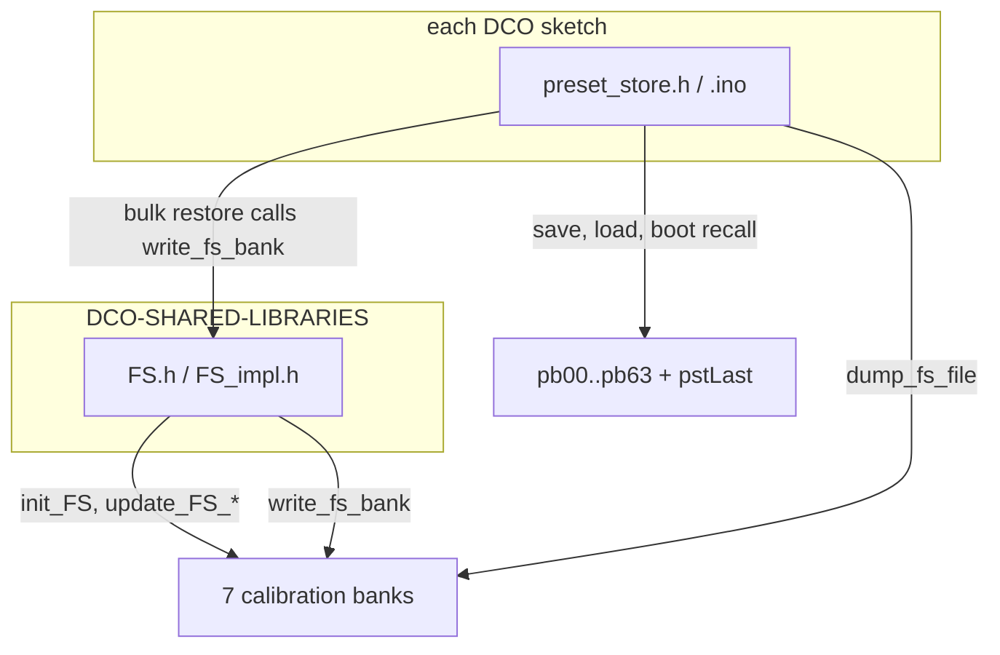

#line 1 "/home/felipe/Documentos/DCO4-REBORN/DCO/_shared/docs/FILESYSTEM.md"
# The DCO filesystem

Everything the DCO board keeps across a power cycle lives in one LittleFS
partition: the seven calibration banks and the 256 preset slots. This page is the
overview — what is on flash, how much room it takes, and who owns each part.

The two halves have their own pages:

- [`CALIBRATION_STORAGE.md`](CALIBRATION_STORAGE.md) — the calibration banks, byte
  for byte, and the invariants that keep stored calibration readable.
- [`PRESET_STORAGE.md`](PRESET_STORAGE.md) — the preset record, the chunk files and
  the host protocol that reads and writes both halves.

Only the DCO board has a filesystem. The Input board keeps a RAM-only cache of the
256 slot names and asks the DCO to refill it; the Screen and the Mainboard persist
nothing. The DCO's slots are the single source of truth system-wide.

## The partition

Build with `flash=4194304_524288`: 4 MB flash, **512 KB** of LittleFS. Arduino-Pico
LittleFS uses 4096-byte blocks, so that is **128 blocks**.

This flag is not optional. Without an FS partition `LittleFS.begin()` fails, and
neither calibration nor presets survive a reboot — see each board's
`DCO/docs/BUILD_FLAGS.md` and the build requirements in
[`SKETCH_CONTRACT.md`](SKETCH_CONTRACT.md).

**Changing the FS size reformats the filesystem.** It moves `_FS_start` /
`_FS_end`, and everything stored is gone. Back up calibration *and* presets from
`DCO-CONTROL-PANEL` first (Calibration tab for the cal tables, preset browser or
bank export for the slots), then restore after flashing.

## What is on flash

| File | Count | Size each | Holds |
|---|---|---|---|
| `pb00` … `pb63` | 64 | 2392 B | Four 598-byte preset records: slots `chunk*4 + 0..3` |
| `pstLast` | 1 | 1 B | Slot to recall at boot (last saved or loaded) |
| `voiceTables` | 1 | `FSBankSize` | Amp-comp table, 22 `[freq, RANGE PWM]` pairs per oscillator |
| `PWCenter` | 1 | `FSPWBankSize` | Measured PW center per PW channel |
| `PWHighLimit` | 1 | `FSPWBankSize` | PW at ~98% duty |
| `PWLowLimit` | 1 | `FSPWBankSize` | PW at ~2% duty |
| `ManualOffset` | 1 | `FSManualOffsetBankSize` | `int8` manual amp trim per oscillator |
| `AmpComp440` | 1 | `FSAmpComp440BankSize` | `u16` 440 Hz anchor per oscillator (0 = never set) |
| `AmpCompDutyOffset` | 1 | `FSAmpCompDutyOffsetBankSize` | `i16` duty target trim per oscillator, 0.01 % units |

The preset side is the same on every board — 598 bytes is 598 bytes. The
calibration banks are sized from `NUM_OSCILLATORS` and `NUM_PW_CHANNELS` in
[`FS.h`](../FS.h), so they differ:

| | DCO3-MONOSYNTH (3 osc, 3 PW ch) | DCO4-REBORN (8 osc, 4 PW ch) |
|---|---|---|
| `voiceTables` | 528 B | 1408 B |
| `PWCenter` / `PWHighLimit` / `PWLowLimit` | 6 B each | 8 B each |
| `ManualOffset` | 3 B | 8 B |
| `AmpComp440` | 6 B | 16 B |
| `AmpCompDutyOffset` | 6 B | 16 B |
| **calibration total** | **561 B** | **1472 B** |

## Space budget

Presets dominate: 64 × 2392 B is about **150 KB** of the 512 KB, and each chunk
file needs its own block, so that is **64 of the 128 blocks**. `voiceTables` takes
one more. Everything else — the six small cal banks and `pstLast` — stays under
LittleFS's 256-byte inline limit and costs no data block at all, living in the
metadata instead.

So roughly 65 data blocks plus metadata are in use, and the partition is a little
under half full. There is room for another preset bank or a much larger
calibration table, but not for both.

## Who owns what

The **shared FS layer** owns the calibration banks. `init_FS()` is the only reader
and runs at boot; the `update_FS_*()` writers each rewrite a single element in
place; `write_fs_bank()` truncates and rewrites a whole bank.

Each **sketch's `preset_store.*`** owns the chunk files and `pstLast`. The FS layer
knows nothing about them.

They meet in two places, both on the host protocol path:

- A calibration bulk restore from the host lands in `preset_bulk_commit()`, which
  calls the FS layer's `write_fs_bank()` and then `init_FS()` to reload. `FS.h`
  annotates `write_fs_bank()` as shared for exactly this reason.
- A calibration dump to the host goes through `dump_fs_file()`, which is local to
  `preset_store.ino` and reads the banks directly.

Both are documented in [`PRESET_STORAGE.md`](PRESET_STORAGE.md), because the wire
protocol carries presets and calibration over the same two commands.

## Write conventions

**Preset chunks are written in place.** Four records of 598 bytes are 2392 bytes,
which fits inside a single 4096-byte block — so an `"r+"` open plus `seek` plus
`write` stays within that one block and LittleFS never has to copy a long file
tail. Mid-file writes otherwise rewrite the remainder of the CTZ skip-list, which
is what packing four records per file avoids. This is why slots are chunked rather
than stored one file each, quite apart from the wasted space 256 tiny files would
cost.

`File::seek()` refuses to seek past EOF, so a missing or wrong-sized chunk is
created with `"w"` in one pass that writes all four records — the target slot real,
the other three zeroed. Later saves use `"r+"`. An all-zero record fails the magic
check and reads back as an unused slot.

**Calibration banks are read whole and written per element.** `init_FS()` creates
any missing bank, then reads the leading `FS*BankSize` bytes — never the file's
real length, so a longer leftover file from a build with a different oscillator
count is harmless. The element writers open `"r+"` and seek to
`index * elementSize`, which is safe only because `init_FS()` has already
guaranteed the file exists and is long enough.

On the preset side every write return value is checked, so a full filesystem
surfaces to the host as `reason=nospace` or `reason=write` rather than as a silently
lost slot.
