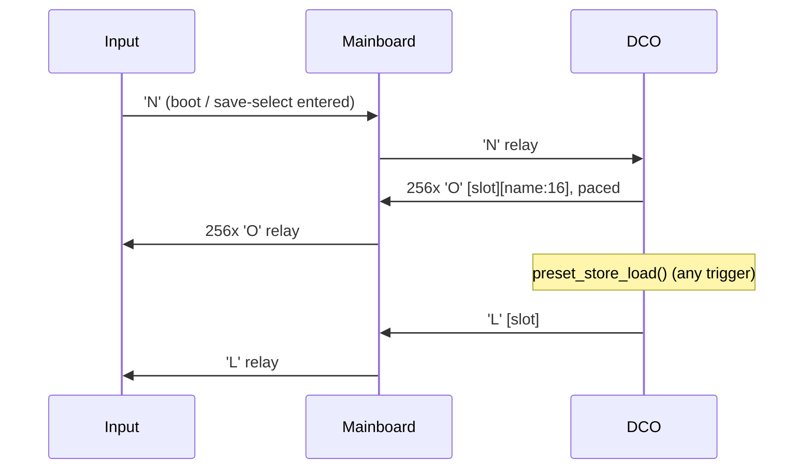

#line 1 "/home/felipe/Documentos/DCO4-REBORN/DCO/docs/PRESET_STORE.md"
# Preset store — DCO4-REBORN specifics

The record format, the chunked LittleFS layout, the host protocol and the recall
paths are a shared contract, documented once for both projects:

- [`../_shared/docs/PRESET_STORAGE.md`](../_shared/docs/PRESET_STORAGE.md) — the
  598-byte record, chunk addressing, `'p'` 170-173, `'B'`/`'C'`, `'N'`/`'O'`/`'L'`,
  host answer lines, recall paths, host JSON formats.
- [`../_shared/docs/FILESYSTEM.md`](../_shared/docs/FILESYSTEM.md) — the 512 KB
  partition, the full file inventory and the space budget.
- [`../_shared/docs/CALIBRATION_STORAGE.md`](../_shared/docs/CALIBRATION_STORAGE.md)
  — the seven calibration banks and their sizes on this board.

**This page is only what is different here.** Source of truth:
[`preset_store.h`](../preset_store.h) / [`preset_store.ino`](../preset_store.ino).
Serial how-to: [`README_serial_and_params.md`](README_serial_and_params.md).
Topology: [`SYSTEM_OVERVIEW.md`](SYSTEM_OVERVIEW.md),
[`MAINBOARD_REINTEGRATION.md`](MAINBOARD_REINTEGRATION.md). Host UI:
[`DCO-CONTROL-PANEL`](../../DCO-CONTROL-PANEL/README.md).

These 256 slots are the **only** preset storage in the instrument. Panel save/load,
MIDI program change, boot recall and the host all end up in the same records.

---

## Staging buffer

`PRESET_BULK_STAGING_SIZE` is **1440**, because the largest bulk target here is the
1408-byte `voiceTables` bank (8 oscillators), not the 598-byte preset record.
DCO3-MONOSYNTH, with three oscillators, sizes it off the record instead and uses 640.

## Topology: the Mainboard relays everything

Input is not on Serial2 — the STM32 Mainboard is, and it relays preset frames in
both directions:

```
Input  <-- Serial8 -->  Mainboard  <-- Serial2 -->  DCO  <-- USB CDC -->  DCO-CONTROL-PANEL
```



**Every relayed byte needs its own Mainboard LUT row.** `'N'` is registered in
`inputSerial8Commands[]` and `'O'`/`'L'` in `mainSerial2Commands[]`
([`../../MAINBOARD-CONTROLLER/Serial.ino`](../../MAINBOARD-CONTROLLER/Serial.ino)).
An unregistered command byte is dropped silently in transit, with no error on
either end.

**Two command tables, so the links carry different commands.** `inputSerialLut`
(historical name) is drained from USB CDC only; `mainboardSerialLut` is drained from
Serial2:

| Frame | USB (`inputSerialLut`) | Serial2 (`mainboardSerialLut`) |
|---|---|---|
| `'p'` 170-173 | yes | yes |
| `'B'` / `'C'` bulk | **yes** | no |
| `'N'` directory request | no | **yes** |
| `'q'`, block frames | yes | yes |

So bulk restore is a **USB-only** path, and the host cannot request a directory
push — it reads `[pdir]` text from `'p'` `PARAM_PRESET_DUMP` = −1 instead. On DCO3 a
single LUT serves both links and all of these work either way.

The Mainboard-side handlers for the panel's block and name frames exist so the DCO
can shadow the panel's envelope, filter and name state and build an accurate record
even though it never sees Input directly. They only re-emit on USB ingress, so
nothing bounces back.

## Block mirroring on load

EnvVCA, EnvVCF and the filter block are mirrored to the **Mainboard** over Serial2
(`serial_send_adsr_*_block_to_mb()` / `serial_send_filter_block_to_mb()`) so its
analog VCA and VCF CVs follow the recalled patch. **EnvDCO stays DCO-local** — it
drives the DCO's own pitch envelope and the Mainboard has nothing to do with it.

## Screen silencing around a load

`preset_record_apply()` mirrors every persistable param and all four blocks to the
Mainboard, which forwards them to the Screen as parameter toasts — a full patch
recall would flood it. So `preset_store_load()` brackets the apply:

1. `serial_send_screen_signal_to_mb(SCREEN_SIGNAL_SILENT)` before applying.
2. `serial_send_preset_loaded_to_mb(slot)` — `'L'`, for the panel.
3. `serial_send_preset_scroll_to_mb(slot)` — slot + name for the Screen.
4. `serial_send_screen_signal_to_mb(SCREEN_SIGNAL_PRESET_SCROLL)` lifts silence.

Both markers sit past record validation, so they stay balanced on every caller path:
boot recall, MIDI program change, host command and panel-triggered load.

## The directory push is paced

256 `'O'` frames are 4864 bytes, which at 2.5 Mbaud is **19.5 ms of unbroken
traffic** — more than the Mainboard can receive and relay on to Input while it is
also running the LFOs, envelopes and DAC writes. Sending them in one go loses most
of the directory.

So `preset_store_send_directory_to_mb()` only **arms** the push, and
`preset_store_dir_push_task()` (called from `loop()`) sends one chunk — 4 slots, 76
bytes on the wire — per 1 ms tick: 256 slots in **64 ms**, about 76 kB/s, which every
buffer along DCO → Mainboard → Input absorbs without dropping an entry. One file open
per tick, the same total as the old blast. A repeat `'N'` just restarts the cursor.

DCO3 has no equivalent task; on its direct link it blasts all 256 frames in one call.

## Persistable parameters

`preset_param_is_persistable()` is the common version. DCO3's extra sub-oscillator
range (90-99) is absent here — those parameters do not exist on this board.

## Host file format tags

`dco4-patch`, `dco4-bank`, `dco4-cal`. The cal file carries all seven decoded
tables: `amp_comp` (8 osc), `pw_center` / `pw_high_limit` / `pw_low_limit` (4
channels), `manual_offset` (8), `amp_comp_440` (8), `amp_comp_duty` (8).

Patch and bank files share one param numbering with DCO3-MONOSYNTH and load on
either model; cal files are strictly per-model because the table sizes differ.

---

## Related files

| File | Role |
|---|---|
| `preset_store.h` / `.ino` | Record layout, CRC, chunked save/load/dump, bulk, boot recall, paced `'O'` directory push |
| `FS.h` / `.ino` | Shims → `_shared/FS.h` + `_shared/FS_impl.h`: cal banks, `write_fs_bank()` shared with bulk restore |
| `params_def.h` | ParamIds 170-173 (canonical superset, byte-identical on every board) |
| `params.ino` | `apply_param_preset_*` / `apply_param_cal_dump`; shadow capture in `update_parameters` |
| `Serial.h` / `.ino` | `'B'`/`'C'` handlers, block-echo helpers after load, `'N'` handler, `serial_send_preset_loaded_to_mb()`, `serial_send_preset_scroll_to_mb()` |
| `serial_protocol.h` | `SCREEN_SIGNAL_SILENT` / `SCREEN_SIGNAL_PRESET_SCROLL` |
| `serial_input_protocol.h` | Command bytes / payload lengths for `'q'`, `'B'`, `'C'`, `'N'`, `'O'`, `'L'` |
| `midi.ino` / `globals.h` | Bank Select CC 0/32 + Program Change → load |
| [`../../MAINBOARD-CONTROLLER/Serial.ino`](../../MAINBOARD-CONTROLLER/Serial.ino) | Relay tables: `'q'`/`'N'` Input→DCO, `'O'`/`'L'` DCO→Input |
| [`../../INPUT-CONTROLLER/presetStorage.ino`](../../INPUT-CONTROLLER/presetStorage.ino) | Input's RAM-only `presetDir[256]` cache; `'N'`/`'O'`/`'L'` client side |
| [`../../DCO-CONTROL-PANEL/mcu_link.py`](../../DCO-CONTROL-PANEL/mcu_link.py) | Queued dump / bulk ops over CDC text |
| [`../../DCO-CONTROL-PANEL/fileformats.py`](../../DCO-CONTROL-PANEL/fileformats.py) | JSON + binary codecs (model-aware) |
