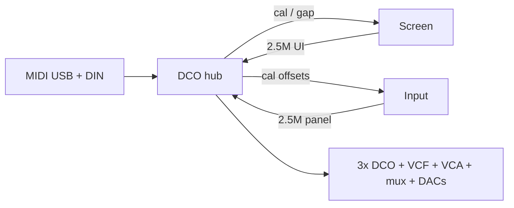

#line 1 "/home/felipe/Documentos/DCO3-MONOSYNTH/DCO/docs/MAINBOARD_ABSORPTION.md"
# Mainboard → DCO absorption (Phase 0)

Engineering notes for ditching the STM32 Mainboard: **DCO (Pico 2 / RP2350) becomes the serial hub**, and **filter/VCA/reso PWM + MCP4728 + 74HC595** move onto the DCO PCB.

Pin map: [`PINOUT.md`](PINOUT.md).  
System overview (today still four boards): [`SYSTEM_OVERVIEW.md`](SYSTEM_OVERVIEW.md).

---

## Target topology

---

## Core0 / Core1 responsibilities (after merge)

| Core | Keep | Add | Remove |
|------|------|-----|--------|
| **Core0** (`setup`/`loop`) | USB MIDI, DIN MIDI (PIO or HW), LFO1/2 + drift sample, FIFO push LFO1→detune Q24 | **Input UART RX** (dense `'a'..'f'`, params), **Screen UART TX** (cal/gap `'x'`), optional Screen RX stub | `serial_STM32_task` / Mainboard `'n'`/`'o'` TX as envelope peer |
| **Core1** (`setup1`/`loop1`) | LittleFS, amp-comp, PIO voices, autotune/manual cal, **EnvDCO** (today’s ADSR1 → pitch/PW) | **EnvVCA** + **EnvVCF** Bézier engines; **`setPWMOuts`-class** CV writers; wave mux + `mcpUpdate` on param/cal edges | Dependence on remote note edges from Mainboard |

**Default scheduling:** EnvVCA/EnvVCF + CV PWM on Core1 next to EnvDCO (shared `noteStart`/`noteEnd` from local MIDI). LFO levels for VCA/VCF read volatiles updated on Core0 (same pattern as LFO1 detune FIFO).

**Risk:** Core0 UART load at 2.5 M ×2 — benchmark FIFO/parser time before deleting Mainboard.

---

## Envelope naming (do not confuse wire names)

| Wire / ParamId today | Mainboard role | DCO today | After merge |
|----------------------|----------------|-----------|-------------|
| ADSR1 block `'a'` | → VCA CV | — | **EnvVCA** |
| ADSR2 block `'b'` | → VCF CV | — | **EnvVCF** |
| ADSR3 / `'s'` / `PARAM_ADSR3_*` | Forward times/depths to DCO | Local **ADSR1** → pitch/PW | **EnvDCO** (keep ParamId numbers) |

---

## Symbol port matrix

### Already on DCO (keep; stop dual-running with Mainboard)

| Area | Symbols / files |
|------|-----------------|
| MIDI / voices | `note_on`/`note_off`, `voice_task_*`, PIO freq, RANGE/PW PWM |
| EnvDCO | `adsr1_voice_*`, `ADSR1Level`, `ADSR1_*` times, `ADSR1toDETUNE1`, `ADSR1toPWM`, `ADSR3ToOscSelect` |
| LFO | `LFO1`/`LFO2`, drift LFOs, `LFO1toDCO`, `LFO2toPW`, detune2/3 |
| Serial params | `params.ino` DCO apply table, `'p'`/`'w'`/`'x'` |
| Cal | `autotune.*`, LittleFS, manual cal flags |

### Port from Mainboard → DCO

| Area | Port | Source |
|------|------|--------|
| Input protocol | `serial_input_protocol.h` + `'a'..'f'`/`'p'`/`'w'`/`'q'` handlers | `Mainboard/Serial.ino` |
| Screen TX | `serialSendParam32ToScreen`-class / gap `'x'` | `Mainboard/Serial2.ino` |
| EnvVCA/EnvVCF | Second/third `ADSR_Bezier` + update/restart/curves | `Mainboard/ADSR.*` |
| CV math | `setPWMOuts`, formulas, VCA Bézier table, keytrack | `Mainboard/PWM.ino`, `formulas.*`, `tables.h`, `auxiliary.h` |
| Wave mux | `waveSelector.*` | Mainboard |
| MCP4728 | `MCP4728.ino` + level applies | Mainboard |
| Params (local-only) | wave statuses, SQR/sub levels, VCA level, reso comp, keytrack, vel→VCF/VCA, LFO1→VCA, ADSR1/2 curves/restart | `Mainboard/params.ino` |
| Manual cal CV park | mute mux / open VCA-low / cutoff-reso 0 | `setPWMOutsManualCalibration` |

### Delete after cutover (no DCO equivalent needed)

| Item | Why |
|------|-----|
| Mainboard↔DCO `'n'`/`'o'` note notify | Envelopes local |
| `'f'` PW / `'s'` ADSR stream from Mainboard | Produced locally or from Input |
| Param “forward to DCO” branches | No peer |
| Duplicate LFO clocks on Mainboard | Unify on DCO |
| STM32 `Timers.ino` HardwareTimer init | Pico PWM API |
| `ENABLE_SD` / flashData / BU2505 | Already removed or N/A |
| Mainboard sketch as runtime | Archive after Phase 5 |

### Do not port

STM32 pin macros, soft-timer bank as-is (reimplement with Pico timers if needed), `_removed/` dumps, buffered empty serial queues, Screen RX stub unless Screen requires it.

---

## Phased delivery

| Phase | Exit |
|-------|------|
| **0** (docs + [`PINOUT.md`](PINOUT.md)) | Pin/UART/core/symbol plan agreed |
| **1** | Input UART + local params — **landed** (`ENABLE_INPUT_UART`, `cv_state.h`) |
| **2** | EnvVCA/EnvVCF + CV math — **landed** (`adsr_vca`/`adsr_vcf`, `cv_out.ino` → `VCA_PWM`/`VCF_PWM`) |
| **3** | Real PWM / I2C / 595 — **landed** (opt-in `ENABLE_CV_OUTS` / `ENABLE_WAVE_MUX` / `ENABLE_MCP4728`) |
| **4** | Unify LFOs; Screen UART; drop redundant forwards — **landed** (`ENABLE_SCREEN_UART`, gap→Screen, notes no-op in hub) |
| **5** | Remove Mainboard link; three-board overview; archive Mainboard — **landed** (hub default; `_archived/Mainboard`; `ENABLE_LEGACY_MAINBOARD_LINK` escape hatch) |

**Phase 5 defaults:** `ENABLE_INPUT_UART` + `ENABLE_SCREEN_UART` unless `ENABLE_LEGACY_MAINBOARD_LINK`. Parser renamed `serial_panel_task` (alias `serial_STM32_task`).

---

## Phase 0 defaults (locked for planning)

| Decision | Choice |
|----------|--------|
| Production MCU package | Prefer **RP2350B** (48 GPIO); bench OK on Pico 2 / WEACT if map fits |
| UART | Input + Screen on **HW UARTs**; DIN MIDI on **PIO UART** (HW MIDI interim allowed) |
| Cutoff 0 GPIO | **GP15** (not shared with PW slice) |
| MCP4728 map | Defer monosynth channel remap to Phase 3; keep Mainboard addresses 0x63/0x64/0x65 |

See [`PINOUT.md`](PINOUT.md) for the full table. Remaining fab freeze is a PCB review, not a firmware blocker for Phase 1.

---

## Open before / during Phase 3 hardware bring-up

1. Confirm physical carrier exposes GP29 (RESET OSC1) or remap RESET/RANGE.
2. **Reso1 GP7 shares PWM slice 3 with RANGE OSC2 GP22** — firmware scales reso duty into `DIV_COUNTER`; consider remapping Reso1 to a free slice on next PCB spin.
3. Finalize MCP4728 channel → SQR1/SQR2/Sub for monosynth (today’s Mainboard comments still say DCO4 V1–V4).
4. Choose interim HW MIDI vs PIO MIDI for first Input UART bring-up.
