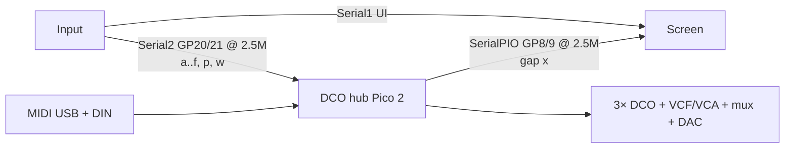

#line 1 "/home/felipe/Documentos/DCO3-MONOSYNTH/DCO/docs/SYSTEM_OVERVIEW.md"
# DCO3-MONOSYNTH System Overview

DCO3-MONOSYNTH is a **fully digitally controlled analog monosynth**, forked from DCO4: digital control and calibration drive analog DCO / filter / VCA hardware. The goal includes patch saving for all parameters.

The shipping instrument is **three firmwares** (Mainboard absorbed into DCO). Board-specific details live in each board folder / docs.

**DCO board:** Raspberry Pi Pico 2, **1 voice × 3 oscillators**, freq on PIO0/1/2 SM0, amp via RANGE PWM, EnvDCO/VCA/VCF, LFOs, opt-in CV PWM / mux / MCP4728. Autotune stack retained (PW center/limits + amp-comp).

**Absorption:** STM32 Mainboard firmware is archived under [`../../_archived/Mainboard/`](../../_archived/Mainboard/). History: [`MAINBOARD_ABSORPTION.md`](MAINBOARD_ABSORPTION.md).

---

## Boards and ownership

| Board | Repo / folder | MCU | Owns |
|-------|---------------|-----|------|
| **DCO (voice + hub)** | `DCO/` | RP2350 Pico 2 | MIDI, 1×3 PIO DCOs, EnvDCO/VCA/VCF, LFOs, cal, LittleFS; Input UART + Screen UART; CV outs (flags) |
| **Input controller** | `INPUT-CONTROLLER/` | RP2040 | Front panel, presets; UART to DCO hub |
| **Screen controller** | `SCREEN-CONTROLLER/` | RP2040 | ILI9488 + LVGL; gap from DCO Screen UART |
| ~~Mainboard~~ | [`_archived/Mainboard/`](../../_archived/Mainboard/) | STM32 | *Archived* — use only with DCO `ENABLE_LEGACY_MAINBOARD_LINK` |

**ParamId space:** shared `params_def.h` across boards. Do not renumber IDs.

---

## Inter-board links (default — three boards)

### Link details (hub default)

| Link | Baud | Peers | Role |
|------|------|-------|------|
| DCO `Serial1` | 31250 | DIN MIDI | MIDI in (RX1 / TX0) — interim HW; PIO MIDI later |
| DCO `Serial2` | 2.5M | Input | Panel ADSR/filter/PW/params (`'a'..'f'`, `'p'`/`'w'`) — GP20/21 |
| DCO SerialPIO | 2.5M | Screen | Gap `'x'` (PARAM_GAP_FROM_DCO) — GP8/9 |
| Input `Serial1` | 2.5M | Screen | UI frames / preset names |
| Screen `Serial1` | 2.5M | Input | Peer of Input UI link |

Cal offsets (`PARAM_MANUAL_CALIBRATION_OFFSET_FROM_DCO`) TX on DCO→Input Serial2 when hubbed.

### Legacy 4-board (opt-in)

Build DCO with `#define ENABLE_LEGACY_MAINBOARD_LINK` (clears hub defaults). Then Serial2 speaks Mainboard protocol again (`'n'`/`'o'` notes; `'f'`/`'s'`/`'p'`/`'w'`/`'x'` in). Archived Mainboard firmware: [`_archived/Mainboard/`](../../_archived/Mainboard/).

---

## Feature flags (`DCO.ino`)

| Flag | Default | Role |
|------|---------|------|
| `ENABLE_INPUT_UART` | **on** (unless legacy) | Serial2 = Input hub |
| `ENABLE_SCREEN_UART` | **on** (unless legacy) | Screen gap UART |
| `ENABLE_LEGACY_MAINBOARD_LINK` | off | 4-board STM32 peer |
| `ENABLE_CV_OUTS` / `WAVE_MUX` / `MCP4728` | off | Hardware CV writers |

Pin map: [`PINOUT.md`](PINOUT.md).
