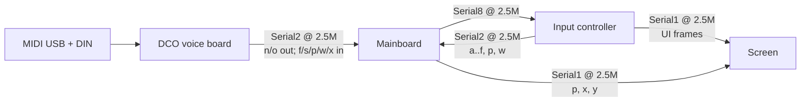

#line 1 "/home/felipe/Documentos/DCO3-MONOSYNTH/DCO/docs/SYSTEM_OVERVIEW.md"
# DCO3-MONOSYNTH System Overview

DCO3-MONOSYNTH is a **fully digitally controlled analog monosynth**, forked from DCO4: digital control and calibration drive analog DCO / filter / VCA hardware. The goal includes patch saving for all parameters.

The instrument is split across **four firmwares**. This document describes how they fit together. Board-specific details live in each board folder / docs.

**DCO board (current):** Raspberry Pi Pico 2, **1 voice × 3 oscillators**, freq on PIO0/1/2 SM0, amp via RANGE PWM. Autotune stack from `autotune-improvements` retained (PW center/limits + amp-comp), re-indexed for one shared PW voice.

---

## Boards and ownership

| Board | Repo | MCU | Owns |
|-------|------|-----|------|
| **DCO (voice board)** | `DCO` (this tree) | RP2350 Pico 2 | MIDI in (USB + DIN), voice allocation, 1×3 PIO DCOs, amp/PW calibration, LittleFS voice tables |
| **Mainboard** | `DCO4_Mainboard_Controller` | STM32 | Modulation brain: ADSRs, LFOs, filter/VCA/PW CVs (PWM + I2C DACs), wave select, param routing between boards |
| **Input controller** | `DCO4_Input_Controller` | RP2040 | Front panel (pots, encoders, buttons), preset storage (LittleFS), dual UART fan-out to mainboard and screen |
| **Screen controller** | `DCO4_Screen_Controller` | RP2040 | ILI9488 TFT + LVGL UI (params, presets, calibration screens) |

**ParamId space:** shared `params_def.h` across boards. Do not renumber IDs. Comments in that header treat the mainboard copy as the coordination point for shared IDs.

---

## Inter-board links

### Link details (from firmware)

| Link | Baud | Peers | Role (summary) |
|------|------|-------|----------------|
| DCO `Serial1` | 31250 | DIN MIDI | MIDI in (RX1 / TX0) |
| DCO `Serial2` | 2.5M | Mainboard | Notes out (`'n'`/`'o'`); params / PW / ADSR in (`'f'`/`'s'`/`'p'`/`'w'`/`'x'`) — pins RX21 / TX20 |
| Mainboard `Serial2` | 2.5M | DCO | PD6 / PD5 |
| Mainboard `Serial8` | 2.5M | Input | PE0 / PE1 — input control blocks and params |
| Mainboard `Serial1` | 2.5M | Screen | PA10 / PA9 — param / UI traffic (`'p'`/`'x'`/`'y'`) |
| Input `Serial2` | 2.5M | Mainboard | TX4 / RX5 — ADSR/filter/PW blocks + params to Mainboard `Serial8` |
| Input `Serial1` | 2.5M | Screen | TX0 / RX1 — screen signals, preset names, mirrored UI data |
| Screen `Serial2` | 2.5M | Mainboard | RX21 / TX20 |
| Screen `Serial1` | 2.5M | Input | RX13 / TX12 |

**Input RX note:** Mainboard→Input frames are expected on Input **Serial2** (RX5) per the pin map. The current Input firmware’s only live inbound parser (`serial_read_from_mainboard`, `'x'` cal offset) runs on **Serial1** — treat this as a firmware/wiring discrepancy to verify; do not assume Mainboard `Serial8` traffic is consumed on Serial2 today.

**Naming note:** shared headers often call the mainboard↔input UART “Serial8” (STM32 side). On the Input and Screen RP2040s the physical UARTs are `Serial1` / `Serial2`.

---

## Data flow (who talks about what)

- **Notes:** External MIDI → DCO allocates voices → DCO notifies mainboard (`'n'`/`'o'`) so CV envelopes and filters track voices.
- **Panel controls:** Input scans hardware → sends control blocks / `ParamId` frames to mainboard (and often mirrors display-oriented values to the screen).
- **Parameters:** Routed via shared `'p'`/`'w'`/`'x'` frames; each board applies what it owns and may forward the rest.
- **Display:** Screen receives param values, preset names, and mode signals (`'s'`, `'q'`, `'c'`, etc.) from input and/or mainboard.
- **Calibration:** Triggered from UI / params; DCO runs measurement and stores amp/PW tables; related stages and offsets are coordinated over the param protocol.

---

## Protocol documentation

- **How to reuse / extend** shared headers: [`README_serial_and_params.md`](README_serial_and_params.md) (also present on Mainboard and Input).
- **On-wire layouts:** `serial_protocol.h`, `serial_parser.h`, `serial_param_protocol.h`, `params_def.h` in each repo that needs them.
- **`serial_input_protocol.h`** (input → mainboard command sizes) lives on **Mainboard** and **Input**, not in this DCO repo. Copy it from those boards if you need it here.

This DCO repo’s voice-math build flags are documented in [`ENGINE_OPTIONS.md`](ENGINE_OPTIONS.md).

---

## Out of scope here

Per-board pinouts beyond the UART summary above, ParamId value ranges, full MIDI CC maps, build/flash steps, and SquareLine UI workflow — those belong in board-specific docs.
