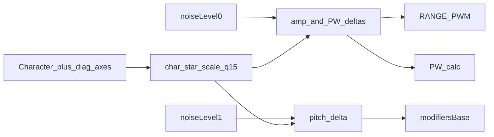

# Character (noise imperfection)

Master **Character** amount scales three diagnostic “imperfection” axes that modulate live synthesis from existing `noiseLevel[]` samples. No extra noise generators are added — Character only reads the fleet already filled in `loop1` ([`noise.h`](../noise.h)).

Related: [`MOD_MATRIX.md`](MOD_MATRIX.md) (Noise 0–3 as matrix sources), [`BENCHMARKING.md`](BENCHMARKING.md) §11 (noise engines). PCM5102 listen of a local noise fleet is on voice-aux ([`../../VOICE-AUX/docs/I2S_NOISE.md`](../../VOICE-AUX/docs/I2S_NOISE.md)), not this Character path.

---

## Purpose

Analog-style instability without a separate DSP block:

| Axis | What it disturbs |
|------|------------------|
| Amp-comp jitter | RANGE PWM duty (`chanLevel*`) after amp-comp lookup |
| Pulsewidth jitter | Shared PW calculation |
| Pitch jitter | Pitch `modifiersBase` after the mod matrix |

Only **`PARAM_CHARACTER` (221)** is a real synth ParamId (presets / Send all). The three axis amounts are **diagnostic** — packed on `PARAM_DEBUG_COMMAND` (160), not stored in preset banks.

---

## Controls

| Control | Path | Global | Range |
|---------|------|--------|-------|
| Character | `PARAM_CHARACTER` 221 → `apply_param_character` | `character` | 0..128 |
| Amplitude compensation jitter | debug 160, hi=`0xC8` | `ampCompJitter` | 0..128 |
| Pitch jitter | hi=`0xCA` | `pitchJitter` | 0..128 |
| Pulsewidth jitter | hi=`0xCB` | `pulsewidthJitter` | 0..128 |

Packed wire value: `(hi << 8) | amount` with `amount` in 0..128. These sit above the `pioPulseLength` window (200..50000) so they do not collide.

**UI:** dco_control **Character** tab — `Param(221)` plus `CHARACTER_JITTERS` in [`tools/dco_control/params.py`](../tools/dco_control/params.py); sliders via `_add_character_jitter_sliders` in [`app.py`](../tools/dco_control/app.py). Axis sliders are excluded from presets / Send all.

**MIDI CC:** none assigned today.

---

## Math and precomputed scales

Helpers live in [`character_jitter.h`](../character_jitter.h). Knob changes call `character_recompute_scales()` (param / diag path only — not every audio frame):

```text
eff   = (axis * character) >> 7              // 0..128
scale = (max_delta * eff) >> 7               // → char_*_scale_q15
delta = (noise_q15 * scale) >> 15            // hot path

// Amp: absolute PWM counts, then saturate to 0..DIV_COUNTER
out   = clamp(chanLevel + amp_delta)
```

If `character == 0` or the axis is 0, that axis scale is 0 (hot path early-outs / gates).

| Scale | Peak `max_delta` (Character=128 and axis=128) |
|-------|-----------------------------------------------|
| `char_pitch_scale_q15` | `(1<<24)/20` → ±0.05 octave (Q24) |
| `char_amp_scale_q15` | `DIV_COUNTER/20` = **700** (±5% RANGE, absolute) |
| `char_pw_scale_q15` | `DIV_COUNTER_PW/10` = **102** (±10% PW) |

Amp / PW products fit in `int32`. Pitch uses `int64` for the mul. Amp RANGE writes use `character_clamp_amp` (0..`DIV_COUNTER`).

---

## Noise mapping

| Axis | `noiseLevel[]` | Generator ([`noise.h`](../noise.h)) |
|------|----------------|-------------------------------------|
| Amp-comp + pulsewidth | `[0]` | `noise0` (white) |
| Pitch | `[1]` | `noise1` (pink) |

Fleet is two gens only. Both feed Character and remain available as mod-matrix sources 12–13 ([`MOD_MATRIX.md`](MOD_MATRIX.md)).

---

## Inject sites



Both `voice_task_fixed_point` and `voice_task_float` in [`voices.ino`](../voices.ino):

| Axis | When | Behavior |
|------|------|----------|
| Pitch | Every voice_task when `char_pitch_scale_q15` | Add `character_pitch_delta_q24()` into modifiers (fixed: Q24; float: `q24_to_float`) |
| Amp | Note-on RANGE write + `timer99microsFlag` (~10 kHz) when `char_amp_scale_q15` | One `character_amp_delta()`, then `character_clamp_amp(chanLevel* + amp_j)` |
| PW | Same ~10 kHz PW path when pulse enabled | `+ character_pw_delta()` inside PW calc (still clamped to PW range) |

---

## Source file map

| File | Role |
|------|------|
| [`character_jitter.h`](../character_jitter.h) | Scales, deltas, amp clamp |
| [`globals.h`](../globals.h) | Knobs, `char_*_scale_q15` |
| [`include_all.h`](../include_all.h) | `#include "character_jitter.h"` |
| [`params_def.h`](../params_def.h) | `PARAM_CHARACTER = 221`; debug 0xC8 / 0xCA / 0xCB comments |
| [`params.ino`](../params.ino) | `apply_param_character`; debug packed setters |
| [`voices.ino`](../voices.ino) | Pitch / amp / PW inject (fixed + float) |
| [`tools/dco_control/params.py`](../tools/dco_control/params.py) | `GROUP_CHARACTER`, Param 221, `CHARACTER_JITTERS` |
| [`tools/dco_control/app.py`](../tools/dco_control/app.py) | Character tab + diagnostic jitter sliders |

---

## Removal (restore pre-Character)

Use this checklist to strip the feature and return to pre-Character behavior. Order matters for a clean compile.

### 1. Delete header and include

- Delete [`character_jitter.h`](../character_jitter.h).
- Remove `#include "character_jitter.h"` from [`include_all.h`](../include_all.h).

### 2. `globals.h`

- Remove the Character knob block: `character`, `ampCompJitter`, `pitchJitter`, `pulsewidthJitter`.
- Remove `char_pitch_scale_q15`, `char_amp_scale_q15`, `char_pw_scale_q15`.

### 3. `params_def.h`

- Remove `PARAM_CHARACTER = 221` and its comment.
- Remove the Character-jitter comments near `PARAM_DEBUG_COMMAND`.

### 4. `params.ino`

- Remove `apply_param_character` and its `{ PARAM_CHARACTER, apply_param_character }` table row.
- In `apply_param_debug_command`: remove the packed-jitter block (`0xC8` / `0xCA` / `0xCB`).
- Drop Character mentions from the debug-command comment block.

### 5. `voices.ino` (both fixed and float engines)

| Site | Restore to |
|------|------------|
| Pitch | No `char_pitch_scale_q15` gate / no `character_pitch_delta_q24` add |
| RANGE PWM (mono note-on, para note-on, `timer99`) | Always `pwm_set_chan_level(..., chanLevel*)` — no amp_j branch |
| PW calc | Drop `+ character_pw_delta()` |

### 6. dco_control

- [`params.py`](../tools/dco_control/params.py): remove `GROUP_CHARACTER`, the Character `Param(221, ...)` row, and `CHARACTER_JITTERS` / related constants.
- [`app.py`](../tools/dco_control/app.py): remove `character_jitter_vars`, `GROUP_CHARACTER` tab branch, `_add_character_jitter_sliders`, and any reset/init loops over those vars.

### 7. Docs after removal

- Delete this file (`docs/CHARACTER.md`).
- Drop Character links from [`../README.md`](../README.md), [`REFERENCE_AI.md`](REFERENCE_AI.md), [`FILE_INDEX.md`](FILE_INDEX.md), and [`tools/dco_control/README.md`](../tools/dco_control/README.md).

### Verify

```bash
rg -n 'character_|char_.*_scale|PARAM_CHARACTER|CHARACTER_JITTER|ampCompJitter|pitchJitter|pulsewidthJitter|0xC8' DCO/
```

Should be empty aside from unrelated uses of the English word “character” (e.g. in [`PIO_OSCILLATORS.md`](PIO_OSCILLATORS.md)).
