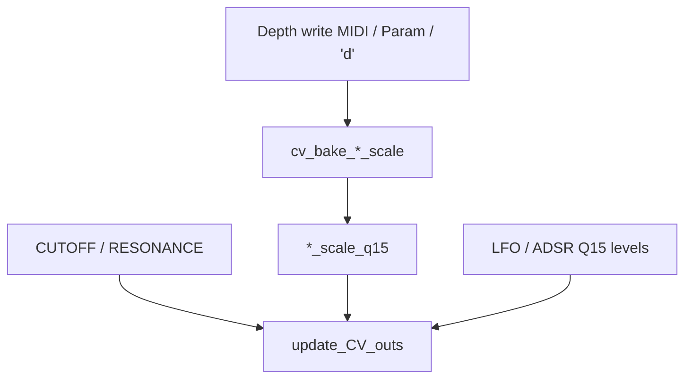

# CV mod depth scales

Soft VCA / VCF modulation depths are **baked into gain scales** when a panel depth changes, then applied on the ~10 kHz CV hot path with a single multiply. This doc is the human reference for those bakers and the peak math.

Related: hot-path call graph [`UPDATE_CV_OUTS_HOT_PATH.md`](UPDATE_CV_OUTS_HOT_PATH.md), matrix [`MOD_MATRIX.md`](MOD_MATRIX.md), Character bake pattern [`CHARACTER.md`](CHARACTER.md).

Code: [`cv_out.h`](../cv_out.h), [`cv_out.ino`](../cv_out.ino), state in [`cv_state.h`](../cv_state.h).

---

## Purpose

Panel depths (`ADSR2toVCF`, `LFO2toVCF`, `LFO1toVCA`) are not applied with divides every CV tick. On write:

1. A **baker** turns depth → precomputed scale (`*_scale_q15` or float `*_scale`).
2. `update_CV_outs` does `(src * scale) >> 15` (fixed) or `src * scale` (float A/B).

**Shipping default:** fixed Q15 path (`USE_FLOAT_CV_OUTS` off on both MCUs). Float formulas below are for A/B builds only.

---

## Domains and constants

Defined in [`cv_out.ino`](../cv_out.ino):

| Symbol | Value | Meaning |
|--------|------:|---------|
| Panel depth | 0..512 | `ADSR2toVCF`, `LFO2toVCF`, `LFO1toVCA` (and related MIDI/serial values) |
| `CV_U12_MAX` | 4095 | Soft CV / 12-bit DAC domain |
| `CV_PANEL_DEPTH_FULL` | 512 | Full panel depth (“center” of the old Mainboard depth scale) |
| `CV_LFO_Q15_PEAK_DIV` | 1024 | `CV_PANEL_DEPTH_FULL * 2` — see LFO peak below |
| Q15 +1.0 | 32768 | Hot multiply: `(a * b) >> 15` |

Live modulation sources on the fixed path:

| Source | Global | Domain |
|--------|--------|--------|
| EnvVCF / EnvVCF2 | `ADSR_VCF_Level_q15`, `ADSR_VCF2_Level_q15` | Q15 unipolar (~0..32767) |
| LFO2 | `LFO2Level` | Q15 bipolar (±32767) |
| LFO1 | `LFO1Level` | Q15 bipolar (±32767) |
| Drift LFO | `LFO_DRIFT_LEVEL[0]` | Q15 bipolar |

CUTOFF and RESONANCE are **not** baked into these scales; they are read live in `update_CV_outs`.

---

## Why ADSR uses `/512` and LFO uses `/1024`

Fixed-path identities at full-scale source (`src_q15 ≈ 32768` for +1.0):

```text
mod = (src_q15 * scale_q15) >> 15

ADSR2→VCF peak ≈ +depth * 4095 / 512
LFO1→VCA / LFO2→VCF peak ≈ -depth * 4095 / 1024
```

**ADSR** was always unipolar: envelope peak ≈ full scale, so panel full depth maps to `depth/512` of the 0..4095 CV span → divide by `CV_PANEL_DEPTH_FULL`.

**LFO** used to live in a CC-count domain (e.g. dacSize 1024) with bipolar peak at **HALF** (`dacSize/2`). Old formulas divided by full dacSize, so at peak the effective travel was half of “panel/512 × 4095”:

```text
HALF/CC = 1/2  →  peak = depth * 4095 / (512 * 2) = depth * 4095 / 1024
```

When sources moved to Q15 (±1.0), the bake must keep that half-factor (`CV_LFO_Q15_PEAK_DIV = 1024`). Using `/512` for LFO would make LFO→VCA/VCF about **twice** as deep as the pre-Q15 synth. Pitch/drift depth scales live in [`LFO.h`](../LFO.h) — see [`LFO.md`](LFO.md).

LFO scales are **negative** so polarity matches the absorbed Mainboard CV path.

---

## Function reference

All declared in [`cv_out.h`](../cv_out.h); bodies in [`cv_out.ino`](../cv_out.ino).

### `cv_bake_adsr2_to_vcf_scale()`

| | |
|--|--|
| **Input** | `ADSR2toVCF` (panel depth) |
| **Output** | `ADSR2toVCF_scale_q15` or float `ADSR2toVCF_scale` |
| **Polarity** | Positive |
| **Hot path** | EnvVCF / EnvVCF2 → cutoff sum |

```text
// Fixed
ADSR2toVCF_scale_q15 = (ADSR2toVCF * CV_U12_MAX) / CV_PANEL_DEPTH_FULL

// Float A/B (source still u12 ADSR_VCF_Level, not Q15)
ADSR2toVCF_scale = ADSR2toVCF / CV_PANEL_DEPTH_FULL
// mod = ADSR_VCF_Level * scale
```

### `cv_bake_lfo2_to_vcf_scale()`

| | |
|--|--|
| **Input** | `LFO2toVCF` |
| **Output** | `LFO2toVCF_scale_q15` or float `LFO2toVCF_scale` |
| **Polarity** | Negative (Mainboard restore) |
| **Hot path** | LFO2 → cutoff sum |

```text
// Fixed
LFO2toVCF_scale_q15 = -(LFO2toVCF * CV_U12_MAX) / CV_LFO_Q15_PEAK_DIV

// Float A/B (LFO2Level is Q15)
LFO2toVCF_scale = -LFO2toVCF * (CV_U12_MAX / (CV_LFO_Q15_PEAK_DIV * 32768))
// mod = LFO2Level * scale
```

### `cv_bake_lfo1_to_vca_scale()`

| | |
|--|--|
| **Input** | `LFO1toVCA` |
| **Output** | `LFO1toVCA_scale_q15` or float `LFO1toVCA_scale` |
| **Polarity** | Negative |
| **Hot path** | LFO1 → VCA (gated off when EnvVCA Q15 level is 0) |

Same algebra as LFO2→VCF, with `LFO1toVCA` / `LFO1Level`.

### `cv_update_mod_scales()`

Calls all three bakers. Used at **boot** (`init_cv_out`). Prefer the per-depth baker when only one depth changed.

---

## When to call

| Writer | File | Baker |
|--------|------|-------|
| Boot `init_cv_out` | [`cv_out.ino`](../cv_out.ino) | `cv_update_mod_scales()` |
| Input filter block `'d'` | [`Serial.ino`](../Serial.ino) | `cv_bake_adsr2_to_vcf_scale` + `cv_bake_lfo2_to_vcf_scale` |
| MIDI `CC_LOCAL_FILTER_ADSR2_TO_VCF` | [`midi.ino`](../midi.ino) | `cv_bake_adsr2_to_vcf_scale` |
| MIDI `CC_LOCAL_FILTER_LFO2_TO_VCF` | [`midi.ino`](../midi.ino) | `cv_bake_lfo2_to_vcf_scale` |
| `PARAM_LFO1_TO_VCA` | [`params.ino`](../params.ino) | `cv_bake_lfo1_to_vca_scale` |
| CUTOFF / RESONANCE (MIDI or `'d'`) | — | **none** — used live |

`'d'` carries CUTOFF, RESONANCE, and the two VCF depths in one frame. Scales refresh because of the **depths**, not because of cutoff/reso. The ~1 ms Input Core1 path sends `'d'` for manual VCF pots (not the 5 ms timer — that only may flag ADSR3 TX). See Input [`CONTROL_PIPELINE.md`](../../INPUT-CONTROLLER/docs/CONTROL_PIPELINE.md).



---

## Hot path combine

Full live identities (reso, keytrack, velocity, AS2164 lerp, dual VCF invert): [`UPDATE_CV_OUTS_HOT_PATH.md`](UPDATE_CV_OUTS_HOT_PATH.md) § Hot-path math.

```text
LFO1_mod  = (LFO1Level * LFO1toVCA_scale_q15) >> 15
LFO2_mod  = (LFO2Level * LFO2toVCF_scale_q15) >> 15
ADSR_mod  = (ADSR_VCF_Level_q15 * ADSR2toVCF_scale_q15) >> 15

VCA ≈ clamp_u12( (env_u12 + LFO1_mod) * velocity_q15 >> 15 ) → AS2164 lerp
// env_u12 = (EnvVCA_q15 * CV_U12_SCALE) >> 15; SCALE=4096, clamp max=4095
VCF ≈ 4095 - clamp( (ADSR_mod + LFO2_mod + CUTOFF + VCF_DRIFT + matrix_cutoff)
                    * vel_q15 >> 15 * keytrack_q15 >> 15 )
```

**VCF drift** (fixed): `vcf_drift_scale_q15 = analogDrift` at boot and in `apply_param_analog_drift_amount`. At full-scale Q15 drift, `VCF_DRIFT ≈ analogDrift` CV units.

---

## Related bake patterns (same idea, other domains)

| Path | Where | Pattern |
|------|--------|---------|
| LFO → pitch | [`params.ino`](../params.ino) → `*_q24` | `lfo_pitch_depth_q24(amt, LFO*_PITCH_DEPTH_SCALE)` — [`LFO.h`](../LFO.h) / [`LFO.md`](LFO.md) |
| EnvDCO → pitch | `ADSR1toDETUNE1_scale_q24` | exp knob → norm × `ADSR_PITCH_MAX_OCTAVES` → Q24; hot `applyDepthQ24(env_dco_pitch_wave_q15(env), depth)` (unipolar or (env−16384)<<1) — [`LFO.md`](LFO.md) |
| Drift → pitch | `drift_pitch_scale_q24` | `analogDrift * DRIFT_PITCH_UNIT_Q24 * DRIFT_PITCH_DEPTH_SCALE` |
| ADSR → PW | `ADSR1toPWM_scale` | Legacy `(level_u12 * depth) >> 11` peak → `(q15 * scale) >> 15` |
| Character | [`CHARACTER.md`](CHARACTER.md) | `character_recompute_scales()` → `char_*_scale_q15` |

Mental model everywhere: **expensive depth math on knob/CC write; hot path is Q15 × scale >> 15** (or Q24 for pitch).

---

## File map

| File | Role |
|------|------|
| [`cv_out.h`](../cv_out.h) | Bake / update API |
| [`cv_out.ino`](../cv_out.ino) | Constants, bakers, `update_CV_outs` |
| [`cv_state.h`](../cv_state.h) | Depth globals + `*_scale(_q15)` |
| [`Serial.ino`](../Serial.ino) | `'d'` → two VCF bakers |
| [`midi.ino`](../midi.ino) | Per-depth MIDI bake |
| [`params.ino`](../params.ino) | `PARAM_LFO1_TO_VCA` + drift scale assign |
