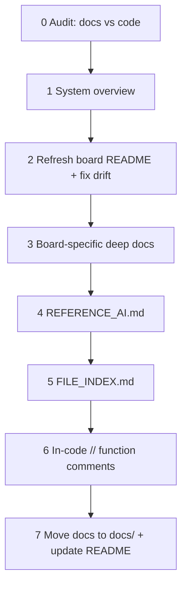

# DCO4 Firmware Documentation Procedure

Reusable action guide for documenting any DCO4 board firmware the same way **DCO4_DCO** was documented. Apply phases **in order**. Scope **one board at a time** unless the user asks for system-wide work.

**Boards:** `DCO4_DCO` | `DCO4_Mainboard_Controller` | `DCO4_Input_Controller` | `DCO4_Screen_Controller`

**Reference implementation:** this repo’s [`../README.md`](../README.md) + files under [`docs/`](./) (except this procedure).

---

## Quality bar

- Docs must match **current code**, not aspirational design.
- Prefer **Current vs Archive / Historical** over deleting history.
- Cross-board: `ParamId` numbers and shared protocol bytes stay coordinated; document ownership, do **not** renumber casually.
- Do **not** invent callers; use search / call graphs.
- No phantom files or modules in docs.
- Note headers that live only on other repos when relevant.
- Archive banners should point at the live replacement doc.

---

## Phase overview



| Phase | Deliverable |
|-------|-------------|
| 0 | Gap list (docs vs code, shared protocols) |
| 1 | Canonical system overview correct; other boards point at it |
| 2 | Accurate root `README.md` + doc index statuses |
| 3 | Board-specific deep docs (only where needed) |
| 4 | `REFERENCE_AI.md` semantic map |
| 5 | `FILE_INDEX.md` (every file + function + call sites) |
| 6 | `//` comments on undocumented functions |
| 7 | All detailed docs under `docs/`; README links updated |

---

## Phase 0 — Audit (read-only first)

1. Inventory existing docs: `README*`, `*.md`, `docs/`, protocol notes, `.cursor/rules/`.
2. Map real modules: `.ino` / `.h` / `.cpp` (and dual-core entry points if any).
3. For each major feature, note: user docs / developer docs / comments only / missing.
4. Cross-check **shared** assets against sibling repos:
   - `params_def.h` (IDs must stay stable)
   - `serial_*.h`, `param_router.h`, `serial_parser.h`
5. Produce a short **gap list**: architecture, pins/UART, protocols, build/libs, dead or drifting docs.
6. Ask the user only when placement or scope would fork the plan. System overview placement is already decided (canonical in DCO).

---

## Phase 1 — System context

- **Canonical** four-board overview: [`SYSTEM_OVERVIEW.md`](SYSTEM_OVERVIEW.md) in **DCO4_DCO** (ownership table, UART mermaid, ParamId note).
- On **other boards**: do **not** fork a second full system doc. Link/point to DCO’s overview (short stub in that board’s `docs/` or a README pointer is enough).
- If the board under review proves a link, baud, or ownership fact wrong, **correct the canonical** `SYSTEM_OVERVIEW.md` in DCO4_DCO.

---

## Phase 2 — README refresh against code

Update the board’s root `README.md` so it reflects reality:

- What the board owns; how it fits the system (link Phase 1).
- Features, high-level architecture, pins/UART baud, build/libs, board-specific workflows (calibration, UI, CV outs, etc.).
- Remove or archive claims about empty/`src/` phantoms, wrong pins, obsolete modules.
- Documentation index table with **Status: Current | Archive | Historical**.

---

## Phase 3 — Board-specific deep docs

Adapt; do **not** copy DCO docs blindly.

| Deliverable | When to create/refresh |
|-------------|------------------------|
| `ENGINE_OPTIONS.md` (or equivalent) | Only if the board has meaningful compile-time math/feature forks. Mark older migration notes **Archive** with a pointer to the live doc. |
| Protocol / domain how-to | Refresh existing (e.g. serial/params) or add board equivalents (UI screens, ADC map, modulation CV paths). |
| Domain algorithm docs | Only if a non-obvious subsystem needs long-form docs (like shared `_shared/docs/AUTOTUNE.md`). |

Accuracy rules: no phantom files; note cross-repo-only headers; archive banners → live doc.

---

## Phase 4 — `REFERENCE_AI.md`

Deep **semantic** map for developers / AI assistants:

- Cores / tasks / main loops
- Modules and data paths
- “What to edit carefully”
- Cross-links to SYSTEM (canonical or stub), ENGINE (if any), FILE_INDEX, domain docs
- Prefer truth over completeness theater — delete stale sections rather than leave wrong ones

---

## Phase 5 — `FILE_INDEX.md`

Mandatory structure (match DCO quality):

1. Purpose blurb + links to REFERENCE_AI / engine / README.
2. **Call-flow overview** (mermaid) for `setup`/`loop` (and `setup1`/`loop1` if dual-core).
3. **Context tags** (Framework, Boot, Every loop, callbacks, serial, param table, etc.).
4. **Every file** — purpose.
5. **Every function** — what it does, **Called from**, **When**; mark Dead / Unreachable / `#if 0`.
6. Documentation section listing `docs/` + root README.
7. Quick **“where do I change X?”** table.

Do not invent call sites; verify with search.

---

## Phase 6 — In-code `//` function comments

Run **after** FILE_INDEX exists (use it for accuracy).

- Add short `//` descriptions above undocumented functions.
- Match local style (`//` one-liners or short `//` blocks); do **not** convert the tree to Doxygen.
- Keep existing `/** … */` blocks as-is.
- One sentence on **what**; add caller/when only when non-obvious.
- **No** logic, signature, or drive-by formatting changes.
- Skip generated/noise files; light touch on trivial one-liner setters (`apply_param_*`-style).
- Mark unused lightly if documenting: e.g. `// Currently unused.`

---

## Phase 7 — `docs/` layout + README

Target tree:

```
BoardRepo/
  README.md                 # entry + docs index → docs/
  docs/
    REFERENCE_AI.md
    FILE_INDEX.md
    … board-specific / refreshed domain docs …
    (optional stub linking to DCO SYSTEM_OVERVIEW)
  … sources …
```

Steps:

1. Root keeps **`README.md` only**.
2. Move all other project docs into **`docs/`** (`git mv` when tracked).
3. Update README links to `docs/…`.
4. Within `docs/`, keep relative peer links; add `../README.md` where useful.
5. Update FILE_INDEX documentation paths to `docs/…`.

**DCO4_DCO extras:** also keeps canonical `SYSTEM_OVERVIEW.md` and this `DOCUMENTATION_PROCEDURE.md` in `docs/`.

---

## Worked example: DCO4_DCO

| Phase | What was produced / updated |
|-------|-----------------------------|
| 0 | Cross-repo audit; gaps prioritized (system overview, engine flags, file index, comment coverage) |
| 1 | [`SYSTEM_OVERVIEW.md`](SYSTEM_OVERVIEW.md) — four boards, UART topology, ownership |
| 2 | Root [`../README.md`](../README.md) — features, pins, dual engine, doc index |
| 3 | [`ENGINE_OPTIONS.md`](ENGINE_OPTIONS.md); shared [`../_shared/docs/AUTOTUNE.md`](../_shared/docs/AUTOTUNE.md); [`README_serial_and_params.md`](README_serial_and_params.md) |
| 4 | [`REFERENCE_AI.md`](REFERENCE_AI.md) — semantic map aligned to current code |
| 5 | [`FILE_INDEX.md`](FILE_INDEX.md) — files, functions, Called from / When |
| 6 | `//` comments on previously bare functions across `.ino` sources |
| 7 | All detailed docs under `docs/`; README points at `docs/…` |

---

## Applying to another board (checklist)

When documenting Mainboard / Input / Screen:

- [ ] Phase 0 gap list for that repo
- [ ] Phase 1: link to DCO `SYSTEM_OVERVIEW.md`; fix canonical facts if needed
- [ ] Phase 2: accurate board README + statused doc index
- [ ] Phase 3: only the deep docs that board needs
- [ ] Phase 4: `REFERENCE_AI.md`
- [ ] Phase 5: `FILE_INDEX.md` to DCO quality
- [ ] Phase 6: missing `//` function comments
- [ ] Phase 7: `docs/` + README links

Suggested user prompt: *“Document this board using the DCO4 documentation procedure.”*
