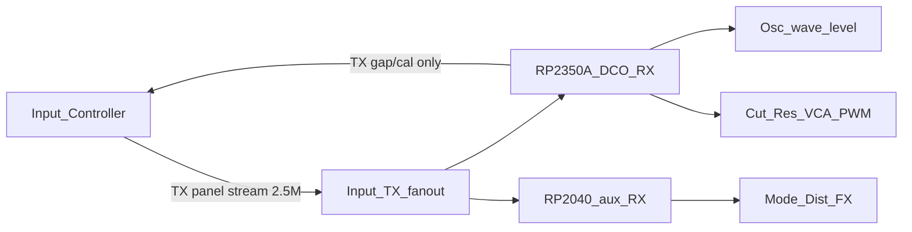

# Dual MCU voice path (RP2350A + RP2040)

**Status:** architecture + firmware scaffold. Helper sketch: [`../../VOICE-AUX/`](../../VOICE-AUX/). Input remains the source of truth for **live** parameter values; presets belong to the DCO ([`PRESET_STORE.md`](PRESET_STORE.md)).

Related: [`SYSTEM_OVERVIEW.md`](SYSTEM_OVERVIEW.md), [`PINOUT.md`](PINOUT.md), [`FILTER_ROUTING.md`](FILTER_ROUTING.md), [`DISTORTION.md`](DISTORTION.md), [`../../VOICE-AUX/docs/README.md`](../../VOICE-AUX/docs/README.md).

---

## Why

GPIO / PWM headroom without mandating an **RP2350B**. Production voice path:

| MCU | Role |
|-----|------|
| **RP2350A** | DCO board: oscillators, osc switching/levels, Input hub, filter **cutoff/reso** CV, main **VCA** CV |
| **RP2040** | Post-filter controls: AS3320 mode, distortion Drive/Mix, effects, other filter→output digitals/PWMs **except** Cut/Res/VCA |

**Alternate:** a single **RP2350B** can still run the **full** stack alone (no helper). The `DCO/` firmware must **keep** code paths for everything the RP2040 would own, so that build stays viable.

---

## Parameter authority

- **Source of truth:** Input Controller for live panel values, same as today; preset storage is the DCO's ([`PRESET_STORE.md`](PRESET_STORE.md)).
- Both MCUs **RX** the Input→voice UART (fan out Input TX to RP2350A RX and RP2040 RX).
- Each board applies only **its owned** ParamIds / blocks and **discards** the rest.
- **Nothing upstream from the RP2040** — it never drives the Input bus.
- Only the **RP2350A** TX back to Input (gap `'x'` 154, cal 155, etc.).

No spare HW UART on the DCO RP2350 for a 2350→2040 command link; dual-listen + discard is intentional.

Boot gap: prefer Input **periodic full snapshot** (or resend on demand) so a late-powered RP2040 catches up. Do not rely on the RP2350 mirroring params to the RP2040.

---

## Ownership split

### RP2350A (`DCO/` project) — always

| Domain | Examples |
|--------|----------|
| Oscillators | PIO DCO, sync, cal, RESET/RANGE/PW |
| Osc switching | Dual 74HC595 → 3× DG411 (OSC1–3 Saw/Pulse/Tri) — [`WAVE_MUX.md`](WAVE_MUX.md) |
| Osc levels | OSC1/2/3 + Sub PWM → level VCAs |
| Critical CVs | Filter **cutoff** ×2, **resonance** ×2, main **VCA** |
| Hub | Input UART RX + TX upstream; MIDI as today |
| Envelopes / LFOs | EnvDCO/VCA/VCF state that drives those CVs |

### RP2040 (new helper project — TBD) — dual-MCU build

Everything from the **filter through the end of the chain** that is **not** cutoff, resonance, or VCA CV:

| Domain | Examples |
|--------|----------|
| Filter mode | AS3320 multimode GPIOs → DG411/4066 ([`FILTER_ROUTING.md`](FILTER_ROUTING.md)) |
| Distortion | Drive / Mix PWM (+ related digitals) ([`DISTORTION.md`](DISTORTION.md)) |
| Effects | FV-1 program / digitals (later) |
| I2S listen | PCM5102 noise listen (local gens @ 48 kHz) — [`VOICE-AUX/docs/I2S_NOISE.md`](../../VOICE-AUX/docs/I2S_NOISE.md); **not** on DCO |
| Other | Post-filter switches, mutes, slow controls in that segment |

### Discard matrix (dual-MCU)

| Param class from Input | RP2350A | RP2040 |
|------------------------|---------|--------|
| Notes, osc, wave, level, ADSR, LFO→voice | Apply | Discard |
| Cutoff, resonance, VCA | Apply | Discard |
| Mod matrix 60–83 (dests 0–5) | Apply | Discard (dest≠6) |
| Mod matrix 60–83 (dest 6 Dist Drive) | Apply (solo) / soft base | Apply |
| Dist Drive/Mix, AS3320 mode, FX, other post-filter | Discard* | Apply |

\*On the dual-MCU hardware build, the RP2350A must **not** also drive those pins (avoid fighting the RP2040). Flag: **`ENABLE_VOICE_AUX`** in [`../DCO.ino`](../DCO.ino) — skip Dist PWM init/writes; keep `apply_param_dist_*` / `PARAM_FILTER_MODE` state updates.

### Live ParamId ownership

| Domain | Mechanism / IDs | Dual-MCU owner |
|--------|-----------------|----------------|
| Osc / wave / level / notes / ADSR / LFO→voice | `'a'`–`'d'`, `'p'`, mux, level PWM | **RP2350** |
| Cut / Res (+ `'d'` mods), VCA | `'d'`, envs, `PARAM_VCA_LEVEL` 43, … | **RP2350** |
| Dist Drive / Mix | `PARAM_DIST_DRIVE` **52**, `PARAM_DIST_MIX` **53** | **RP2040** ([`VOICE-AUX/`](../../VOICE-AUX/)) |
| AS3320 mode | `PARAM_FILTER_MODE` **54** | **RP2040** |
| Mod matrix slots | ParamIds **60–83** — DCO applies dests 0–5; aux applies dest 6 (Dist Drive) | **both** (see [`MOD_MATRIX.md`](MOD_MATRIX.md)) |
| FX (reserved) | **55–56** commented in `params_def.h` | **RP2040** later |
| Upstream `'x'` 154/155 | DCO TX only | **RP2350** |

Aux parses `'p'` only for apply; `'a'`–`'d'` / `'q'` are discarded after framing.

---

## DCO firmware policy: keep full functionality

The `DCO/` tree on RP2350 retains **complete** support for Dist Drive/Mix writers and `PARAM_FILTER_MODE` apply state so an **RP2350B-only** build can own the whole voice path again.

| Build | Behavior |
|-------|----------|
| **Dual MCU** (`ENABLE_VOICE_AUX`) | DCO applies osc + Cut/Res/VCA; Dist/mode **state** still updates; **no** Dist pin drive |
| **Single MCU** (flag off) | DCO applies **all**; Dist on GP9/GP26 under `ENABLE_CV_OUTS` |

Do **not** strip dist/mode logic from `DCO/` — gate writers only.

---

## Electrical / link notes

- Short stubs from Input TX to both RX pins; common ground.
- RP2040 RX only (`VOICE-AUX` uses `Serial1` GP1); leave UART TX unconnected to the Input bus.
- Baud / framing identical to today’s DCO←Input link (2.5 M).
- Aux provisional pins: see [`VOICE-AUX/docs/README.md`](../../VOICE-AUX/docs/README.md) (GP2/3 Dist PWM, GP4/5 mode).

---

## Status / follow-ups

- [x] ParamIds 52–54 synced across DCO / Input / Screen / VOICE-AUX `params_def.h`
- [x] `ENABLE_VOICE_AUX` gates DCO Dist PWM
- [x] [`VOICE-AUX/`](../../VOICE-AUX/) RX parse → Dist PWM + mode GPIO stub
- [ ] Input **full snapshot** on aux boot (cycle controls for v1)
- [ ] Freeze aux pinout on PCB; wire panel/MIDI for `PARAM_FILTER_MODE`
