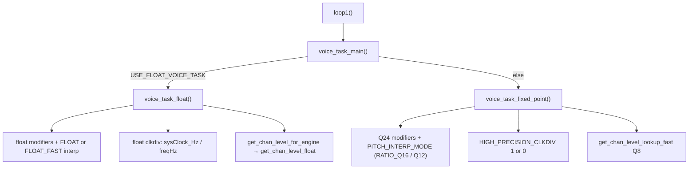

# DCO Engine Options (Float vs Fixed-Point)

This firmware can run the real-time voice engine in **float** or **fixed-point** form. The goal is **maximum real-time speed without losing pitch / amplitude precision**. Which path you get depends on compile-time flags at the top of [`DCO.ino`](DCO.ino).

**Live source of truth for flags:** the top of [`DCO.ino`](../DCO.ino) before includes — **pitch mode ids**, **board defaults** (including `PITCH_INTERP_MODE`), **overrides**, **guards**, then profiling / board IO.  
There is **no** `USE_FLOAT_ENGINE` umbrella; voice and amp are separate compile flags. Pitch A/B overrides use `#undef PITCH_INTERP_MODE` then `#define` (default is already set with board defaults).  
**Historical migration notes:** [`FIXED_POINT_ANALYSIS.md`](FIXED_POINT_ANALYSIS.md) and [`FIXED_POINT_PLAN.md`](FIXED_POINT_PLAN.md) (archive only — not current flag docs).

---

## 1. Purpose and MCU guidance

| Target | Board defaults (`PICO_RP2350` / else) | Why |
|--------|--------------------------------------|-----|
| **RP2350** (FPU) | `USE_FLOAT_VOICE_TASK` + `PITCH_INTERP_FLOAT_FAST` + `USE_FLOAT_AMP_COMP`; amp method `FLOAT_QUAD`; HP clkdiv `1` | Float pitch / clkdiv / amp is natural |
| **RP2040** (no FPU) | Neither float flag; `PITCH_INTERP_RATIO_Q16`; amp method `FIXED`; HP clkdiv `1` | Soft-float is expensive; lean Q8 amp (no LUT RAM) |

Overrides (after board defaults) can `#undef` / `#define` those flags. See the commented examples in `DCO.ino`.

---

## 2. Quick-pick flag sets

Normally **do nothing** — board defaults apply. To force behaviour, use the **ENGINE — overrides** block in `DCO.ino`.

| Goal | What to set (overrides) |
|------|-------------------------|
| **RP2350 stock** | (leave overrides commented) |
| **Fixed voice on RP2350** | `#undef USE_FLOAT_VOICE_TASK` (and `#undef USE_FLOAT_AMP_COMP` / pitch if needed) |
| **RP2040 speed clkdiv** | `#define HIGH_PRECISION_CLKDIV 0` (~1 µs/voice vs ~4 µs) |
| **Pitch interp A/B** | `#undef PITCH_INTERP_MODE` then `#define PITCH_INTERP_MODE PITCH_INTERP_FLOAT` (walk) / `FLOAT_FAST` / `RATIO_Q16` / `Q12` |

After changing flags: clean rebuild, confirm LittleFS amp-comp tables still load, listen to low notes and amp plateau behaviour.

---

## 3. Engine flags

`DCO.ino` layout:

```text
ENGINE — pitch mode ids     // FLOAT / FLOAT_FAST / RATIO_Q16 / Q12
ENGINE — board defaults     // per-MCU: voice/amp/pitch/HP/amp-method (pitch inside each branch)
ENGINE — overrides          // #undef / #define to force (pitch needs #undef first)
ENGINE — guards             // FLOAT / FLOAT_FAST require float voice
PROFILING / BOARD / IO
NOTE_RETRIG_MODE_DEFAULT
```

| Define | Effect |
|--------|--------|
| `USE_FLOAT_VOICE_TASK` | Compiles `voice_task_float()`; omits fixed `voice_task_fixed_point()`. Float portamento in `voices.h`. |
| `PITCH_INTERP_MODE` | Pitch table path (ids above). Board default: `FLOAT_FAST` on RP2350, `RATIO_Q16` on RP2040. |
| `USE_FLOAT_AMP_COMP` | **Compile-time** float amp dual-build: Hz tables, LUT (~42 KB), float precompute + Q8 seed. Not the same as method (see §7). |
| `AMP_COMP_METHOD_DEFAULT` | Live method when float amp is built: `0 FLOAT_QUAD` / `1 LUT` / `2 FIXED` (runtime cmds 20–22). |
| `HIGH_PRECISION_CLKDIV` | Fixed-voice clkdiv only (`1` = 64-bit ~4 µs; `0` = fast ~1 µs). Ignored by float voice. |

**Voice vs amp:** independent. Float voice with `#undef USE_FLOAT_AMP_COMP` uses lean Q8 amp via `get_chan_level_for_engine`. Fixed voice with float amp is unusual (extra RAM); stock board defaults keep them paired on RP2350.

### Dispatch

```text
loop1() → voice_task_main()
            ├─ USE_FLOAT_VOICE_TASK → voice_task_float()
            └─ else                 → voice_task_fixed_point()
```



Related (not engine math, but often used together):

| Define | Default | Role |
|--------|---------|------|
| `RUNNING_AVERAGE` | off | Cycle-accurate hot-path profiler (`bench.h`) — see [`BENCHMARKING.md`](BENCHMARKING.md) |
| `RUNNING_AVERAGE_FINE` | off | Adds probes on the smallest stages; needs `RUNNING_AVERAGE` |
| `RUNNING_AVERAGE_PERIOD` | off | Loop periods only (no stage probes); needs `RUNNING_AVERAGE`; overrides FINE |
| `DCO_DEBUG_REPORT` | `0` in `voices.ino` | Serial dump of OSC1 frequency stages |
| `ENABLE_FS_CALIBRATION` | on in `globals.h` | Load LittleFS voiceTables / PW cal into amp-comp arrays |
| `CLKDIV_BENCHMARK` | off | Float vs double clkdiv comparison; needs `RUNNING_AVERAGE` |

---

## 4. Pitch interpolation (`PITCH_INTERP_MODE`)

One compile-time enum selects **exactly one** interpolator and allocates **only that mode’s** slope / table storage. No runtime branch on the hot path.

Defined in `DCO.ino`:

| Mode | Value | Hot-path function | Storage | Engine |
|------|-------|-------------------|---------|--------|
| `PITCH_INTERP_FLOAT` | 0 | `interpolateRatioFloat_cached` (walk+bsearch) | `x/yMultiplierTableF`, `slopeF` | Float voice **required**; walk A/B |
| `PITCH_INTERP_RATIO_Q16` | 1 | `interpolateRatioQ16_cached` | int `x/y` tables, **`slopeQ20`** + fused `y→ratio` | Fixed voice default, or float voice A/B |
| `PITCH_INTERP_Q12` | 2 | `interpolatePitchMultiplierIntQ16_cached` + reciprocal | int tables, `slopeQ12` | Slope A/B only |
| `PITCH_INTERP_FLOAT_FAST` | 3 | `interpolateRatioFloat_cached_fast` (trunc+clamp±1, `noinline`) | same float tables as FLOAT | Float voice **required**; RP2350 default |

There is **no** selectable `PITCH_INTERP_Q20` or `PITCH_INTERP_Q8`: Q20 slope lives inside `RATIO_Q16`; Q8 pitch slope A/B was removed. Accuracy bench cmd 29 still uses a private Q20 `y` lerp as the int reference.

**Defaults** (set inside each MCU branch in **ENGINE — board defaults**, `#ifndef`):

| Board | Default mode |
|--------|----------------|
| `PICO_RP2350` | `PITCH_INTERP_FLOAT_FAST` (with float voice) |
| else (RP2040 / fallback) | `PITCH_INTERP_RATIO_Q16` |

**Guards:** `FLOAT` / `FLOAT_FAST` without float voice → `#error`. Float voice may use any mode (fixed interpolators convert scaled `float x → Q16` then back to a float ratio for A/B).

**Float domain (`FLOAT` / `FLOAT_FAST`):** tables store natural modifier `x ∈ [-1, 3]` and frequency ratio `y` directly. Call site passes `freqModifiers` with **no** `×10000`; interpolator returns the ratio (no `/scale`). Same storage for both; only the segment find differs. The scale exists only for int tables.

**Fixed-voice flow** (`!USE_FLOAT_VOICE_TASK`):

1. Portamento → current frequency in **Q24 Hz** (`Hz × 2^24`).
2. Sum pitch modifiers in **Q24** (pitch bend, LFO1 FIFO, unison, ADSR→detune, drift, OSC2 detune, epsilon ≈ 1.00001).
3. Scale modifiers × `multiplierTableScale` (10000) into **table-units Q16**.
4. Interpolate → **ratio Q16** (`RATIO_Q16` fuses y→ratio; `Q12` returns table `y` then reciprocal-multiply).
5. `freq_q24 = (portamento_cur_freq_q24 * ratioQ16) >> 16` (OSC2 also folds detune into the Q16 factor).

| Mode | Slope / precision notes |
|------|-------------------------|
| `RATIO_Q16` | Production int path: `slopeQ20` + fused `y → ratio Q16` (`/10000` ≈ `* 0xD1B71759 >> 45`) |
| `Q12` | Slope A/B; return `y` then reciprocal |

Override examples (float voice): `#undef PITCH_INTERP_MODE` then `#define PITCH_INTERP_MODE PITCH_INTERP_FLOAT` (walk A/B) or `PITCH_INTERP_RATIO_Q16`. Float porta / clkdiv stay float; only the table interpolator changes.

Speed/accuracy one-shots for FLOAT / FLOAT_FAST / RATIO / Q12 (private tables in `pitch_interp_bench.ino`): debug **28/29** with `RUNNING_AVERAGE` — see [BENCHMARKING.md](BENCHMARKING.md) §9. Cmd **28** prints **seq** + **jump** speed tables. Private rows always include both float finds; `live_pitch=` in the header is the compiled `PITCH_INTERP_MODE`.

---

## 5. Fixed-point clock divider

Active only in fixed `voice_task_fixed_point()`. Controlled by `HIGH_PRECISION_CLKDIV` (default **`1`**).

| Value | Math | Code comment |
|-------|------|--------------|
| **1** | 64-bit divide on full **Q24 Hz**: `((sysClock_Hz << 24) + freq_q24/2) / freq_q24` | Preferred accuracy at low Hz; ~**4 µs/voice** |
| **0** | Round to **Q4 Hz** (`freq_q24 >> 20` with rounding), then 32-bit divide | Faster; ~**1 µs/voice** — for aggressive modulation or slower MCUs |

Then OSR chunking / phase-align adjustments produce `clk_div1` / `clk_div2` for the PIO SMs.

**Float path ignores `HIGH_PRECISION_CLKDIV`** and always uses `sysClock_Hz / freqHz` in float.

---

## 6. Float engine pipeline

Active when `USE_FLOAT_VOICE_TASK` is defined.

| Stage | Behaviour |
|-------|-----------|
| Portamento | Separate float state in `voices.h` (`porta_*_f`): TIME = linear Hz; SLEW = linear semitones via `noteIndex_to_freqFloat` |
| Pitch bend / LFO / ADSR / drift | Computed in float; many depths still arrive as Q24 from core 0 / params and are scaled by `1/2^24` each frame |
| Multiplier table | Default `interpolateRatioFloat_cached` (`FLOAT`, natural modifier→ratio). Override to `RATIO_Q16` / `Q12` for compile-time A/B (`×10000` → Q16 glue, then float ratio). |
| Clkdiv | Always `sysClock_Hz / freqHz` (float), then OSR / phase math |
| Amp-comp | `get_chan_level_for_engine(freqHz, dco)` → `get_chan_level_float` when float amp-comp is on |
| PW | Float intermediates, then integer `get_PW_level_interpolated` (shared) |

**A/B:** under float voice, non-`FLOAT` modes keep the float voice shell and swap only the interpolator. The float→Q16 convert tax is part of those candidates; native `FLOAT` stays convert-free.

There are **no** additional float precision `#define`s beyond voice/amp flags and `PITCH_INTERP_MODE`.

---

## 7. Amplitude compensation

Gated by **compile-time** `USE_FLOAT_AMP_COMP` (board default on RP2350). That flag **builds** the float amp stack; `AMP_COMP_METHOD_*` only **picks** among methods when the stack is built.

Flash format is shared: frequencies stored as **`freq × 100`** (`freq_x100`). Runtime representation diverges after `init_FS()`.

| Mode | After FS load | Precompute | Runtime lookup |
|------|---------------|------------|----------------|
| **Fixed** (`!USE_FLOAT_AMP_COMP`) | `ampCompFrequencyArray` in **Q8 Hz** (`FREQ_FRAC_BITS = 8`), `ampCompArray` as `int32_t` | `precomputeCoefficients()` — windows with `T_FRAC = 12`, `invDxWIN_q28` | `get_chan_level_lookup_fast(xQ8, voiceN)` |
| **Float** (`USE_FLOAT_AMP_COMP`) | `ampCompFrequencyHz` as `float`, shared `ampCompArray` as `int32_t` | Float quadratic + dense LUT fill; also seed Q8 and run fixed precompute for `FIXED` | Selected by `amp_comp_method` (see below) |

Shared constants: `ampCompTableSize = 22`, `AMP_COMP_MAX_HZ = 7000`, plateau metadata per oscillator, shared `ampCompArray` (`int32_t`).

**Domain-max early-out:** float quadratic and FIXED both return `DIV_COUNTER` at `freq >= AMP_COMP_MAX_HZ` / `x >= AMP_COMP_MAX_HZ_Q` (cal sentinel = full RANGE). Prevents a window-scan miss at exact max from falling through to window 0.

**Plateau early-out:** float / LUT use `plateauStartIndex >= 0` plus `plateauStartFreqHz`. FIXED (`get_chan_level_lookup_fast`) does **not** use the shared index after dual-build; validity is `plateauStartFreqQ < AMP_COMP_MAX_HZ_Q` (precompute leaves Q at max when no real plateau was found — same role as `index < 0`).

`precompute_amp_comp_for_engine()` runs the active precompute(s) at startup. Under float amp-comp it also builds `ampCompLut[osc][0..7000]` (~42 KB) from `get_chan_level_float_quad` and keeps fixed Q8 tables for A/B.

### Live methods (`USE_FLOAT_AMP_COMP`)

| Id | Name | Behaviour |
|----|------|-----------|
| 0 | `FLOAT_QUAD` | Cached walk + `y = (a*x+b)*x+c` (live default on RP2350) |
| 1 | `LUT` | Nearest Hz → `ampCompLut` index (speed A/B only) |
| 2 | `FIXED` | Q8 `get_chan_level_lookup_fast` (tables built alongside float) |

- **Compile-time default:** board defaults in [`DCO.ino`](../DCO.ino) — **RP2350 → FLOAT_QUAD**, **RP2040 → FIXED**. Override with `#define AMP_COMP_METHOD_DEFAULT` in **ENGINE — overrides**.
- **Runtime:** `PARAM_DEBUG_COMMAND` values **20–22** (`amp_comp_set_method`). Profiler dump (10) appends `amp_comp method=…`.
- Facade: `get_chan_level_for_engine` / `get_chan_level_float` dispatch on `amp_comp_method`.
- **Speed order:** on RP2350 (FPU) typically **LUT ≪ FLOAT_QUAD ≲ FIXED**. On RP2040 soft-float, FLOAT_QUAD is usually slowest. See [BENCHMARKING.md](BENCHMARKING.md) §8.

Without `USE_FLOAT_AMP_COMP`, only FIXED exists; method selects collapse to FIXED.

**Call-site quirk:** fixed `voice_task_fixed_point()` converts Q24 → Q8 and calls `get_chan_level_lookup_fast` directly. Float `voice_task_float` and autotune use `get_chan_level_for_engine`.

Speed/accuracy one-shots: `#define AMP_COMP_BENCHMARK` + `RUNNING_AVERAGE`, debug **24/25** — see [BENCHMARKING.md](BENCHMARKING.md) §8.

---

## 8. Formats cheat-sheet

| Format | Representation | Typical use |
|--------|----------------|-------------|
| float Hz | `float` | Float voice path; float amp-comp; `sNotePitches[]` |
| Q24 Hz | `int64_t` / `int32_t`, `Hz × 2^24` | Fixed portamento / final freq; LFO/ADSR/pitchbend depths |
| Q16 semitone | `int32_t`, note × `2^16` | Fixed slew portamento |
| Q16 table / ratio | `int32_t` | Pitch table `x`; multiplier ratio after `/10000` |
| Q4 Hz | `uint32_t`, `Hz × 16` | Fast fixed clkdiv (`HIGH_PRECISION_CLKDIV 0`) |
| Q8 Hz | `int32_t`, `Hz × 256` | Fixed amp-comp frequency domain |
| Q12 `t` | `T_FRAC = 12` | Fixed amp-comp quadratic parameter |
| Q20 / Q12 slopes | `slopeQ20` (RATIO only) / `slopeQ12` (Q12 A/B) | Multiplier table interpolation |
| Q28 reciprocal | `invDxWIN_q28` | Fixed amp-comp `1/dx` |
| `freq_x100` | `int32_t` | FS / calibration storage |
| Table scale | `multiplierTableScale = 10000` | Int pitch tables only (`FLOAT` is unscaled) |

System clock used by clkdiv: `sysClock = 225000` kHz → `sysClock_Hz = 225e6` (`globals.h`).

---

## 9. Shared behaviour (both engines)

- **LFO pitch mods:** Core 0 writes `lfo1_pitch_mod_q24[]` / `lfo2_pitch_mod_q24[]` every ~50 µs; core 1 reads volatiles in the voice task (float path converts each frame).
- **PW PWM:** both engines end in `get_PW_level_interpolated` (integer map using calibrated center/limits).
- **Autotune:** `voice_task_autotune()` uses float-style clkdiv math and `get_chan_level_for_engine`; it is compiled regardless of engine and is not the production note path.
- **Legacy helpers:** `voice_task_simple()` / `voice_task_debug()` / gold reference are **removed** (see `_removed/` if needed).

---

## 10. Known traps

1. Voice / amp / pitch / HP / amp-method defaults are set **inside** each MCU branch in board defaults; force changes in **overrides** (`#undef` then `#define` when replacing a default).
2. Under float voice, `RATIO_Q16` / `Q12` are valid A/B overrides; they allocate int tables (not `slopeF`).
3. Only the active mode’s slope array is allocated — no inert `slopeQ12` RAM on the float / `RATIO_Q16` defaults.
4. `CLKDIV_BENCHMARK` needs `RUNNING_AVERAGE` (it borrows that module's time source) and only instruments the float voice path.
5. `USE_FLOAT_AMP_COMP` without float methods you need still costs LUT RAM; `#undef` it for lean Q8-only amp.
6. README / older docs that mention `USE_FLOAT_ENGINE` / `PITCH_USE_RATIO_Q16` / `PITCH_INTERP_USE_Q*` are obsolete.
7. Stale “Q18 frequency” / `T_FRAC is 14` remarks in places — trust `T_FRAC = 12` in `amp_comp.h`.

---

## 11. Change checklist

1. Prefer **ENGINE — overrides** in `DCO.ino` (before includes); leave board defaults alone unless changing MCU policy.
2. Full rebuild (both cores / clean if IDE caches oddly).
3. Confirm `ENABLE_FS_CALIBRATION` load path matches amp-comp mode (no assert / empty tables).
4. Play low and high notes; check for zippering, beating, or amp dropouts at plateau.
5. Optional: enable `RUNNING_AVERAGE`, send debug command 10, and compare the `%win` budget before and after the flag change ([`BENCHMARKING.md`](BENCHMARKING.md)).

---

## 12. Where the code lives

| Concern | Files |
|---------|-------|
| Flag definitions | `DCO.ino` |
| Dispatch + both voice tasks | `voices.ino` / `voices.h` |
| Amp-comp dual path | `amp_comp.h`, `FS.ino` |
| Note tables | `noteList.h` (`sNotePitches`, `sNotePitches_q24`) |
| Loop call site | `DCO.ino` `loop1()` → `voice_task_main()` |
