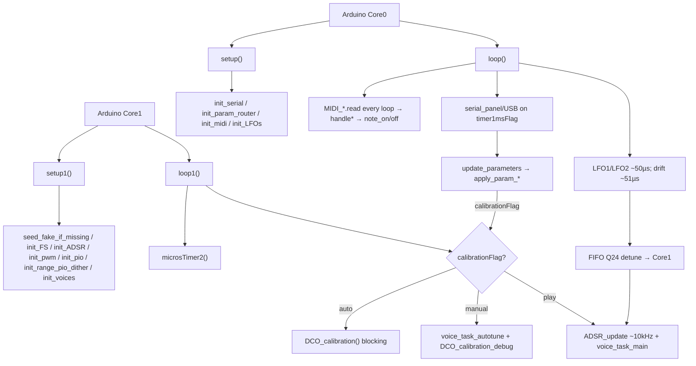

# DCO File Index

Purpose of **every file**, and for each source function: **what it does**, **who calls it**, and **when**.

> `params_def.h`, `param_router.h`, `serial_input_protocol.h`,
> `serial_param_protocol.h`, `serial_frame.h` and `serial_parser.h` are no longer
> files in this folder. They come from the shared
> [`DCO-PROTOCOL`](../../DCO-PROTOCOL/README.md) library, symlinked in as
> `_build_libs/DCO-PROTOCOL`. Their entries below still describe the code this
> board compiles; edit them in the library, once, for every board.

- Deep narrative: [`REFERENCE_AI.md`](REFERENCE_AI.md)
- Build flags catalog: [`BUILD_FLAGS.md`](BUILD_FLAGS.md)
- Preset store / cal dump protocol: [`PRESET_STORE.md`](PRESET_STORE.md)
- Calibration banks on flash: [`../_shared/docs/CALIBRATION_STORAGE.md`](../_shared/docs/CALIBRATION_STORAGE.md)
- Engine float/fixed math: [`ENGINE_OPTIONS.md`](ENGINE_OPTIONS.md)
- Hot-path profiling: [`BENCHMARKING.md`](BENCHMARKING.md)
- SRAM / heap / stack: [`MEMORY.md`](MEMORY.md)
- Character / noise jitter: [`CHARACTER.md`](CHARACTER.md)
- CV mod depth scales: [`CV_MOD_SCALES.md`](CV_MOD_SCALES.md)
- LFO Q15 bus / pitch depth scales: [`LFO.md`](LFO.md)
- Repo entry / doc index: [`../README.md`](../README.md)

Headers with no bodies are marked **no function definitions**.  
**Dead** = no live callers. **Unreachable** = call site exists but cannot run as currently gated. **`#if 0`** = compiled out.

---

## Call-flow overview

| Context tag | Meaning |
|-------------|---------|
| Framework | Arduino invokes `setup` / `loop` / `setup1` / `loop1` |
| Boot Core0 / Core1 | Inside `setup` / `setup1` |
| Every `loop` / `loop1` | Realtime forever loops |
| MIDI callback | Dispatched from `MIDI_*.read()` in `loop` |
| Serial2 | Parser command on the Input link (DCO `Serial2`) |
| Param table | Only via `paramTable[]` / `param_router_apply` |
| Auto-cal / Manual-cal | `loop1` calibration branches |
| Hot path | Inside `voice_task_fixed_point` / `voice_task_float` |

---

## 1. Entry / build / globals

### `DCO.ino`

Main sketch: dual-core setup/loops, USB init (product **DCO4-REBORN**), engine flags (**pitch ids** / **board defaults** / **overrides** / **guards** at top). **4 MIDI voices × 2 oscillators**.

**Functions**
- `setup()` — Core 0 init: serial, MIDI, LFOs, USB strings, cal pin.
  - **Called from:** Arduino framework (Core 0).
  - **When:** Boot once.
- `setup1()` — Core 1 init: `seed_fake_calibration_tables(false)` if `voiceTables` missing, FS, ADSR, `mod_matrix_init`, amp-comp precompute, PWM, PIO, optional `init_range_pio_dither`, voices; clears cal flags.
  - **Called from:** Arduino framework (Core 1).
  - **When:** Boot once.
- `loop()` — Core 0: MIDI USB+DIN every iteration; Serial2 + USB CDC pumps on `timer1msFlag`; LFO1/LFO2 ~50 µs; drift ~51 µs; `bench_poll_core0` + `mem_diag_poll_core0`. `__not_in_flash_func`.
  - **Called from:** Arduino framework (Core 0).
  - **When:** Forever.
- `loop1()` — Core 1: `microsTimer2`; noise fleet; auto/manual cal **or** ADSR + FIFO pop + `voice_task_main`; ends with `bench_service(1)` + `mem_diag_poll_core1`. The manual-cal branch runs the PIO work core 0 books for it — `calSyncNeutralRequested` → `setSyncMode()`, `pwCvProbeRequested` → `run_pw_cv_probe()` — since `pio_defer_service()` only runs on the play path. `__not_in_flash_func`.
  - **Called from:** Arduino framework (Core 1).
  - **When:** Forever.

**Key macros:** full catalog in [`BUILD_FLAGS.md`](BUILD_FLAGS.md). Engine: `USE_FLOAT_VOICE_TASK`, `USE_FLOAT_AMP_COMP`, `USE_FLOAT_CV_OUTS`, `PITCH_INTERP_MODE` (`FLOAT` / `FLOAT_FAST` / `RATIO_Q16` / `Q12`), `CLKDIV_MODE` (`GOLD` / `FLOAT` / `Q16` / `Q8` / `FAST_Q4`), `AMP_COMP_METHOD_DEFAULT`. Noise: `NOISE_ENGINE`, `ENABLE_NOISE_OUT`. Profiler: `RUNNING_AVERAGE`, `RUNNING_AVERAGE_FINE`, `RUNNING_AVERAGE_PERIOD`, `BENCH_STAGE_STRIDE`, `BENCH_USE_SYSTICK`, `BENCH_PERIOD_MAX_US`, `BENCH_PATH_STATS`, `ENABLE_MEM_DIAG`. Board/IO: `ENABLE_USB_CONTROL`, `ENABLE_CV_OUTS`, `ENABLE_WAVE_MUX`, `ENABLE_VOICE_AUX`, `ENABLE_PIO_RESET_INVERT`, `RANGE0_PIO_DITHER_TEST`, `NOTE_RETRIG_MODE_DEFAULT`.

### `mcu_board.h`

Shim to `_shared/mcu_board.h`. Pico/Pico 2 SMPS PS HIGH, WeAct KEY (A440) + analog board-fix. **Not included** by the sketch (`include_all.h` does not pull it). To enable: `#include "mcu_board.h"` and call `mcu_board_pins_init()` from `setup()` / `user_key_task()` from Core 0 `loop()`. Pin constants stay in `globals.h`.

### `bench.h`

Hot-path profiler. All storage, ids, nesting and labels are generated from the single
`BENCH_PROBES` X-macro table, so a probe cannot exist at a call site and be missing from the
report. Time source is SysTick read as a 24-bit cycle counter (RP2040's M0+ has no DWT).
`BENCH_PERIOD()` uses the same SysTick clock (`BENCH_USE_SYSTICK`); samples longer than
`BENCH_PERIOD_MAX_US` are discarded. The 1 µs timer is the dump-window gate, or all probes
when `BENCH_USE_SYSTICK` is `0`. Compiles to nothing without `RUNNING_AVERAGE`. Core0 IO is
split into `MIDI read` vs `serial panel/USB`. Note-on: `retrig period split` under
voice_task_fixed_point; under note-on, `retrig SM apply` + `retrig RANGE PWM` (do not slice
SM apply — cold XIP mis-ranks kids).

**Subsystem reference:** [`BENCHMARKING.md`](BENCHMARKING.md).

**Functions**
- `bench_init_core()` — Arm this core's SysTick and calibrate the probe overhead.
  - **Called from:** `setup()` and `setup1()`.
  - **When:** Boot, once per core (SysTick is core-local).
- `bench_now()` / `bench_span()` / `bench_us_now()` — Raw counter reads and wrap-safe deltas.
  - **Called from:** `BENCH_*` macros; one-shot benches.
- `bench_service()` — Snapshot and clear this core's probes on request.
  - **Called from:** `bench_poll_core0()` for core 0; `loop1()` for core 1.
- `bench_poll_core0()` — Drive the handshake and print the report; calls `print_amp_comp_bench()`, `print_pitch_interp_bench()`, `print_clkdiv_hp_bench()`.
  - **Called from:** `loop()`.
  - **When:** Every iteration; prints only once both cores have answered a dump request.
- `bench_reset_all()` — Clear every accumulator.
  - **Called from:** `apply_param_debug_command()` value 11.
- `bench_print_report()` / `bench_print_core()` / `bench_print_row()` / `bench_print_unattributed()` — Format the budget table.
  - **Called from:** `bench_poll_core0()`.

### `mem_diag.h`

SRAM/heap/stack dump (cmd **13**). `ENABLE_MEM_DIAG` off → empty `static inline` polls/request. Flag on → inline idle check (`mem_diag_runtime_enabled` then pending) then `.ino` work. See [`MEMORY.md`](MEMORY.md).

**Functions** (inlines when flag on/off)
- `mem_diag_poll_core1()` / `mem_diag_poll_core0()` — Idle early-out; call `_work` only when a dump is pending and polls are runtime-enabled.
  - **Called from:** `loop1()` / `loop()`.
  - **When:** Every iteration; compiles out without `ENABLE_MEM_DIAG`.

### `mem_diag.ino`

Heap + per-core stack snapshot (`ENABLE_MEM_DIAG` only). Works without `RUNNING_AVERAGE`. Core 1 never prints.

**Functions**
- `mem_diag_request()` — Set pending flag for a dump (no-op if runtime polls off).
  - **Called from:** `apply_param_debug_command()` value **13**.
  - **When:** Diagnostics button / USB param.
- `mem_diag_poll_core1_work()` — Snapshot `rp2040.getFreeStack()` on Core 1.
  - **Called from:** inline `mem_diag_poll_core1()` when pending.
- `mem_diag_poll_core0_work()` — Print heap / stacks / layout over USB CDC.
  - **Called from:** inline `mem_diag_poll_core0()` when Core 1 has answered.

### `include_all.h`

Umbrella include (`mem_diag.h` included). **No function definitions.**

### `globals.h`

Shared constants, pins, state, prototypes. Includes Character knobs / `char_*_scale_q15` (see [`CHARACTER.md`](CHARACTER.md)). **No function definitions** (inlines for period split live here).

### `character_jitter.h`

Character-tab noise jitter: precomputed scales, per-axis deltas, amp clamp. Deep doc: [`CHARACTER.md`](CHARACTER.md).

**Functions**
- `character_axis_scale()` — `(axis * character) >> 7` then scale by max delta.
  - **Called from:** `character_recompute_scales()`.
  - **When:** Param / diag path.
- `character_recompute_scales()` — Refresh `char_*_scale_q15` from knobs.
  - **Called from:** `apply_param_character`; `apply_param_debug_command` (0xC8 / 0xCA / 0xCB).
  - **When:** Character / jitter change.
- `character_pitch_delta_q24()` — `noiseLevel[1] * char_pitch_scale_q15 >> 15` (Q24).
  - **Called from:** `voice_task_fixed_point` / `voice_task_float` (gated).
  - **When:** Hot path, pitch jitter on.
- `character_amp_delta()` — `noiseLevel[0] * char_amp_scale_q15 >> 15` absolute PWM counts (caller gates scale ≠ 0).
  - **Called from:** RANGE PWM sites in both voice engines.
  - **When:** Hot path / note-on, amp jitter on.
- `character_clamp_amp()` — Saturate level to `0..DIV_COUNTER`.
  - **Called from:** same RANGE PWM sites after `chanLevel* + amp_j`.
  - **When:** Amp jitter on.
- `character_pw_delta()` — `noiseLevel[0] * char_pw_scale_q15 >> 15`.
  - **Called from:** PW calc in both voice engines.
  - **When:** ~10 kHz PW update.

### `tusb_config.h`

TinyUSB `#define`s. **No function definitions.**

### `usb_descriptors.c`

Legacy descriptors — fully commented. **No active function definitions.**

---

## 2. Voice / oscillator / PWM path

### `voice_alloc_state.h`

Build-flag wrapper around the shared `_shared/voice_alloc.h`: sets `VOICE_ALLOC_SRAM_HOT 1` and declares `voiceAlloc` (`VoiceAllocator<NUM_VOICES_TOTAL>`, poly allocation state) and `monoStack` (`MonoNoteStack<8>`, mono held keys). **No function definitions.**

### `voices.h`

Declarations / portamento & table state. **No function definitions.** Carries no profiler
declarations: probe storage lives in the `bench.h` table instead, because the extern block
that used to be here drifted out of step with `voices.ino` and compiled anyway.

### `voices.ino`

Real-time voice engine (float/fixed), allocation, pitch tables, amp/PW helpers.

**Functions**
- `init_voices()` — Initial notes, tables, voice mode, first `voice_task_main()`.
  - **Called from:** `setup1()`.
  - **When:** Boot Core1.
- `noteQ16_to_freqQ24()` — Q16 semitone → Q24 Hz.
  - **Called from:** `voice_task_fixed_point()` (slew portamento).
  - **When:** Fixed hot path.
- `float_to_q24()` — Float → Q24.
  - **Called from:** **none (dead)** — defined but unused.
- `noteIndex_to_freqFloat()` — Float note index → Hz.
  - **Called from:** `voice_task_float()` (portamento).
  - **When:** Float hot path.
- `voice_task_main()` — Dispatch to float or fixed voice task.
  - **Called from:** `loop1()` (play path); `init_voices()` (boot kick).
  - **When:** Every play-path `loop1` iter + once at boot.
- `voice_task_fixed_point()` — Fixed-point hot path. `__not_in_flash_func`.
  - **Called from:** `voice_task_main()` when `!USE_FLOAT_VOICE_TASK`.
  - **When:** Fixed-engine builds only.
- `voice_task_float()` — Float hot path (RP2350 default). `__not_in_flash_func` (SRAM-pinned like fixed). Clkdiv via `clkdiv_live_hz_total_cycles` (`CLKDIV_MODE`).
  - **Called from:** `voice_task_main()` when `USE_FLOAT_VOICE_TASK`.
  - **When:** Every play-path `loop1` iter (float-engine builds).
- `voice_task_autotune()` — Drive one osc for calibration measurement (mode 4 reads `calibrationFreqHz`; manual-cal PW via `cal_pw_channel`).
  - **Called from:** `loop1()` (manual cal); `measure_gap_for_amp` / PW & freq search helpers in `_shared/autotune_search_impl.h` / `_shared/autotune_impl.h`.
  - **When:** Manual-cal every `loop1`; nested during auto-cal measurements.
- `voice_alloc()` — Adapter over `voiceAlloc.alloc()` (shared library): idle tier, then release tails, then steal a held note. Returns `VOICE_ALLOC_NONE` under `VOICE_ALLOC_NO_STEAL`. Refreshes the allocator's release time under `ENABLE_MB_MOD_STREAM`, where there is no level source.
  - **Called from:** `note_on()` (poly).
  - **When:** MIDI note-on.
- `voice_mark_on()` / `voice_mark_off()` — Gate flag, pitch table and ADSR edge flags for one voice, then `voiceAlloc.markOn()` / `markOff()` so the allocation bookkeeping cannot drift from them.
  - **Called from:** `note_on()` / `note_off()`.
  - **When:** MIDI note-on / note-off.
- `setVoiceMode()` — Apply `voiceMode` → `NUM_VOICES` / `STACK_VOICES`; `voiceAlloc.resyncFromGates(VOICES)` and `setVoiceCount()`; on mono also `mono_note_stack_clear()`.
  - **Called from:** `init_voices()`; `apply_param_voice_mode()`.
  - **When:** Boot; Serial2 / MIDI voice-mode param.
- `setSyncMode()` — Rebuild sync topology via `assign_sm_mapping()` + `start_voice_sms()`; retrigger. Declared in `state_machines.h` (core 1 only).
  - **Called from:** `pio_defer_service()` for `apply_param_sync_mode()` / `apply_param_soft_sync()`; `loop1()`'s manual-cal branch when `calSyncNeutralRequested`.
  - **When:** Serial2 param; manual-cal entry, to unsync the pairs before the solo.
- `get_chan_level_lookup_fast()` — Q8 Hz → range PWM (always compiled; live FIXED / fixed `voice_task_fixed_point`). `__not_in_flash_func`.
  - **Called from:** `amp_level_q24()` (FIXED); `get_chan_level_for_engine()` / method FIXED.
  - **When:** Fixed hot path; float-engine FIXED method / benches.
- `get_chan_level_float_quad()` — Float quadratic cached walk (Hz); live FLOAT_QUAD / LUT fill / accuracy gold. `__not_in_flash_func` (SRAM-pinned like fixed lookup).
  - **Called from:** method FLOAT_QUAD; LUT fill; speed/accuracy benches.
  - **When:** `USE_FLOAT_AMP_COMP`.
- `get_chan_level_lut()` — Dense 1 Hz LUT (nearest Hz index). `__not_in_flash_func` (SRAM-pinned like fixed lookup).
  - **Called from:** `get_chan_level_for_engine` when method LUT.
  - **When:** `USE_FLOAT_AMP_COMP` (speed A/B; live default = FIXED).
- `get_PW_level_interpolated()` — Map PW counter into calibrated limits/center.
  - **Called from:** `voice_task_fixed_point()` / `voice_task_float()` (99 µs PW update).
  - **When:** Hot path.
- `modifiers_q24_to_xQ16()` / `interpolate_live_ratio_q16()` — compile-time wrappers for fixed `vt_freq_scale_x` / `vt_ratio_interp` (`PITCH_INTERP_MODE` inside; not function pointers).
  - **Called from:** `voice_task_fixed_point()`.
- `interpolate_live_ratio_f()` — same for float `vt_ratio_interp` (FLOAT / FAST / RATIO / Q12 glue).
  - **Called from:** `voice_task_float()`.
- `interpolatePitchMultiplierIntQ16_cached()` — IntQ16 table interp (`PITCH_INTERP_Q12`). `__not_in_flash_func`.
  - **Called from:** `interpolate_live_ratio_q16` / `_f` when mode is Q12; pitch benches 28/29.
  - **When:** Alternate pitch modes (fixed voice or float-voice A/B).
- `interpolateRatioQ16_cached()` — Table → ratio Q16 (`slopeQ20`). `__not_in_flash_func`.
  - **Called from:** `interpolate_live_ratio_q16` / `_f` when `PITCH_INTERP_MODE == PITCH_INTERP_RATIO_Q16`; pitch benches.
  - **When:** Default fixed pitch mode; optional float-voice A/B.
- `interpolateRatioFloat_cached()` — Natural modifier `[-1,3]` → float ratio; walk+bsearch find. `__not_in_flash_func`.
  - **Called from:** `interpolate_live_ratio_f` when `PITCH_INTERP_MODE == PITCH_INTERP_FLOAT`; pitch benches.
  - **When:** Float walk A/B (`USE_FLOAT_VOICE_TASK`).
- `interpolateRatioFloat_cached_fast()` — Same lerp; trunc+clamp±1 find (`noinline` + `__not_in_flash_func`).
  - **Called from:** `interpolate_live_ratio_f` when `PITCH_INTERP_MODE == PITCH_INTERP_FLOAT_FAST`; pitch benches.
  - **When:** RP2350 board-default float hot path.
- `initMultiplierTables()` — Build tables/slopes for the active `PITCH_INTERP_MODE` only (uses `expInterpolationSolveY`).
  - **Called from:** `init_voices()`.
  - **When:** Boot Core1.
- Clkdiv total-cycle helpers — see [`clkdiv.h`](../clkdiv.h) (also listed below).

### `noteList.h`

Note → frequency tables. **No function definitions.**

### `state_machines.h`

Prototypes plus the inline period model: `pio_period_split()` (exact split, remainder into
Y), `pio_clk_div_for_y()` (rounded, for a Y that must not move), `osc_ramp_weight()` /
`osc_period_overhead()` (per-program constants), and the jump-target helpers
`osc_restart_target()` / `osc_phase_hold_target()` / `osc_phase_hold_x()`.
`osc_ramp_entry_target()` is unused by live phase-align.

### `state_machines.ino`

PIO load, SM setup, sync topology and diagnostics. **All three oscillators live on pio0**
(SM0/1/2) so they can share a reset pin — see `pio_topology_report()`.

**Subsystem reference:** [`PIO_OSCILLATORS.md`](PIO_OSCILLATORS.md).

**Functions**
- `sync_slave_osc()` / `sync_master_osc()` — Resolve `syncMode` into slave/master indices.
  - **Called from:** `assign_sm_mapping()`, `start_voice_sms()`, `pio_topology_report()`.
- `assign_sm_mapping()` — Rewrite `VOICE_TO_SM` so the slave outranks-below its master.
  - **Called from:** `init_pio()`, `setSyncMode()`.
  - **When:** Boot; sync topology change.
- `init_pio()` — `pio_sm_claim` pio0 SM0–2 + pio1 subosc/noise SMs; load free + one soft-sync poll image into pio0 and the sub-osc programs into pio1.
  - **Called from:** `setup1()`.
  - **When:** Boot Core1.
- `ensure_soft_sync_program()` — Swap resident poll image (N=1/2/3) via remove/add.
  - **Called from:** `init_pio()`, `start_voice_sms()`.
- `start_voice_sms()` — Ensure poll image; per-osc program/pin/sideset selection, Y preload,
  RESET pad polarity (`ENABLE_PIO_RESET_INVERT`), same-cycle start via `pio_enable_sm_mask_in_sync()`.
  - **Called from:** `init_pio()`, `setSyncMode()`.
  - **When:** Boot; sync topology / soft-sync threshold change.
- `pio_reset_pin_apply_polarity()` — `static`; GPIO OUTOVER+INOVER invert (or clear) on one RESET pin.
  - **Called from:** `start_voice_sms()`.
- `osc_load_period_stopped()` / `_noclear` / `osc_load_periods_stopped_noclear()` — `static inline` in `state_machines.h`: push Y + clk_div to a
  **stopped** SM via direct TXF/instr MMIO (Y travels through the OSR, which also feeds the
  chunk reads). Clear variant for boot/topology; fused noclear for note-on EXACT_Y.
  - **Called from:** `start_voice_sms()`, `osc_set_reset_pulse()` (clear); both engine note-on
    EXACT_Y paths (fused noclear).
- `osc_phase_align_hold_stopped()` — `static inline` in `state_machines.h`: preload X, restore
  clk_div, `set pins, 0`, jmp `loop_final` (one-shot delay until OSC2's first flyback).
  - **Called from:** both engine note-on EXACT_Y paths when `phaseHoldX != 0`.
  - **When:** Mono note-on, `oscSync > 1`, EXACT_Y. SM already stopped after noclear load.
- `osc_set_reset_pulse()` — Change only Y, reusing `osc_last_clk_div[]`.
  - **Called from:** `apply_param_osc_sync_mode()`.
- `pio_topology_report()` — Print sync roles and assert every RESET pin reads back as PIO0.
  - **Called from:** Bench/diagnostic use.
- `pio_period_probe()` / `pio_solve_period_model()` — Bench helpers for confirming the
  period weight and overhead against a frequency counter.
- `set_subosc_divide()` — (Re)configure the sub-oscillator on pio1 SM0.
  - **Called from:** `init_pio()`, `apply_param_subosc_divide()`.
- `init_pio()` also loads `noise_lfsr` at PIO1 origin 0 (SM1) before the sub-osc programs
  and starts it via `noise_lfsr_init()` — white words for `noise.h`.

### `pico-dco.pio`

PIO assembly source. **Not C functions.** Programs in use: `frequency_sync_4_jumps`
(free-running, weight 4), `frequency_sync_poll` / `_2` / `_3` (soft-sync slave, N=1/2/3
trailing `jmp pin` chunks, weights 5/6/7; one resident at a time), `noise_lfsr` (PIO1
origin 0), `subosc_div2` / `subosc_div4`. Comment-only listing for RANGE dither
(`range_pwm_dither`; real encoding in `range_pwm_dither.pio.h`).

Annotated listings and the period model for each program: [`PIO_OSCILLATORS.md`](PIO_OSCILLATORS.md).

### `pico-dco.pio.h`

PIO C wrappers. **Hand-maintained** — Arduino does not run `pioasm`, so new programs must be
assembled by hand and kept in step with `pico-dco.pio`. The encoding is documented inline
above `frequency_sync_poll`.

**Functions**
- `frequency_program_get_default_config()` — Default config for basic frequency program.
  - **Called from:** `init_sm_pin()`.
  - **When:** Only if `init_sm` path used (currently dead).
- `init_sm_pin()` — Init SM for basic frequency program.
  - **Called from:** `init_sm()`.
  - **When:** Dead path today.
- `frequency_sync_program_get_default_config()` — Default config for sync program.
  - **Called from:** `frequency_sync()`.
  - **When:** Only if that init used (**dead** — not called from project code).
- `frequency_sync()` — Init SM for older sync program.
  - **Called from:** **none (dead)** — production uses `frequency_sync_4_jumps`.
- `frequency_sync_4_jumps_program_get_default_config()` — Default config for production program.
  - **Called from:** `frequency_sync_4_jumps()`.
  - **When:** Boot SM init.
- `frequency_sync_4_jumps()` — Init SM for production 4-jump sync program.
  - **Called from:** `start_voice_sms()`.
  - **When:** Boot; sync topology change.
- `frequency_sync_poll_init()` — Init soft-sync slave SM (`chunks` selects poll-1/2/3 wrap).
  - **Called from:** `start_voice_sms()`.
  - **When:** Soft sync enabled.
- `frequency_pulse1_program_get_default_config()` — Default config for pulse1 program.
  - **Called from:** `frequency_pulse1_program_init()`.
  - **When:** Only if pulse1 init used.
- `frequency_pulse1_program_init()` — Init SM for pulse1 program.
  - **Called from:** **none (dead)** in this firmware.

### `range_pwm_dither.pio.h`

Hand-encoded 4-inst 1-cycle RANGE PWM (sideset). **Not C functions** besides
`range_pwm_dither_program_get_default_config()`. Loaded by `init_range_pio_dither()` onto
pio0 and pio1 when `RANGE0_PIO_DITHER_TEST`. Detail: [`PIO_OSCILLATORS.md`](PIO_OSCILLATORS.md) §4.4.

### `PWM.h`

`write_range_pwm()` is **inline** here (PIO dither or slice). Under `RANGE0_PIO_DITHER_TEST`:
prototypes `init_range_pio_dither`, `range_pio_set_level`. Constants `RANGE_PIO_FRAMES` (3),
`RANGE_PIO_PERIOD` (`DIV_COUNTER / RANGE_PIO_FRAMES`), `RANGE_PIO_LEVELS` (`PERIOD * FRAMES`).

### `PWM.ino`

**Functions**
- `init_pwm()` — Configure range + PW PWM slices (`RANGE_PWM_SLICES` / `RANGE_PWM_CHANNELS`);
  under `RANGE0_PIO_DITHER_TEST` skips all RANGE slices (`0xFF`); under `ENABLE_CV_OUTS` calls `init_cv_pwm()`.
  - **Called from:** `setup1()`.
  - **When:** Boot Core1.
- `init_range_pio_dither()` — Claim RANGE SMs (pio1 SM2/3, pio0 SM3), load `range_pwm_dither`,
  start 3× data+ctrl DMA rings. Idempotent re-enable.
  - **Called from:** `setup1()` when `RANGE0_PIO_DITHER_TEST`.
  - **When:** Boot Core1, after `init_pio()`.
- `range_pio_set_level(osc, level)` — Scale `0..DIV_COUNTER` → 3-frame packed DMA words.
  - **Called from:** `write_range_pwm()`; `disable_all_oscillators_and_range_pwm()`.
  - **When:** Live amp-comp / cal RANGE writes when flag on.
- `init_cv_pwm()` — Cutoff / reso / VCA / dist PWM; calls `init_level_pwm()`.
  - **Called from:** `init_pwm()` when `ENABLE_CV_OUTS`.
- `init_level_pwm()` / `write_level_pwm()` / `write_level_pwm_raw()` — OSC1/2/3 + Sub level PWM → mix VCAs.
  - **Called from:** `init_cv_pwm()`; `mod_matrix_apply_cv()`; manual cal.
- `write_cv_pwm()` / `write_cv_pwm_raw()` — Push soft VCF/VCA/per-filter reso/dist compares.

### `wave_mux.h` / `wave_mux.ino`

Per-osc Saw/Pulse/Tri via dual 74HC595 → DG411. Docs: [`WAVE_MUX.md`](WAVE_MUX.md).

**Functions**
- `init_waveSelector()` — GPIO + all bits off.
  - **Called from:** `setup1()`.
- `update_waveSelector()` — Rebuild 9 bits from `waveEnable[3][3]`.
  - **Called from:** wave-enable apply handlers; cal restore.
- `waveSelector_manual_calibration(stage)` — Solo OSC{stage} Saw.
  - **Called from:** `update_CV_outs_manual_calibration()`.

### `mod_matrix.h` / `mod_matrix.ino`

Sparse mod matrix (8 slots). Docs: [`MOD_MATRIX.md`](MOD_MATRIX.md).

**Functions**
- `mod_matrix_init()` — Clear slots / AT / random.
  - **Called from:** `setup1()`.
- `mod_matrix_set_source/dest/depth()` — Slot table from ParamIds 60–83.
  - **Called from:** `params.ino` apply handlers.
- `mod_matrix_on_note_on()` / `mod_matrix_set_aftertouch()` — Random S&H + AT source.
  - **Called from:** `note_on()` / MIDI AT callback.
- `mod_matrix_accumulate()` / `mod_matrix_apply_cv()` — Sum → level PWM + `RESONANCE_PWM[]` + Dist Drive / Dist Mix; cutoff sum in `update_CV_outs()`.
  - **Called from:** `update_CV_outs()`.

### `cv_out.h` / `cv_out.ino` / `cv_state.h`

Soft VCA/VCF/reso CV math (~10 kHz). Depth bakers and peak math: [`CV_MOD_SCALES.md`](CV_MOD_SCALES.md). Hot-path map: [`UPDATE_CV_OUTS_HOT_PATH.md`](UPDATE_CV_OUTS_HOT_PATH.md). `cv_q15_to_u12`: Q15→u12 via `CV_U12_SCALE=4096`; clamp with `CV_U12_MAX=4095`.

**Functions**
- `init_cv_out()` — AS2164 linearize table; `cv_update_mod_scales()`; fixed path sets `vcf_drift_scale_q15`.
  - **Called from:** Core1 boot (with soft CV init).
- `cv_bake_adsr2_to_vcf_scale()` / `cv_bake_lfo2_to_vcf_scale()` / `cv_bake_lfo1_to_vca_scale()` — Bake one panel depth → `*_scale(_q15)`.
  - **Called from:** MIDI depth CCs; Input `'d'` (ADSR2+LFO2); `PARAM_LFO1_TO_VCA`; `cv_update_mod_scales`.
- `cv_update_mod_scales()` — All three bakers (boot).
  - **Called from:** `init_cv_out()`.
- `update_CV_outs()` — Env + LFO scales + CUTOFF + drift + matrix → soft PWM levels.
  - **Called from:** `loop1` play path.
- `update_CV_outs_manual_calibration()` — Cal-branch CV writers.

### `amp_comp.h`

Amp-comp tables, LUT, method select, dual precompute/facade. Per-window data is `FixedQuadWindow` / `FloatQuadCoeffs` (AoS). `ampCompLut` is compiled whenever `USE_FLOAT_AMP_COMP` is on (`NUM_OSCILLATORS × 7001 × 2` bytes; ~109 KB at 8 osc).

**Functions**
- `precomputeCoefficients()` — Fixed Q-window precompute (also under float engine for FIXED).
  - **Called from:** `precompute_amp_comp_for_engine()`.
  - **When:** Boot / after auto-cal reload.
- `precomputeCoefficients_float()` — Float Hz quadratic precompute.
  - **Called from:** `precompute_amp_comp_for_engine()` when `USE_FLOAT_AMP_COMP`.
  - **When:** Boot / after auto-cal reload.
- `fill_amp_comp_lut_from_quad()` — Fill `ampCompLut[osc][0..7000]` from float quad.
  - **Called from:** `precompute_amp_comp_for_engine()` when `USE_FLOAT_AMP_COMP`.
  - **When:** Boot / after auto-cal reload.
- `precompute_amp_comp_for_engine()` — Float+LUT+fixed dual build, or fixed-only.
  - **Called from:** `setup1()`; end of `DCO_calibration()`; end of `seed_fake_calibration_tables()`.
  - **When:** Boot Core1; end of auto-cal; after fake seed.
- `amp_comp_set_method()` / `get_chan_level_for_engine()` — Runtime method + Hz → PWM facade.
  - **Called from:** debug cmds 20–22; `voice_task_float()`, `voice_task_autotune()`.
  - **When:** Float play path / cal / A/B.

### `amp_comp_bench.ino`

Amp-comp speed/accuracy one-shots (`AMP_COMP_BENCHMARK` + `RUNNING_AVERAGE`).

**Functions**
- `amp_comp_bench_run_speed()` / `amp_comp_bench_run_accuracy()` / `print_amp_comp_bench()`
  - **Called from:** `bench_poll_core0()` when debug 24/25 pending.
  - **When:** Diagnostics; paced `bench_out_*` TX.

### `pitch_interp_bench.ino`

Pitch-interpolator speed/accuracy one-shots (`RUNNING_AVERAGE`). Self-contained private tables + interpolators. Speed rows: FLOAT / FLOAT_FAST / RATIO_Q16 / Q12; accuracy keeps a private Q20 `y` reference (not a live mode).

**Functions**
- `pitch_interp_bench_run_speed()` / `pitch_interp_bench_run_accuracy()` / `print_pitch_interp_bench()`
  - **Called from:** `bench_poll_core0()` when debug 28/29 pending.
  - **When:** Diagnostics; paced `bench_out_*` TX.

### `clkdiv.h`

Live total-cycle helpers (`static inline`), shared by `voice_task_fixed_point` / `voice_task_float` and cmds 32/33.

- `clkdiv_gold_hz_total_cycles()` — native Hz → `llround(sys / hz)` (GOLD_REF; float-voice GOLD_LIVE).
- `clkdiv_gold_total_cycles()` — Q24 → double Hz → `clkdiv_gold_hz_total_cycles` (`CLKDIV_GOLD` / fixed GOLD_LIVE).
- `clkdiv_q16_total_cycles()` — Q16 Hz → 64/32 (`CLKDIV_Q16`, shipping).
- `clkdiv_precise_q8_total_cycles()` — Q8 Hz → 64/32 (internal; Q8 fallback &lt;16 Hz, not a `CLKDIV_MODE`).
- `clkdiv_q8_total_cycles()` — Same Q8; 32/32 + remainder correction (`CLKDIV_Q8`).
- `clkdiv_fast_q4_total_cycles()` — Q4 Hz → 32-bit `(sys*16 + Q4/2) / Q4` (`CLKDIV_FAST_Q4`).
- `clkdiv_float_hz_total_cycles()` — `fminf(sys/hz + 0.5)` (`CLKDIV_FLOAT` native Hz; float-voice FLOAT_LIVE).
- `clkdiv_float_total_cycles()` — Q24 → float Hz → `clkdiv_float_hz_total_cycles` (`CLKDIV_FLOAT` / fixed FLOAT_LIVE).
- `clkdiv_live_total_cycles` — compile-time alias of `CLKDIV_MODE` (fixed `vt_clk_div`; not a function pointer).
- `clkdiv_live_hz_total_cycles()` — float `vt_clk_div`: FLOAT/GOLD native Hz; else Hz→Q24 then `clkdiv_live_total_cycles`.

### `clkdiv_bench.ino`

GOLD_REF / GOLD_LIVE / FLOAT_LIVE / Q16 / Q8 / FAST_Q4 speed/accuracy on **both** voice engines (`RUNNING_AVERAGE`). Glue matches live (fixed Q24 vs float native Hz; integer on float = Hz→Q24 via `clkdiv_live_hz`). GOLD_REF is true-Hz `llround`. Speed **`pctVsGOLD_REF`**. Accuracy cents + `|Δdiv|` vs GOLD_REF. Q8 vs internal `precise_q8` identity. Does not touch PIO.

**Functions**
- `clkdiv_hp_bench_run_speed()` / `clkdiv_hp_bench_run_accuracy()` / `print_clkdiv_hp_bench()`
  - **Called from:** `bench_poll_core0()` when debug 32/33 pending.
  - **When:** Diagnostics; paced `bench_out_*` TX.

---

## 3. Modulation (ADSR / LFO)

### `adsr.h`

Globals / instances. `env_dco_pitch_centered` + `env_dco_pitch_wave_q15()` (EnvDCO → pitch tap; [`LFO.md`](LFO.md)).

### `adsr.ino`

**Functions**
- `init_ADSR()` — Tables + initial A/D/S/R (uses `linearToLogarithmic`).
  - **Called from:** `setup1()`.
  - **When:** Boot Core1.
- `ADSR_update()` — Parameterless `noteOn`/`noteOff`/`getWave()` (per-call time); `NATIVE_Q15=1`: → `*_q15` only (no per-tick `levelDac`); EnvVCF/EnvVCF2 once; lazy params.
  - **Called from:** `loop1()` play path when `(micros delta) > 100`.
  - **When:** ~10 kHz while playing.
- `ADSR_set_parameters()` — Debounced A/D/S/R apply to all voices.
  - **Called from:** `ADSR_update()`.
  - **When:** Nested in ADSR update.
- `ADSR1_set_restart()` — Set restart/legato mode on all voices.
  - **Called from:** **none (dead)**.
- `ADSR1_change_curves()` — Re-apply after curve change.
  - **Called from:** **none (dead)**.
- `ADSR_VCA_set_restart()` / `ADSR_VCF_set_restart()` — Restart/legato for EnvVCA / EnvVCF.
  - **Called from:** `apply_param_vca_adsr_restart()` / `apply_param_vcf_adsr_restart()` (`params.ino`).
- `ADSR_VCA_change_attack_curve()` / `ADSR_VCA_change_decay_curve()` — EnvVCA curve shape, then re-apply A/D/S/R.
  - **Called from:** `apply_param_adsr1_attack_curve()` / `apply_param_adsr1_decay_curve()` (`params.ino`).
- `ADSR_VCF_change_attack_curve()` / `ADSR_VCF_change_decay_curve()` — EnvVCF curve shape, then re-apply A/D/S/R.
  - **Called from:** `apply_param_adsr2_attack_curve()` / `apply_param_adsr2_decay_curve()` (`params.ino`).

### `LFO.h`

Live LFO instances + Q15 levels + pitch mod arrays. Pitch/drift depth scales (`LFO1_PITCH_DEPTH_SCALE`, `LFO2_PITCH_DEPTH_SCALE`, `DRIFT_PITCH_*`), `lfo_pitch_depth_q24`, and synth-side `applyDepthQ24` (not in mo-lfo). ctor dacSize unused. Prototypes: `LFO1` / `LFO2` / `DRIFT_LFOs`. Docs: [`LFO.md`](LFO.md).

### `LFO.ino`

**Functions**
- `init_LFOs()` — Init LFO1 + LFO2 (`setAmplQ15(MO_LFO_Q15_ONE)`).
  - **Called from:** `setup()`.
  - **When:** Boot Core0.
- `init_LFO1()` — Configure main detune LFO (`LFO1Waveform`).
  - **Called from:** `init_LFOs()`.
  - **When:** Boot.
- `init_LFO2()` — Configure secondary LFO (`LFO2Waveform`).
  - **Called from:** `init_LFOs()`.
  - **When:** Boot.
- `init_DRIFT_LFOs()` — Init all drift LFOs.
  - **Called from:** `setup()`.
  - **When:** Boot Core0.
- `init_DRIFT_LFO(lfo&, byte)` — Init one drift LFO (uses `expConverterFloat`).
  - **Called from:** `init_DRIFT_LFOs()`.
  - **When:** Boot Core0.
- `LFO1()` — `getWaveQ15` → `lfo1_pitch_mod_q24[]` via DCO `applyDepthQ24` in `LFO.h` (broadcast when per-osc extras are 0). `__not_in_flash_func`.
  - **Called from:** `loop()` when ~50 µs elapsed (with LFO2 + drift).
  - **When:** Realtime Core0.
- `LFO2()` — `getWaveQ15` → `lfo2_pitch_mod_q24[]`. `__not_in_flash_func`.
  - **Called from:** `loop()` when ~50 µs elapsed.
  - **When:** Realtime Core0.
- `DRIFT_LFOs()` — Update `LFO_DRIFT_LEVEL[]` (negated Q15). `__not_in_flash_func`.
  - **Called from:** `loop()` when ~51 µs elapsed.
  - **When:** Realtime Core0.

---

## 4. Calibration / storage / experimental

> The whole calibration subsystem — the searches **and** their LittleFS storage —
> lives in the shared library
> (`DCO-SHARED-LIBRARIES/`, reached as `_shared/`), and both sketches consume it. The
> sketch keeps five one-line shims: `autotune.h` → `_shared/autotune.h`,
> `autotune.ino` → `_shared/autotune_impl.h`, `autotune_search.ino` →
> `_shared/autotune_search_impl.h`, `FS.h` → `_shared/FS.h`, `FS.ino` →
> `_shared/FS_impl.h`. On-flash bank format:
> [`_shared/docs/CALIBRATION_STORAGE.md`](../_shared/docs/CALIBRATION_STORAGE.md).
> The file names below are the shared ones;
> `autotune_constants.h`, `autotune_context.h` and `autotune_measurement.h` are
> pulled in by `_shared/autotune.h` and have no shim. See
> [`_shared/README.md`](../_shared/README.md) for what the sketch must provide.

### `_shared/autotune.h`

Globals / types / prototypes, plus two inline helpers: `note_to_freq()` (MIDI note → Hz) and `settle_for_freq()` (period-proportional settle delay: 2 periods, floored at 4 ms). Every function defined in the two `*_impl.h` and called from elsewhere is declared here, since the Arduino prototype generator only scans `.ino` files.

### `_shared/autotune_constants.h`

Constants only, plus the `CalPrecisionProfile` struct and its three instances (`kCalPrecisionNormal`, `kCalPrecisionFine`, `kCalPrecisionFast`) holding every speed-vs-quality knob: hi-res segment floor/ceiling and averaging window, frequency-change settle, bisection acceptance/budget, post-bisection re-measurement, anchor and rung retries and the stability-check budget (`kSettleSkipCents` sets the move below which no check is needed, `kSettleBigMoveCents` the one that earns the full budget, and `kSearchStepCentsHigh`/`Mid`/`Low` with `kSearchStepHighHz`/`kSearchStepLowHz` bound one frequency-search step to 400/200/100 cents by range). Selected at runtime by `calibrationPrecision` and read through `cal_precision()` (autotune.h). **No function definitions.**

### `_shared/autotune_context.h`

**Functions**
- `DCOCalibrationContext::DCOCalibrationContext(...)` — Bind refs for `calibrate_DCO`.
  - **Called from:** `DCO_calibration()` when constructing context.
  - **When:** Auto-cal per oscillator.

### `_shared/autotune_measurement.h`

**Functions**
- `measure_gap()` — Wrap `find_gap()` with timeout flag.
  - **Called from:** PW search in `autotune_impl.h`; `measure_gap_for_amp`, `find_highest_freq`, `find_lowest_freq`, `DCO_calibration_debug`.
  - **When:** Auto-cal / manual-cal measurement.

### `_shared/autotune_impl.h`

Included once from the `autotune.ino` shim. Statics used before their definition are forward-declared at the top.

**Functions**
- `disable_all_oscillators_and_range_pwm()` — Mute oscs / park RANGE (PIO `range_pio_set_level(DIV_COUNTER)` when `RANGE0_PIO_DITHER_TEST`, else GPIO high); calls `reset_pw_to_DIV_COUNTER_PW` and clears `g_lastDrivenFreqHz` (nothing is running any more).
  - **Called from:** `DCO_calibration()`, `restart_DCO_calibration()`.
  - **When:** Cal setup.
- `reset_pw_to_DIV_COUNTER_PW()` — All assigned PW PWM channels → max wrap. A rail, not an operating point: only the PW searches (which program PW per probe) may leave it here.
  - **Called from:** `disable_all_oscillators_and_range_pwm()`.
  - **When:** Cal setup.
- `apply_pw_center_solo()` — Stored `PW_CENTER` on the given PW channel (via `apply_pw_center()`), 0 on the others. Only the soloed channel is tracked in `PW[]`, since `PW[0]` doubles as the panel's pulse width.
  - **Called from:** `restart_DCO_calibration()`.
  - **When:** Auto-cal, per oscillator.
- `pw_level_readback()` — What a PW channel is actually driving, read from the slice's `cc` register. Used by the diagnostics because `PW[]` is not a hardware mirror.
  - **Called from:** `find_gap()` (`[GAP_TIMEOUT]`, `[GAP_MEASURE]`), `calibrate_DCO_freq_trace()` (`[FREQ_TRACE_GUARD]`).
  - **When:** Cal logging.
- `DCO_calibration()` — Auto-cal; `calibrationScope` (param 150 value: 1 amp, 2 PW, 3 full; 5/6/7 = the same at `CAL_PRECISION_FINE`; 9/10/11 FAST) selects the stages: PW center/limits once per assigned channel (`cal_pw_channel`), and/or per osc 0..7 the amp-comp stage (fine → `refine_DCO_amp_table`, otherwise `calibrate_DCO` or `calibrate_DCO_freq_trace` per `autotuneAmpMethod`, debug cmds 34/35) + `apply_measured_lowest_freq()` for the classic normal run's amp-comp-0 anchor + raw table dump + `print_calibration_report()` + FS write (skipped when a `FREQ_TRACE` table fails its monotonicity check), reload, precompute; clears `calibrationFlag`. An amp-only run applies the stored `PW_CENTER[ch]` without searching (per oscillator, in `restart_DCO_calibration()`). Cancelable: clears `calibrationCancelRequested` on entry; every search loop polls it (param 150 = 0 sets it from core 0) and the interrupted stage keeps its previous values.
  - **Called from:** `loop1()` when `calibrationFlag && !manualCalibrationFlag`.
  - **When:** Auto-cal (blocking one-shot).
- `restart_DCO_calibration()` — Reset state/table header between oscillators; drives this oscillator's PW channel at its stored `PW_CENTER` and the others at 0 (`apply_pw_center_solo()`), undoing the max-wrap park so the amp-comp stage has a pulse to measure; also clears `g_lastDrivenFreqHz` so the next oscillator's first probe is treated as a cold start rather than a move from the previous one's frequency.
  - **Called from:** `DCO_calibration()` (PW pass and per osc).
  - **When:** Auto-cal.
- `set_pw_and_measure()` — Program a PW value on a **PW channel** (`cal_pw_channel(osc)`, not an oscillator index), sync `PW[]`, settle, `measure_gap(2)`.
  - **Called from:** all PW search phases (`pw_coarse_scan`, `pw_bisect_bracket`, `pw_fine_scan_around_best`, `pw_lock_in`, `search_PW_limit_from_center`), each passing `cal_pw_channel(currentDCO)`.
  - **When:** Auto-cal PW stage.
- `pw_search_state_init()` / `pw_record_sample()` — `PWSearchState` init and valid-sample bookkeeping (best candidate, in-tolerance count, valid table).
  - **Called from:** `find_PW_for_target_duty()` and its phases.
  - **When:** Auto-cal PW stage.
- `pw_coarse_scan()` — Phase 1: scan PW range for a sign-change bracket; probes the interpolated crossing.
  - **Called from:** `find_PW_for_target_duty()`.
  - **When:** Auto-cal PW stage.
- `pw_bisect_bracket()` — Phase 2a: bisection within the bracket (14 iters max).
  - **Called from:** `find_PW_for_target_duty()` when a bracket was found.
  - **When:** Auto-cal PW stage.
- `pw_fine_scan_around_best()` — Phase 2b: local fine scan when no bracket was found.
  - **Called from:** `find_PW_for_target_duty()`.
  - **When:** Auto-cal PW stage.
- `pw_lock_in()` — Demand 3 consecutive in-band readings at one PW (8 tries max).
  - **Called from:** `pw_select_and_lock()` (candidate + local refinement).
  - **When:** Auto-cal PW stage.
- `pw_select_and_lock()` — Phase 3: pick best candidate from the valid table, lock in, refine PW±2.
  - **Called from:** `find_PW_for_target_duty()`.
  - **When:** Auto-cal PW stage.
- `find_PW_for_target_duty()` — Orchestrates the PW target-duty search phases; returns fallback PW on failure.
  - **Called from:** `find_PW_center()`.
  - **When:** Auto-cal PW stage.
- `find_PW_center()` — Find ~50% PW center on `cal_pw_channel(currentDCO)`; `update_FS_PWCenter`.
  - **Called from:** `DCO_calibration()` (once per assigned channel).
  - **When:** Auto-cal.
- `search_PW_limit_from_center()` — Walk PW toward low/high duty limit.
  - **Called from:** `find_PW_limit_v2()`.
  - **When:** Auto-cal.
- `find_PW_limit_v2()` — High-level PW limit; persist low/high via FS.
  - **Called from:** `DCO_calibration()` (LOW then HIGH).
  - **When:** Auto-cal.
- `find_gap()` — Edge-time duty measurement on cal pin (all state local); timeout logs `freq` / `raw` / `edges` / `rejected` / `accepted`, and `[GAP_MEASURE]` (debug >= 2) logs `freq=` too — the frequency actually driven (`gapGateFreqHz` during an arbitrary-frequency probe, else the note's), since `note=` is stale in that case. Modes 2/3 average an adaptive segment count from the active precision profile (`gapWindowMs` window, clamped to `gapSamplesMin`..`gapSamplesMax`); mode 0 keeps 6. Mode 3 additionally discards a reading whose accepted segments are all one polarity (duty pegged at 0/100%, `avgHigh − avgLow` meaningless) — `[GAP_ONESIDED]` at debug >= 2 — and one whose segments do not sum to the ideal period within `kGapPeriodTolRatio` (15%): the pin is then not toggling at the requested frequency (e.g. a comparator double-trigger at amp 0 near 6 Hz, whose symmetric sub-segments fake ~50% duty) — `[GAP_OFFPERIOD]`. Both return the timeout sentinel.
  - **Called from:** `measure_gap()`.
  - **When:** Cal measurement (live via wrapper).
- `cal_report_reset()` / `cal_report_set_pair()` / `cal_report_set_pair_from_gap()` — Per-pair provenance + achieved duty error bookkeeping for the calibration report.
  - **Called from:** `DCO_calibration()`; both amp-comp methods; `apply_measured_lowest_freq()`.
  - **When:** Auto-cal, as each pair is written.
- `print_calibration_report()` — `[CAL_REPORT]` table for one oscillator: method and precision header, then pair / freq / amp comp / duty error / gap / one-count floor / source, plus lowest-highest-span and avg/worst lines (`autotuneDebug >= 1`).
  - **Called from:** `DCO_calibration()` after the raw table dump.
  - **When:** End of each oscillator's amp-comp stage.
- `run_calibration_verify_sweep()` — Read-only `[CAL_VERIFY]` sweep: 3-semitone steps per osc, amp from `get_chan_level_for_engine()`, duty measured and reported with the one-count floor; forces the FINE profile for its own probes (one per note) and restores the caller's; cancelable.
  - **Called from:** `loop1()` when `calibrationVerifyRequested` (debug cmd 36).
  - **When:** On request, outside calibration.
- `run_pw_cv_probe()` — `[PW_PROBE]` sweep of every PW channel through 0 / ¼ / ½ / ¾ / full scale on the soloed oscillator, printing the duty each level produces plus a per-channel `span≈…pp` and a verdict: expected channel moves = CV live, another channel moves = `PW_PINS` mismapped, nothing moves = no CV path to that pulse. Leaves PW clobbered; the next manual-cal pass rewrites it. Cancelable.
  - **Called from:** `loop1()` manual-cal branch when `pwCvProbeRequested` (debug cmd 46).
  - **When:** On request, during manual cal only (it needs the solo).
- `cal_sense_probe_log()` — 40 ms raw cal-sense edge probe (no period gate); `[CAL_SENSE] pin=…` ~2 Hz.
  - **Called from:** `DCO_calibration_debug()` on gap timeout.
  - **When:** Manual-cal timeout diagnostics. Bench table: [`../_shared/docs/AUTOTUNE.md`](../_shared/docs/AUTOTUNE.md) “Cal-sense bench checks” (`DCO_calibration_pin` = GP10).
- `DCO_calibration_debug()` — Live gap → `[MANUAL_GAP]` + `serialSendParam32` for UI; probe on TIMEOUT.
  - **Called from:** `loop1()` manual-cal branch every iter.
  - **When:** Manual-cal.

### `_shared/autotune_search_impl.h`

Included once from the `autotune_search.ino` shim, which sorts after `autotune.ino` so this file sees the other's statics. Replaces the old `PID.ino` (the `PID_v1` dependency and legacy PID routines were removed; the file never actually used PID for the live calibration path).

**Functions**
- `compute_gap_tolerance_for_freq()` — Duty tolerance vs frequency.
  - **Called from:** `calibrate_DCO()`; `find_PW_center()`.
  - **When:** Auto-cal.
- `did_sign_change()` — Detect gap error sign flip.
  - **Called from:** `calibrate_DCO()`.
  - **When:** Auto-cal amp search.
- `measure_gap_for_amp()` — Set amp PWM, `voice_task_autotune`, `settle_for_freq`, `measure_gap`; normalizes sign (positive = amplitude too low).
  - **Called from:** `calibrate_DCO()`.
  - **When:** Auto-cal.
- `calibration_interval_ratio()` — Frequency ratio of one calibration note interval (2^(n/12)).
  - **Called from:** `find_highest_freq()`, `calibrate_DCO_freq_trace()`.
  - **When:** Auto-cal.
- `freq_move_cents()` — Size of a frequency change in cents; 1e9 when there is nothing to compare against (cold start).
  - **Called from:** `measure_duty_at_freq()`.
- `wait_periods()` — Delay a number of waveform periods, floored at a minimum number of microseconds; the wait between writing a frequency and reading it.
  - **Called from:** `measure_duty_at_freq()`.
- `drive_freq()` — Write a probe frequency in one go and remember it in `g_lastDrivenFreqHz`. No glide by design: stepping toward the target would change the divider again before whole periods have come out at the previous frequency, which is a ramp, not a settle.
  - **Called from:** `measure_duty_at_freq()`.
  - **When:** Every arbitrary-frequency probe.
- `search_step_cap_cents()` — Largest step one probe of the frequency search may take at a frequency: `kSearchStepCentsHigh` (400) at/above 440 Hz, `Mid` (200) from 100 Hz up, `Low` / `VeryLow` (100) below that (the amp-0 hunt under 30 Hz uses the same 100-cent cap: a 50-cent step barely moved the duty).
  - **Called from:** `find_freq_for_duty50()`.
- `measure_duty_at_freq()` — Duty probe at an arbitrary frequency with fixed range PWM (`calibrationFreqHz`/`gapGateFreqHz` → `voice_task_autotune(4, …)`); classic sign convention, target duty shifted by `duty_trim_gap_us()`. Sets the frequency, waits the profile's `settlePeriods` periods (floored at `settleMinMs`), then re-reads until two readings agree within `settleStableMult` x the search acceptance (averaging them), with the number of re-readings taken from how far the frequency moved (`kSettleSkipCents` / `kSettleBigMoveCents` / `settleMaxChecks`) and one extra try before believing a timeout after a large move. A timeout only counts when nothing valid was measured: a settle re-read discarded by the gap gates consumes its check and the valid reading in hand stands (marginal waveforms flicker between clean and glitchy readings). Counts every reading into `g_lastFreqBisectProbes` and the extra ones into `g_lastSettleChecks`. `hiRes` picks `find_gap()` mode 3 (profile's adaptive segment window).
  - **Called from:** `find_freq_for_duty50()`, `run_calibration_verify_sweep()`.
  - **When:** Auto-cal frequency probes; verification sweep.
- `find_freq_for_duty50()` — Frequency at a fixed range PWM where duty = 50% (+ duty trim). Measures the caller's seed first, then steps outward by at most `search_step_cap_cents()` (growing by `kSearchStepGrowth`) — and, tighter than the range cap, by at most what the latest reading implies (`dutyErr% × 100 / kSearchSlopeMinPctPer100Cents`, floored at `kSearchStepFloorCents`, so a near-zero seed steps cents rather than the cap) — until the answer is bracketed, then interpolates in log-frequency (Illinois secant, geometric midpoint when it degenerates or lands within `kBracketEdgeGuard` of an edge); a bracket narrower than `kBracketMinWidthCents` (3 cents) stops the search with its best reading. A timeout is placed from evidence where there is any (below a frequency that read = the bottom of the range, above one = the amplitude collapsing) and read as "freq too high" otherwise; `kMaxSearchTimeouts` in a row end an unbounded search. `windowRatio` is the expected travel, `(bisectWindows + 1) x` it the allowance before giving up with the best reading. `bounds` confines the search to a band, exempts it from the timeout allowance and lets it stride `kHuntStepMaxCents` while nothing has pulsed yet. `refine` (FREQ_TRACE, the fine pass and both endpoints) switches to hi-res probes and takes its probe budget, acceptance and post-search re-measurement from `cal_precision()`; the achieved signed error lands in `g_lastFreqBisectGapUs` and the probe count in `g_lastFreqBisectProbes` (`gapUs= dutyErr= probes=` in the logs).
  - **Called from:** `find_highest_freq()`, `calibrate_DCO_freq_trace()`, `refine_DCO_amp_table()`, `measure_lowest_freq_at_amp0()`.
  - **When:** Auto-cal (FREQ_TRACE method + top-of-range endpoint + bottom anchor; every pair of a fine run).
- `freq_trace_local_slope()` — Local d(log freq)/d(log amp) from the two nearest known points, clamped to 0.5..2.0; drives the rung retry correction.
  - **Called from:** `calibrate_DCO_freq_trace()`.
  - **When:** Auto-cal (FREQ_TRACE rung off target).
- `freq_trace_quality()` — Shared log tail `gapUs= dutyErr=…% probes=… settle=…`.
  - **Called from:** `calibrate_DCO_freq_trace()`, `refine_DCO_amp_table()`.
- `cal_table_is_monotonic()` — Reject a table whose frequencies or amp comp values do not both rise, logging the offending pair under the caller's tag.
  - **Called from:** `calibrate_DCO_freq_trace()`, `refine_DCO_amp_table()`.
- `extrapolate_amp_for_freq()` — generic 1/2/3-point y(x) extrapolation (proportional / log / quadratic) for the curve tracer; works for amp(freq) and freq(amp).
  - **Called from:** `freq_trace_guess()`.

- `freq_trace_guess()` — interpolate/extrapolate through 3 known points chosen to bracket the target and to be at least `kGuessMinSpread` (10%) apart in x, so a tight cluster cannot drive a wild quadratic; falls back to log (2 points) / proportional (1). Used for both amp-for-freq ladder guesses and freq-for-amp bisection seeds.
  - **Called from:** `calibrate_DCO_freq_trace()`.
  - **When:** Auto-cal (FREQ_TRACE method).
- `calibrate_DCO_freq_trace()` — FREQ_TRACE amp-table builder: anchor probe at the stored `(440 Hz, ampComp440[dco])` manual point (aborts with `[FREQ_TRACE_GUARD]` when unset), the manual trim note measured as a second model point (`[FREQ_TRACE_MANUAL]`, cents deviation), the 440 Hz anchor re-measured and corrected/persisted (`[FREQ_TRACE_ANCHOR]`, up to 3 tries, 15 cents), bootstrap 4 extra probes at `kBootstrapSemitones` (±3/±6 semitones of amp comp) around the anchor (`[FREQ_TRACE_BOOT]`), ladder interval + anchor rung derived from that model (3..12 semitones), then trace the freq(amp comp) curve up/down with fixed-amp frequency bisection (one retry per rung more than 25 cents off target, corrected with the local log-log slope), full-amp and amp-comp-0 endpoints measured last with a tight model-seeded window (+ sentinel fill above the top endpoint), monotonicity check (returns false → table not persisted). Records every pair into the `[CAL_REPORT]` arrays.
  - **Called from:** `DCO_calibration()` when `autotuneAmpMethod == AMP_METHOD_FREQ_TRACE`.
  - **When:** Auto-cal (method B, debug cmd 35), normal precision.
- `refine_DCO_amp_table()` — Fine pass over the stored table: validates it (full-amp endpoint present, both columns monotonic, at least 4 distinct amps — otherwise `[CAL_REFINE_GUARD]` and the table is kept), then keeps every stored amp comp and re-measures the frequency it sits at with `find_freq_for_duty50(…, kRefineWindowRatio 1.02, refine)` — a ±34-cent window, tight on purpose so one noisy first reading cannot send an already-right pair hunting. Sentinels copied through, pairs tagged `CAL_SRC_REFINED` in the report, per-pair `[CAL_REFINE]` lines with the cents moved, monotonicity check (returns false → table not persisted). Method-agnostic.
  - **Called from:** `DCO_calibration()` when `calibrationPrecision == CAL_PRECISION_FINE`.
  - **When:** Auto-cal amp stage at param 150 = 5 or 7.
- `update_best_from_neighbours()` — Probe neighbour amps; keep best.
  - **Called from:** `calibrate_DCO()`.
  - **When:** Auto-cal.
- `step_amp_from_error()` — Return ±1/±2 PWM step from signed error (caller clamps to bounds).
  - **Called from:** `calibrate_DCO()`.
  - **When:** Auto-cal.
- `compute_initial_amp_for_note()` — Initial amp guess (uses log/quadratic interp).
  - **Called from:** `calibrate_DCO()`.
  - **When:** Auto-cal.
- `store_note_result()` — Write `[freq,pwm]` into `calibrationData`.
  - **Called from:** `calibrate_DCO()`.
  - **When:** Auto-cal per note.
- `find_highest_freq()` — Highest usable freq at full RANGE PWM (Hz×100); thin wrapper over `find_freq_for_duty50` with the legacy note-interval window. No PID.
  - **Called from:** `calibrate_DCO()`.
  - **When:** Auto-cal, when the table reaches the top of the PWM range.
- `find_lowest_freq()` — Estimate lowest usable freq at amp comp 0 (uses `linearInterpolation` / quadratic); now only a seed/fallback for the measured anchor.
  - **Called from:** `calibrate_DCO()`; `apply_measured_lowest_freq()`.
  - **When:** Auto-cal span setup.
- `amp0_search_band()` — The band the amp-comp-0 point may be in: `firstPairHz * 0.99` down to `firstPairHz / kAmp0BandRatio`, floored at `kAmp0MinFreqHz` (under which a reading cannot tell a lopsided pulse from silence). Wide because a measured table puts the point at about pair 1 / 2.2.
  - **Called from:** `apply_measured_lowest_freq()`, `calibrate_DCO_freq_trace()` (bottom endpoint), `refine_DCO_amp_table()` (pair 0).
- `scan_duty_at_freq()` — One duty reading with no adaptive settle, waiting `max(kAmp0ScanSettleMs, one period)`.
  - **Called from:** `amp0_prescan()`.
- `amp0_prescan()` — Scan `kAmp0ScanPoints` (10) log-spaced frequencies down the band at amp comp 0 looking for two readings of opposite sign; returns that bracket (or the whole band) plus a seed on the secant crossing between its edges. Logs `[AMP0_SCAN]` per point. Probes every point: at amp comp 0 the pulse can be lost above (amplitude collapse) or below (a segment outlasting the deadline), so silence is not evidence about what is under it.
  - **Called from:** `measure_lowest_freq_at_amp0()`.
- `measure_lowest_freq_at_amp0()` — Measured lowest usable freq: `amp0_prescan()` for a bracket, then `find_freq_for_duty50` inside it with the amp fixed at 0 and refinement on. Returns Hz or 0 (no signal).
  - **Called from:** `apply_measured_lowest_freq()`, `calibrate_DCO_freq_trace()`, `refine_DCO_amp_table()`.
  - **When:** The amp-comp-0 endpoint of every method.
- `apply_measured_lowest_freq()` — Overwrite the table's amp-comp-0 anchor (`calibrationData[0..1]`) with the measured point; keeps the previous estimate when there is no signal at amp 0, the result leaves `amp0_search_band()`, or its duty is further than `kEndpointAcceptDutyPct` from 50%. Logs `[LOWEST_FREQ]`. Classic method only — FREQ_TRACE and the fine pass measure their own pair 0.
  - **Called from:** `DCO_calibration()` when `autotuneAmpMethod != AMP_METHOD_FREQ_TRACE`.
  - **When:** Auto-cal, per oscillator, before the table print / FS write.
- `calibrate_DCO()` — Classic per-note amp-table builder (method A, default). Guards: max 300 iterations / 30 s per note, max 20 consecutive gap timeouts, PWM clamped to the per-note `[minAmpComp, maxAmpComp]` window (break-with-best when stuck at a bound).
  - **Called from:** `DCO_calibration()`.
  - **When:** Auto-cal.
- `quadraticInterpolation()` — 3-point quadratic `y(x)`.
  - **Called from:** `compute_initial_amp_for_note()`; `find_lowest_freq()`; `extrapolate_amp_for_freq()`; `calibrate_DCO_freq_trace()`.
  - **When:** Auto-cal.
- `logarithmicInterpolation()` — Log interpolate → uint16.
  - **Called from:** `compute_initial_amp_for_note()`; `extrapolate_amp_for_freq()`.
  - **When:** Auto-cal.
- `linearInterpolation()` — Linear interpolate.
  - **Called from:** `find_lowest_freq()`; `calibrate_DCO_freq_trace()`.
  - **When:** Auto-cal.
- `expInterpolationSolveY()` — Solve exp curve for table building.
  - **Called from:** `initMultiplierTables()`.
  - **When:** Boot (pitch tables), not cal.

### `_shared/FS.h`

Shim: sketch `FS.h` → `_shared/FS.h`. Bank sizes, RAM bank buffers, `File`
handles, and hand-written prototypes for `init_FS()` / every `update_FS_*()` /
`write_fs_bank()` / the two seed helpers (the Arduino prototype generator cannot
see through the `.ino` shim). Sizes on this board: `FSBankSize` 1408 B
(`NUM_OSCILLATORS` 8 × 176), `FSPWBankSize` 8 B (`NUM_PW_CHANNELS` 4),
`FSManualOffsetBankSize` 8 B, `FSAmpComp440BankSize` /
`FSAmpCompDutyOffsetBankSize` 16 B. Included from `include_all.h` **before**
`amp_comp.h`, which sizes its arrays with `chanLevelVoiceDataSize` from here.
Format: [`_shared/docs/CALIBRATION_STORAGE.md`](../_shared/docs/CALIBRATION_STORAGE.md).

### `_shared/FS_impl.h`

Shim: sketch `FS.ino` → `_shared/FS_impl.h`. Included once; sorts first among the
sketch `.ino` files, so these definitions precede the autotune impls that call
them.

**Functions**
- `init_FS()` — Mount LittleFS; create any missing bank; read the leading `FS*BankSize` bytes of all seven banks (never the file's real length) and unpack into `ampCompArray` + float/Q8 frequency arrays (8 osc), `PW_CENTER` / `PW_LOW_LIMIT` / `PW_HIGH_LIMIT` (4 PW channels), `manualCalibrationOffset`, `ampComp440`, `ampCompDutyOffset`. Calls `ensure_pw_fs_banks()` first. Body under `ENABLE_FS_CALIBRATION`; idempotent.
  - **Called from:** `setup1()`; end of `DCO_calibration()`; end of `seed_fake_calibration_tables()`; `preset_bulk_commit()` after cal restore.
  - **When:** Boot; after auto-cal write; after fake seed; after bulk cal restore.
- `write_fs_bank()` — Truncate/create a LittleFS file and write a full bank in one shot.
  - **Called from:** `seed_fake_calibration_tables()`; `ensure_pw_fs_banks()`; `preset_bulk_commit()` for cal targets.
  - **When:** Fake seed; PW bank repair; host bulk restore.
- `update_FS_voice()` — Persist one osc amp table.
  - **Called from:** `DCO_calibration()` per osc.
  - **When:** Auto-cal.
- `update_FS_PWCenter()` — Persist PW center for one **PW channel** (`cal_pw_channel(osc)` = osc / 2, 0..3); out-of-range index returns silently.
  - **Called from:** `find_PW_center()`; `apply_param_manual_calibration_store()`.
  - **When:** PW cal stage; manual store.
- `update_FS_PW_High_Limit()` — Persist PW high limit (PW channel, bounds-checked).
  - **Called from:** `find_PW_limit_v2()`.
  - **When:** PW cal stage.
- `update_FS_PW_Low_Limit()` — Persist PW low limit (PW channel, bounds-checked).
  - **Called from:** `find_PW_limit_v2()`.
  - **When:** PW cal stage.
- `update_FS_ManualCalibrationOffset()` — Persist manual offset (`i8`/osc).
  - **Called from:** `apply_param_manual_calibration_store()`.
  - **When:** Serial2 param (user store).
- `update_FS_AmpComp440()` — Persist one osc's 440 Hz manual anchor (`AmpComp440`, `u16`/osc).
  - **Called from:** `apply_param_manual_calibration_store()`; `calibrate_DCO_freq_trace()` when the anchor is corrected.
  - **When:** Serial2 param (user store); FREQ_TRACE re-anchor.
- `update_FS_AmpCompDutyOffset()` — Persist one osc's duty target trim (`AmpCompDutyOffset`, `i16`/osc, 0.01 % units).
  - **Called from:** `apply_param_manual_calibration_store()`.
  - **When:** Serial2 param (user store).
- `pack_pw_u16()` — `static`. Pack one `u16` little-endian into a PW bank buffer at `channel * 2`.
  - **Called from:** `seed_fake_calibration_tables()`; `ensure_pw_fs_banks()`.
  - **When:** Fake seed; PW bank repair.
- `fs_file_size_ok()` — `static`, **`PROJECT_INSTRUMENT == 4` only**. True when a cal file's on-disk size equals the expected bank size.
  - **Called from:** `ensure_pw_fs_banks()`.
  - **When:** Boot, before the PW reads.
- `ensure_pw_fs_banks()` — `static`, **`PROJECT_INSTRUMENT == 4` only**. Rewrites all three PW banks from `kPwCenterDefault` / 0 / `DIV_COUNTER_PW` when any is missing or still the old 8-slot (16 B) size. Not compiled on DCO3, where a 6 B bank would look stale and a measured center would be lost.
  - **Called from:** `init_FS()`.
  - **When:** Boot; after every cal write that reloads.
- `generate_fake_calibration_data()` — Build one osc’s 22 `[freq_x100, RANGE PWM]` pairs (archived curve shape, real note schedule). Per-osc spread from a fixed 8-entry `kOscScale`.
  - **Called from:** `seed_fake_calibration_tables()`.
  - **When:** Fake seed.
- `seed_fake_calibration_tables(force)` — Write full fake amp-comp (8 osc) + PW banks (centers from `kPwCenterDefault` in `globals.h`, low 0, high `DIV_COUNTER_PW`) + `AmpComp440` = `DIV_COUNTER/10` to LittleFS (`"w"` truncate, which also repairs a wrong-sized leftover file), then `init_FS()`. Precomputes when `force=true`. Silent (no Serial). `force=false` only if `voiceTables` is missing.
  - **Called from:** `setup1()` with `false` (before `init_FS`); `apply_param_debug_command` case **30** with `true`.
  - **When:** Boot if file missing; on-demand force-overwrite.

### `preset_store.h`

256-slot MCU preset store constants + record layout (598 B, magic/version/name/bitmap/params/blocks/CRC32), chunked LittleFS layout (`pb00`…`pb63`, 4 records/file), bulk-restore targets, `preset_param_is_persistable()`, `preset_shadow_capture()` (inline hook for `update_parameters`), `preset_store_boot_task()`, `preset_store_send_directory_to_mb()` prototype. Ported from DCO3-MONOSYNTH; same wire/record format. These slots are the instrument's only preset storage — Input caches names in RAM only. Full doc: [`PRESET_STORE.md`](PRESET_STORE.md).

### `preset_store.ino`

**Functions**
- `preset_store_save(slot)` — Snapshot shadow + ADSR/filter globals into a record; in-place chunk write; update `pstLast`.
  - **Called from:** `apply_param_preset_save()` (ParamId 170).
  - **When:** Host/user save.
- `preset_store_load(slot)` — Read + CRC-check record; replay bitmap-set params via `update_parameters()`; write block globals; mirror EnvVCA/EnvVCF/filter to Mainboard; `serial_send_preset_loaded_to_mb()` (`'L'`) at the end.
  - **Called from:** `apply_param_preset_load()` (171); `handleProgramChange()`; `preset_store_boot_recall()`.
  - **When:** Host/user load; MIDI PC; boot.
- `preset_store_send_directory_to_mb()` — Emit all 256 slots as `'O'` frames (`[slot][name:16]`, blank = unused/invalid magic) on Serial2; opens each of the 64 chunk files once. No-op if Serial2 TX is not writable. Mainboard relays the frames to Input.
  - **Called from:** `input_handle_preset_dir_request()` (`Serial.ino`).
  - **When:** `'N'` on Serial2 (Input boot / save-select entered).
- `preset_store_dump(sel)` — `[pdir]` directory (sel −1) or `[dump]` hex of one record.
  - **Called from:** `apply_param_preset_dump()` (172).
  - **When:** Host pull (`tools/dco_control`).
- `preset_store_cal_dump(sel)` — `[dump]` one/all calibration files (clamped bank sizes).
  - **Called from:** `apply_param_cal_dump()` (173).
  - **When:** Host cal backup.
- `preset_bulk_chunk()` / `preset_bulk_commit()` — Stage `'B'` 32-byte chunks; `'C'` verifies size+CRC32 then persists (preset record or cal bank via `write_fs_bank()` + `init_FS()`).
  - **Called from:** `input_handle_bulk_chunk/commit()` (`Serial.ino`).
  - **When:** Host push/restore.
- `preset_store_boot_recall()` — Load `pstLast` slot once.
  - **Called from:** `preset_store_boot_task()` from `loop()`.
  - **When:** ~1.5 s after boot, skipped during calibration.

### `irq_tuner.h` / `irq_tuner.ino`

Experimental; bodies commented. **No active function definitions.**

---

## 5. MIDI, serial, parameters

### `midi.h`

Prototypes / instances (`init_midi`, `mono_note_stack_clear`). **No function definitions.**

### `midi_cc.h`

MIDI CC control surface: the `MIDI_CC_LINEAR` / `MIDI_CC_EXP_TIME` curves, the `CC_LOCAL_*` codes (224 up) for the values that arrive as `'a'`–`'d'` block frames and so have no `ParamId`, the `MidiCcEntry` layout, and the prototypes for the two functions in `midi.ino`. Includes `midi_cc_map.h`. **No function definitions.**

### `midi_cc_map.h`

**Generated** — `midiCcMap[]`, one row per controller. Emitted by `tools/dco_control/gen_midi_map.py` from `tools/dco_control/params.py`, together with `docs/MIDI_CC_MAP.md` and the Open Stage Control session in `tools/panels/`. Do not edit; change `params.py` and re-run.

### `midi.ino`

**Functions**
- `init_midi()` — Register handlers on USB + Serial1 MIDI; `turnThruOff()` on both (synth, not a thru box).
  - **Called from:** `setup()`.
  - **When:** Boot Core0.
- `handleNoteOn()` — → `note_on()`.
  - **Called from:** MIDI library (registered in `init_midi`).
  - **When:** MIDI callback from `loop` `.read()`.
- `handleNoteOff()` — → `note_off()`.
  - **Called from:** MIDI library.
  - **When:** MIDI callback.
- `handleControlChange()` — CC 42 → pitch-bend range / Q24 multiplier; every other controller → `midi_cc_handle()`.
  - **Called from:** MIDI library.
  - **When:** MIDI callback.
- `midi_cc_handle()` — Find the controller in `midiCcMap[]`, scale it into `lo..hi`, apply the exp curve for envelope times, then `midi_cc_apply()`. Unmapped CCs ignored.
  - **Called from:** `handleControlChange()`.
  - **When:** MIDI callback.
- `midi_cc_apply()` — Dispatch: a `CC_LOCAL_*` target writes ADSR/filter block globals here (`cv_bake_adsr2_to_vcf_scale` / `cv_bake_lfo2_to_vcf_scale` for the matching depth CC). VCA/VCF time CCs also TX `'a'`/`'b'` to Mainboard, filter CCs TX `'d'`, and EnvDCO CCs TX `'c'` — the engine is DCO-local, but the Mainboard relays the block to the panel. PW (`PARAM_PW_VALUE`) and EnvVCA→VCA (`PARAM_ADSR1_TO_VCA`) and every other mapped ParamId go to `update_parameters()` plus `serial_echo_persistable_param16()`.
  - **Called from:** `midi_cc_handle()`.
  - **When:** MIDI callback.
- `handleProgramChange()` — Recall `midiPresetBank * 128 + program` via `preset_store_load()`, ignoring anything past `PRESET_NUM_SLOTS`. Bank Select (CC 0 / CC 32) is what reaches slots 128–255.
  - **Called from:** MIDI library (both `MIDI_USB` and `MIDI_SERIAL`).
  - **When:** MIDI Program Change. See [`PRESET_STORE.md`](PRESET_STORE.md).
- `handlePitchBend()` — Sets `midi_pitch_bend`.
  - **Called from:** MIDI library.
  - **When:** MIDI callback.
- `handleAfterTouchChannel()` — → `mod_matrix_set_aftertouch()`.
  - **Called from:** MIDI library.
  - **When:** MIDI callback.
- `mono_note_stack_clear()` — Empty the mono last-note held stack (Core0).
  - **Called from:** `setVoiceMode()` when `voiceMode == 0`.
  - **When:** Entering mono (boot / voice-mode param).
- `note_on()` — Allocate voice(s), set ADSR/note flags (local envelopes only, nothing on the wire). Mono: push last-note stack then `VOICE_NOTES[0]` / gate / `note_on_flag` + `noteStart`. Para/poly: existing allocators.
  - **Called from:** `handleNoteOn()`.
  - **When:** MIDI note-on.
- `note_off()` — Mono: remove from held stack; empty → gate off + `noteEnd`; else fall back to stack top + `note_on_flag` (porta, no `noteStart`). Para/poly: scan slots, gate off + `noteEnd`.
  - **Called from:** `handleNoteOff()`.
  - **When:** MIDI note-off.

### `Serial.h`

Prototype. **No function definitions.**

### `Serial.ino`

**Functions**
- `init_serial()` — Serial1 MIDI baud (RX 1 / TX 0 @ 31250, IRQ/`setPollingMode(false)`), Serial2 2.5M Mainboard link (RX 21 / TX 20); builds the two O(1) command LUTs: `mainboardSerialLut` from `mainboardSerialCommands[]` (Serial2) and `inputSerialLut` from `inputSerialCommands[]` (USB CDC bench).
  - **Called from:** `setup()`.
  - **When:** Boot Core0.
- `input_handle_adsr1()` / `input_handle_adsr2()` / `input_handle_adsr3()` — `'a'`/`'b'`/`'c'` LE → EnvVCA / EnvVCF / EnvDCO (`ADSR1_*`) times. USB `'a'`/`'b'` also mirror to Mainboard Serial2; `'c'` stays local.
  - **Called from:** both parser LUTs — panel-origin blocks arrive on Serial2 (the Mainboard applies them *and* forwards them so the preset record is not built from stale values).
  - **When:** Serial2 / USB CDC RX.
- `input_handle_filter_block()` — `'d'` LE → `CUTOFF`, `RESONANCE`, `ADSR2toVCF`, `LFO2toVCF`, then `cv_bake_adsr2_to_vcf_scale()` + `cv_bake_lfo2_to_vcf_scale()`. USB ingress also mirrors `'d'` to Mainboard.
  - **Called from:** both parser LUTs.
  - **When:** Serial2 / USB CDC RX.
- `input_handle_param16()` — `'p'` → `update_parameters` (id + i16 LE); USB ingress also `serial_echo_persistable_param16`. Serial2 `'p'` goes to `mb_handle_param16()` instead.
  - **Called from:** USB parser LUT (`inputSerialLut`).
  - **When:** USB CDC RX.
- `input_handle_preset_name()` — `'q'` → `presetName[]` (16 chars). Panel-origin names arrive on Serial2, relayed by the Mainboard; the record is written from this copy.
  - **Called from:** both parser LUTs.
  - **When:** Serial2 / USB CDC RX, before a `PARAM_PRESET_SAVE`.
- `input_handle_bulk_chunk()` / `input_handle_bulk_commit()` — `'B'`/`'C'` → `preset_bulk_chunk()` / `preset_bulk_commit()`.
  - **Called from:** USB parser LUT (`inputSerialLut`).
  - **When:** USB CDC RX (host restore).
- `input_handle_preset_dir_request()` — `'N'` → `preset_store_send_directory_to_mb()` (256× `'O'` back out on Serial2). Registered in `mainboardSerialCommands[]` only, so USB cannot trigger it.
  - **Called from:** Serial2 parser LUT (`mainboardSerialLut`).
  - **When:** Serial2 RX — Input's request, relayed by the Mainboard (Input boot / save-select entered).
- `serial_forward_input_block_to_mb()` — Re-emit an `'a'`–`'d'` block on Serial2, but only when ingress is `PARAM_SRC_USB`, so a Mainboard-origin block is never echoed back.
  - **Called from:** `input_handle_adsr1/2()`, `input_handle_filter_block()`.
  - **When:** USB CDC block edit.
- `mb_handle_param16()` — Serial2 `'p'` → `update_parameters()`, no echo (loop prevention).
  - **Called from:** Serial2 parser LUT.
  - **When:** Serial2 RX.
- `mb_handle_mod_stream()` — `'m'` → `LFO1Level` / `LFO2Level` / `ADSR1Level_q15[]` / `matrix_pitch_mod_q24`; fills the pitch mailboxes only under `ENABLE_MB_MOD_STREAM`.
  - **Called from:** Serial2 parser LUT.
  - **When:** Serial2 RX, Mainboard mod stream.
- `mb_handle_bench_text()` — `'t'` ASCII chunk → 2048-byte ring (drops the frame if it would overflow).
  - **Called from:** Serial2 parser LUT.
  - **When:** Serial2 RX, Mainboard bench text.
- `mb_bench_text_drain()` — Copy up to 256 buffered bytes to USB CDC when `Serial` has room.
  - **Called from:** `loop()`.
  - **When:** Core0, whenever the ring is non-empty.
- `serial_panel_task()` — Non-blocking parser pump for Serial2 (`serial_parser_drain` on `mainboardSerialLut`). Sets ingress `PARAM_SRC_INPUT` (no `'p'` echo). `__not_in_flash_func`.
  - **Called from:** `loop()` when `timer1msFlag`.
  - **When:** Realtime Core0, ~1 ms.
- `init_usb()` — TinyUSB CDC+MIDI descriptors, `Serial.begin`, re-enumerate.
  - **Called from:** `setup()`.
  - **When:** Boot Core0.
- `serial_usb_task()` — Same pump for USB CDC: second `SerialParserContext`, `inputSerialLut`. Sets ingress `PARAM_SRC_USB` so persistable `'p'` and analog `'a'`/`'b'`/`'d'` mirror to Mainboard. Guarded by `ENABLE_USB_CONTROL`; returns if `!Serial`. `__not_in_flash_func`. See [`tools/dco_control`](../tools/dco_control/README.md).
  - **Called from:** `loop()` when `timer1msFlag`.
  - **When:** Realtime Core0, ~1 ms, only when `ENABLE_USB_CONTROL` is defined and CDC is open.
- `serialSendParam32()` — Slim `'x'` TX via `serial_frame_write` (id + u32 LE, 5 B) out Serial2 TX 20 to the Mainboard (gap 154, cal 155; Mainboard relays to Input, Input relays 154 to Screen). Drops if `availableForWrite() < 1`.
  - **Called from:** `apply_param_manual_calibration_flag()`; `DCO_calibration_debug()`.
  - **When:** Manual-cal param / live gap report.
- `serialSendParam16()` — Slim `'p'` TX (id + i16 LE, 3 B) out Serial2 TX 20 to the Mainboard. Drops if `availableForWrite() < 1` unless `force`.
  - **Called from:** `serial_echo_persistable_param16()`.
  - **When:** USB/`dco_control` or MIDI persistable ParamId apply.
- `serial_echo_persistable_param16()` — If id is persistable (`preset_param_is_persistable()`), `serialSendParam16` (wire i16, not Q24) so the panel display follows a USB/MIDI edit. Skips cal/debug/UI and `'a'`–`'d'`.
  - **Called from:** `input_handle_param16()` when ingress is USB; `midi_cc_apply()` ParamId path.
  - **When:** USB/MIDI apply of a persistable id.
- `serial_send_filter_block_to_mb()` — Slim `'d'` of current `CUTOFF`/`RESONANCE`/`ADSR2toVCF`/`LFO2toVCF` on Serial2.
  - **Called from:** `midi_cc_apply()` filter CCs.
  - **When:** MIDI CC 52–55.
- `serial_send_adsr_vca_block_to_mb()` / `serial_send_adsr_vcf_block_to_mb()` / `serial_send_adsr_dco_block_to_mb()` — Slim `'a'`/`'b'`/`'c'` of current EnvVCA/EnvVCF/EnvDCO times on Serial2.
  - **Called from:** `midi_cc_apply()` envelope CCs; `preset_record_apply()`.
  - **When:** MIDI envelope-time CCs.
- `serial_send_preset_loaded_to_mb(slot)` — `'L'` `[slot]` on Serial2; the Mainboard relays it to Input so the panel/Screen show the DCO's current slot. Drops if Serial2 TX is not writable.
  - **Called from:** `preset_store_load()`.
  - **When:** End of every successful load (boot recall, MIDI PC, USB/`dco_control`, panel).

### `serial_protocol.h`

Mainboard ↔ DCO command set on top of `serial_input_protocol.h`: `'n'`/`'o'` note edges, `'e'` expression, `'m'` mod stream (16 B), `'t'` bench ASCII chunk (16 B), plus `'p'`/`'x'` and the `'a'`/`'b'`/`'d'` analog mirror lengths in `serial_protocol_payload_len()`. **No other function definitions.**

### `serial_input_protocol.h`

Command bytes + payload sizes + `serial_input_payload_len()`. **Command values and payload lengths are shared across both projects; the header itself is copied and trimmed per board** — this copy (byte-identical to `DCO3-MONOSYNTH/DCO/` and to `MAINBOARD-CONTROLLER/`) carries only what the DCO parses or sends. `'p'` is inbound apply and outbound persistable mirror; `'q'` is 16 chars; `'B'`/`'C'` are host bulk restore; `'N'` (1 pad byte) / `'O'` (17 B) / `'L'` (1 B) are the preset directory protocol. `'O'`/`'L'` are TX-only here, so they have no `serial_input_payload_len()` row (Input's copy defines them inbound). Never change a value in one copy only. **No other function definitions.**

### `serial_frame.h`

Inner pack/unpack + buffer COBS encode/decode + `serial_frame_stuff` / `unstuff` / `write()`. Default `SERIAL_FRAMING_RAW` (on-wire = inner). `#define SERIAL_FRAMING_COBS` in `DCO.ino` wraps `COBS(inner)+0x00`. `#error` if both flags are forced. `SERIAL_INNER_MAX_PAYLOAD` overridable (`#ifndef`, default 8; `Serial.h` sets **36** on the DCO for `'B'`, Input/Screen set 17). `SERIAL_FRAME_DELIMITER` `0x00` never a command. Codec has no Stream type — UART today, SPI later.

**Functions**
- `serial_cobs_encode()` / `serial_cobs_decode()` — Buffer COBS; decode src has no trailing `0x00`.
  - **Called from:** `serial_frame_stuff()` / `serial_frame_unstuff()`.
- `serial_inner_pack()` / `serial_inner_unpack()` — `[cmd][payload]` ↔ buffer.
  - **Called from:** `serial_frame_stuff()` / `serial_frame_unstuff()`.
- `serial_frame_stuff()` / `serial_frame_unstuff()` — Inner ↔ on-wire (RAW copy or COBS+`0x00`).
  - **Called from:** `serial_frame_write()`; parser COBS path.
- `serial_frame_write()` — Stuff into a stack buffer, `stream.write(...)`.
  - **Called from:** `serialSendParam32()` (slim `'x'`); `serialSendParam16()` (slim `'p'` mirror). Input/Screen TX uses the same helper.

### `serial_param_protocol.h`

**Functions**
- `decode_u16_le()` / `decode_i16_le()` / `decode_u32_le()` / `encode_u16_le()` / `encode_u32_le()` — LE helpers.
  - **Called from:** ADSR/filter handlers; `decode_param_p` / `encode_param32`.
- `decode_param_p()` — Decode `'p'` `[id][i16 LE]`.
  - **Called from:** `input_handle_param16()`.
- `encode_param_p()` — Encode `'p'` payload.
  - **Called from:** `serialSendParam16()` (DCO→Input persistable mirror).
- `encode_param32()` — Encode slim `'x'` payload (id + u32 LE).
  - **Called from:** `serialSendParam32()`.

### `serial_parser.h`

Non-blocking inner-frame parser. RAW: cmd LUT + fixed payload. COBS (`SERIAL_FRAMING_COBS`): accumulate into `rx[]` until `0x00`, then `serial_frame_unstuff` + LUT check. Timeout aborts a partial stuffed frame if the stream is idle `SERIAL_FRAME_TIMEOUT_US` (500 µs).

**Functions**
- `serial_parser_reset()` — Reset parser to idle.
  - **Called from:** `serial_parser_process_byte` / timeout path.
- `serial_command_table_init()` — Fill 256-entry LUT from `SerialCommandDef[]`.
  - **Called from:** `init_serial()`.
- `serial_parser_check_timeout()` — Abort partial frame.
  - **Called from:** `serial_parser_drain()` when mid-frame and stream idle.
- `serial_parser_process_byte()` — Feed one on-wire byte (RAW fixed-length or COBS until `0x00`); invoke handler when complete.
  - **Called from:** `serial_parser_drain()`.
- `serial_parser_drain()` — One `available()` snapshot, then `read()` up to `SERIAL_DRAIN_BYTE_BUDGET` (64); timeout only when idle (incl. partial COBS stuffed frame).
  - **Called from:** `serial_panel_task()` / `serial_usb_task()`.

### `params_def.h`

`enum ParamId` only. **Canonical superset, byte-identical across all seven live board copies of both projects** (DCO / Input / Screen on DCO3-MONOSYNTH; DCO / Input / Mainboard / Screen here); master copy is `DCO3-MONOSYNTH/DCO/params_def.h` — edit there and copy out, never renumber an existing id. Any given board routes only a subset; the `VOICE-AUX` scaffolds carry older forks. **No function definitions.**

### `param_router.h`

**Functions**
- `param_router_build_jump()` — Fill 256-entry apply jump table from `paramTable[]`.
  - **Called from:** `init_param_router()`.
  - **When:** Boot Core0.
- `param_router_apply_jump()` — O(1) ParamId → apply callback.
  - **Called from:** `update_parameters()`.
  - **When:** `'p'` frames / MIDI CC.
- `param_router_apply()` — Linear scan fallback.
  - **Called from:** **none on DCO**.

### `params.ino`

**Functions**
- `init_param_router()` — Build O(1) jump table from `paramTable[]`.
  - **Called from:** `setup()`.
  - **When:** Boot Core0.
- `update_parameters()` — Route param id/value through the jump table.
  - **Called from:** `input_handle_param16()`; `midi_cc_apply()` default.
  - **When:** `'p'` frames / MIDI CC.
- All `apply_param_*()` below — **Called from:** **param table only** (never direct). **When:** matching Serial2 ParamId.

- `apply_param_osc*_saw/pulse/tri_enable()` — Per-osc wave enables → `update_waveSelector()`.
- `apply_param_osc1_level()` / `apply_param_osc2_level()` / `apply_param_osc3_level()` / `apply_param_sub_level()` — Mix level **bases** (PWM via matrix in `update_CV_outs`).
- `apply_param_mod_slot*_source/dest/depth()` — Mod matrix slots 0–7 (ParamIds 60–83).
- `apply_param_adsr3_to_osc_select()` — ADSR3 routing select.
- `apply_param_lfo1_waveform()` — LFO1 waveform.
- `apply_param_lfo2_waveform()` — LFO2 waveform.
- `apply_param_octave_shift()` — global `octave_shift` (wire id `PARAM_OSC1_INTERVAL`).
- `apply_param_osc2_interval()` — OSC2 interval.
- `apply_param_osc2_detune_val()` — OSC2 detune.
- `apply_param_lfo2_to_osc2()` — LFO2→OSC2 fine pitch depth (0..255, `expConverterFloat`).
- `apply_param_lfo2_to_osc3()` — LFO2→OSC3 fine pitch depth (0..255).
- `apply_param_lfo2_to_osc2/3_coarse()` — LFO2 coarse pitch (0..511; LFO1 curve + amp scale at apply time).
- `apply_param_osc_sync_mode()` — Osc sync / phase-align: sets `oscSync` + `phaseAlignOSC2`, retriggers notes.
- `apply_param_portamento_time()` — Porta time (uses `expConverter`).
- `apply_param_portamento_mode()` — Time vs slew porta.
- `apply_param_calibration_value()` — Reserved / no-op.
- `apply_param_voice_mode()` — → `setVoiceMode()`.
- `apply_param_unison_detune()` — Unison amount.
- `apply_param_analog_drift_amount()` — Drift depth.
- `apply_param_analog_drift_speed()` — Drift speed (recomputes via `expConverterFloat`).
- `apply_param_analog_drift_spread()` — Drift spread (recomputes speeds).
- `apply_param_sync_mode()` — → `setSyncMode()`. While manual cal runs, the value only lands in `manualCalSavedSyncMode` (the walk needs an unsynced topology).
- `apply_param_soft_sync()` — Soft sync threshold 0..3 (hard / poll N=1/2/3) → `setSyncMode()`. Also booked in `manualCalSavedSoftSyncChunks` instead while manual cal runs.
- `apply_param_subosc_divide()` — Sub-osc off / ÷2 / ÷4 → `set_subosc_divide()`.
- `apply_param_lfo1_to_dco()` — LFO1→DCO depth (`expConverterFloat`).
- `apply_param_lfo1_to_osc1/2/3()` — additive LFO1 pitch depth per osc (stacks on global FIFO bus).
- `apply_param_lfo1_speed()` — LFO1 rate.
- `apply_param_lfo2_speed()` — LFO2 rate.
- `apply_param_lfo2_to_pw()` — LFO2→PW depth.
- `apply_param_adsr1_to_pwm()` — ADSR→PWM depth (`PARAM_ADSR3_TO_PWM`).
- `apply_param_adsr1_to_detune1()` — ADSR→detune + Q24 scale.
- `apply_param_adsr3_pitch_mode()` — `PARAM_ADSR3_PITCH_MODE` (223): EnvDCO pitch tap unipolar/centered → `env_dco_pitch_centered`. See [`LFO.md`](LFO.md).
- `apply_param_adsr1_curve()` — Attack curve hook (light/reserved).
- `apply_param_adsr2_curve()` — Decay curve hook (light/reserved).
- `apply_param_pw_value()` — Pulse width → `PW[0] = v / 4` (`PARAM_PW_VALUE`).
- `apply_param_adsr1_to_vca()` — EnvVCA → VCA amount (`PARAM_ADSR1_TO_VCA`).
- `apply_param_pwm_pots_manual()` — Manual PWM pots flag.
- `apply_param_function_key()` — Function key (reserved/no-op).
- `apply_param_calibration_flag()` — Sets `calibrationFlag` → next `loop1` auto-cal.
- `apply_param_manual_calibration_flag()` — Manual cal mode; may `serialSendParam32` offsets. Entry saves `syncMode` / `softSyncChunks`, forces both to 0 (logged as `[MANUAL_CAL] sync neutralised: …` when sync was armed) and raises `calSyncNeutralRequested`, because the cal solo stops the partner of every pair and a synced slave cannot reset itself without a running master; exit restores them before `pio_defer_request_cal_restore()`, whose `start_voice_sms()` rebuilds the real topology.
- `apply_param_manual_calibration_stage()` — Manual cal stage index.
- `apply_param_manual_calibration_offset()` — Per-osc manual offset.
- `apply_param_manual_calibration_store()` — → `update_FS_ManualCalibrationOffset`.
- `apply_param_character()` — `PARAM_CHARACTER` (221): master 0..128 → `character_recompute_scales()`. See [`CHARACTER.md`](CHARACTER.md).
- `apply_param_debug_command()` — Bench diagnostics (id 160): 1 → `pio_topology_report()`, 2/3 → `pio_period_probe()` at a low/high divider, 10/11/12 → profiler dump / reset / periodic toggle (`RUNNING_AVERAGE`), **13 → `mem_diag_request()`** (heap/stack; `ENABLE_MEM_DIAG` + runtime polls on; [`MEMORY.md`](MEMORY.md)), **14/15 → mem_diag polls off/on** (ack `mem_diag polls=…`; `compiled out` if flag off), 20–22 → amp-comp method (FLOAT_QUAD / LUT / FIXED), 24/25 → amp-comp speed/accuracy (`AMP_COMP_BENCHMARK` + `RUNNING_AVERAGE`), 28/29 → pitch-interp speed/accuracy (`RUNNING_AVERAGE`), 30 → force-seed fake calibration tables, **32/33 → clkdiv all six vs GOLD_REF** (both voice engines; `RUNNING_AVERAGE`), **200–50000** (uint16) → set `pioPulseLength` and reload running SMs via `pio_defer_request_reset_pulse_all()`, **0xC8xx / 0xCAxx / 0xCBxx** → Character-tab axis jitters (amp / pitch / PW) then recompute scales. Period probes only hold with no note playing.

---

## 6. Timing / utilities

### `Timer_micros.h`

Flag + period constexprs (`kTimer50us`, `kTimer1ms`, …). **No function definitions.**

### `Timer_micros.ino`

**Functions**
- `init_micros_timers()` — Seed last-fire stamps on both cores.
  - **Called from:** `setup()` / `setup1()`.
- `microsTimer()` — Core 0 soft flags: 50 / 51 / 99 µs and **1 ms** (`timer1msFlag`, panel + USB CDC drain). `__not_in_flash_func`.
  - **Called from:** `loop()` every iteration.
  - **When:** Realtime Core0.
- `microsTimer2()` — Core 1 soft flags (99 µs, ~1 ms, …). `__not_in_flash_func`.
  - **Called from:** `loop1()` every iteration.
  - **When:** Realtime Core1.

### `noise.h`

Sketch declarations only (Arduino style). Library: `DCO_Noise`.
Compile `NOISE_ENGINE` in `DCO.ino` selects `DcoNoiseGen` for `noise0`…`noise1` (`NUM_NOISE_GENS = 2`):
- **0 — `ColoredNoise`:** Voss pink / 1-pole brown / white; `PioNoiseWhite` peels.
- **1 — `FastNoiseGen`:** economy Voss pink / leaky brown / local xorshift white.
- **2 — `PrimeHybridNoise`:** three prime tables; color at ctor/`begin` (~9 KB/gen).
- **3 — `ProNoise32`:** Q16.15 Kellett pink / DC-corrected brown / xorshift white.

Ctor args set color/seed; `next()` is always Q15. `setup1` calls `dcoNoisePioBegin`; `loop1`
calls `dcoNoisePioRefill` + `.next()` into `noiseLevel[0..1]`. Mod-matrix sources 14/15
(Noise 2/3) stay reserved and read as 0. Flag gating for PIO white lives in the library
(`dcoNoiseUsesPioWhite`). See [`BENCHMARKING.md`](BENCHMARKING.md) §11.

### `utils.h`

Prototypes. **No function definitions.**

### `utils.ino`

**Functions**
- `uintToStr()` — uint64 → C string.
  - **Called from:** **none (dead)** — only commented use in `irq_tuner.ino`.
- `linearToLogarithmic()` — Linear → log map.
  - **Called from:** `init_ADSR()`.
  - **When:** Boot.
- `linearToExponential()` — Linear 0..4095 → exp 0..maxValue, the Input board's fader curve.
  - **Called from:** `midi_cc_handle()` for `MIDI_CC_EXP_TIME` entries (base 50, max 25000).
  - **When:** MIDI CC on an envelope attack / decay / release.
- `faderExpConverter()` — Fader exp curve.
  - **Called from:** **none (dead)**.
- `expConverterFloat()` — Exp curve → float.
  - **Called from:** `params.ino` applies; `init_DRIFT_LFO()`; also inside dead `controls_formula_update`.
  - **When:** Serial2 params; boot drift init.
- `expConverter()` — Exp curve → uint16.
  - **Called from:** `apply_param_portamento_time()`.
  - **When:** Serial2 param.
- `expConverterReverse()` — Inverse exp.
  - **Called from:** **none (dead)**.
- `expConverterFloatReverse()` — Inverse float exp.
  - **Called from:** **none (dead)**.
- `expConverter2()` — Alternate exp curve.
  - **Called from:** **none (dead)**.
- `formula_update()` — Legacy formula slot update.
  - **Called from:** **none (dead)**.
- `controls_formula_update()` — Map controls to float params.
  - **Called from:** **none (dead)**.
- `led_blinking_task()` — LED heartbeat.
  - **Called from:** **none (dead)** — declared in `globals.h` but never called.

---

## 7. Documentation

All detailed docs live under `docs/` (this file included). Root `README.md` is the entry point.

| File | Purpose |
|------|---------|
| `README.md` (repo root) | Overview, build, documentation index. |
| `docs/DOCUMENTATION_PROCEDURE.md` | Reusable phased guide to document any DCO4 board. |
| `docs/SYSTEM_OVERVIEW.md` | System / UART topology (incl. optional RP2040 voice aux). |
| `docs/DUAL_MCU.md` | RP2350A + RP2040 ownership; Input TX fanout; `ENABLE_VOICE_AUX`; ParamId table. |
| `../VOICE-AUX/` | RP2040 voice-aux sketch (Dist 52/53, mode 54); see `VOICE-AUX/docs/README.md`. |
| `docs/ENGINE_OPTIONS.md` | Float/fixed engine flags. |
| `docs/BENCHMARKING.md` | Hot-path profiler: probes, reading the budget, adding a probe. |
| `docs/MEMORY.md` | SRAM / heap / stack: `__not_in_flash_func`, dump cmd 13, pin policy. |
| `docs/DISTORTION.md` | Post-LP Drive/Mix distortion hardware idea and CV prototype. |
| `docs/FILTER_ROUTING.md` | SSI2144 → dist → AS3320 multimode concept; digital stage switching (DG411/4066). |
| `docs/schematics/distortion/` | KiCad 10 project (`distortion.kicad_pro`) for the distortion stage. |
| `docs/REFERENCE_AI.md` | Deep semantic map. |
| `docs/FILE_INDEX.md` | This file — files, functions, call sites. |
| `docs/README_serial_and_params.md` | Slim inner serial / ParamId how-to, including MIDI CC and RAW vs COBS A/B. |
| `docs/MIDI_CC_MAP.md` | **Generated** — MIDI CC implementation chart. |
| `docs/Serial_comms_and_params_reference.txt` | **Archive** — Mainboard-era protocol notes. |
| `docs/AUTOTUNE.md` | Stub — this board’s osc/PW/pin facts; algorithms in `_shared/docs/AUTOTUNE.md`. |
| `docs/CALIBRATION_PROCEDURE.md` | Stub — operator workflow in `_shared/docs/CALIBRATION_PROCEDURE.md`. |
| `_shared/docs/AUTOTUNE.md` | Shared autotune algorithms. |
| `_shared/docs/CALIBRATION_PROCEDURE.md` | Shared calibration bring-up. |
| `_shared/docs/CALIBRATION_STORAGE.md` | Shared FS banks: on-flash format, sizing, invariants. |

---

## 8. Other / non-active

| File | Purpose |
|------|---------|
| `params.ino.backup_old_version` | Old params backup; not compiled. |
| `.gitignore` | Ignores editor/local clutter. |

---

## 9. Vendored libraries (`_build_libs/`)

| Library | Path | Used by |
|---------|------|---------|
| `ADSR_Bezier` | `_build_libs/ADSR_Bezier` (symlink → monorepo root, branch `main`) | `adsr.*` |
| `DCO_Noise` | `_build_libs/DCO_Noise` (symlink → monorepo root) | `noise.h` fleet |
| `mo-lfo` | `_build_libs/mo-lfo` | `LFO.*` |
| `MIDI_Library` | `_build_libs/MIDI_Library` | `midi.*` |
| `PID_v1` | `_build_libs/PID_v1` | **unused** (kept on disk; the autotune cleanup removed the last user) |

Shared **sketch** code, as opposed to a linked library, comes in through a
separate symlink so `--libraries` never scans it:

| Header | Path | Used by |
|--------|------|---------|
| `voice_alloc.h` | `_shared/voice_alloc.h` (symlink → `DCO-SHARED-LIBRARIES`, branch `main`) | `voice_alloc_state.h`, `voices.ino`, `midi.ino` |
| `FS.h` / `FS_impl.h` | `_shared/FS.h`, `_shared/FS_impl.h` | sketch `FS.h` / `FS.ino` shims; readers: `preset_store.ino`, `params.ino`, autotune impls |
| `mcu_board.h` | `_shared/mcu_board.h` | **not included** — parked; see above |

## 10. Other external dependencies

| Library | Used by |
|---------|---------|
| Adafruit TinyUSB | USB MIDI |
| LittleFS (RP2040 core) | `FS.*` |

---

## Quick “where do I change X?”

| Goal | Start here |
|------|------------|
| Engine float/fixed | `DCO.ino` flags → `voice_task_main` |
| New ParamId | `params_def.h` → `params.ino` table (only call path) |
| Serial command | `serial_input_protocol.h` + `serial_frame.h` + `Serial.ino` handlers ← `serial_panel_task` (Serial2) and `serial_usb_task` (USB CDC) in `loop` |
| Control the board with no panel | [`tools/dco_control`](../tools/dco_control/README.md) over USB; needs `ENABLE_USB_CONTROL` |
| Start auto-cal | Param → `apply_param_calibration_flag` → `loop1` → `DCO_calibration` |
| Manual cal UI | `apply_param_manual_calibration_*` → `loop1` manual branch |
| Calibration bank on flash (size, layout, a new bank) | [`_shared/docs/CALIBRATION_STORAGE.md`](../_shared/docs/CALIBRATION_STORAGE.md); `_shared/FS.h` + `_shared/FS_impl.h` — sizes are load-bearing for presets |
| MIDI notes | `loop` → MIDI `.read` → `note_on`/`note_off` → local `noteStart[]`/`noteEnd[]` (no serial note frames) |
| Mono note priority / held notes | `midi.ino` mono stack (`mono_note_stack_*`); porta still via `note_on_flag` → `voices.ino` |
| MIDI CC assignments | `tools/dco_control/params.py` `cc=` field → `gen_midi_map.py` → `midi_cc_map.h` + [`MIDI_CC_MAP.md`](MIDI_CC_MAP.md) |
| Play audio path | `loop1` → `ADSR_update` + `voice_task_main` |
| OSC2 note-on phase align | `PARAM_OSC_SYNC_MODE` → `oscSync` / `phaseAlignOSC2`; EXACT_Y in `voices.ino` → `osc_phase_align_hold_stopped` ([`PIO_OSCILLATORS.md`](PIO_OSCILLATORS.md) §8) |
| Measure where the time goes | `RUNNING_AVERAGE` in `DCO.ino` → probe table in `bench.h` → debug command 10 |
| Measure SRAM / heap / stack | dump cmd **13** → [`MEMORY.md`](MEMORY.md) / `mem_diag.ino`; `ENABLE_MEM_DIAG` + runtime 14/15; pin policy there |
| RANGE PWM wrap / amplitude resolution vs carrier | `RANGE_PWM_WRAP` in [`../../project_config.h`](../../project_config.h) (`DIV_COUNTER` aliases it). After a change, re-seed or re-calibrate: LittleFS `voiceTables` / `AmpComp440` store absolute PWM counts. |
| RANGE carrier / slice vs PIO dither | `RANGE0_PIO_DITHER_TEST` in `DCO.ino` → `PWM.h` / `PWM.ino` / [`PIO_OSCILLATORS.md`](PIO_OSCILLATORS.md) §4.4 |
