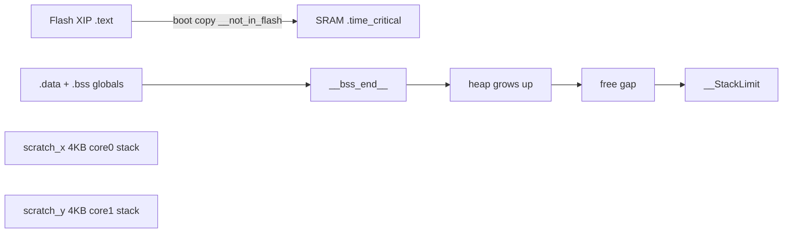

# SRAM, heap, and stack on the DCO Pico

How to tell whether `__not_in_flash_func` is eating static RAM, whether `malloc`/LittleFS/USB is growing the heap, or whether a core is about to smash its 4 KB stack.

- **CPU time** (different question): [`BENCHMARKING.md`](BENCHMARKING.md)
- **Dump command:** `PARAM_DEBUG_COMMAND` **13** — [`mem_diag.ino`](../mem_diag.ino), Diagnostics button in [`tools/dco_control`](../tools/dco_control/README.md). Needs `ENABLE_MEM_DIAG`. Runtime **14/15** disable/enable loop polls.
- **SRAM_HOT flags:** [`BUILD_FLAGS.md`](BUILD_FLAGS.md) (`ADSR_BEZIER_SRAM_HOT`, `MO_LFO_SRAM_HOT`)

---

## 1. Three different “memory problems”

`__not_in_flash_func` does **not** allocate on the heap. At boot the Pico SDK copies that function body into SRAM (`.time_critical`). That raises static RAM use and **shrinks total heap**. Heap *usage* still comes from `malloc` / `new` / LittleFS / TinyUSB / MIDI.

Arduino-Pico typically puts each core’s stack in a **4 KB scratch bank** (X / Y), separate from main SRAM. Stack overflow and heap exhaustion are different crashes.



| Symptom | What it actually is |
|---------|---------------------|
| `getTotalHeap()` drops after pinning more functions | Static SRAM tax (`.time_critical` + `.data`/`.bss`) |
| `getUsedHeap()` climbs after LittleFS / USB / MIDI | Real heap (`mallinfo().uordblks`) |
| Random Core1 glitches, `core1_free` near 0 | **Stack overflow** (~4 KB), not heap. Suspect large locals in `voice_task_*` |
| `getFreeHeap()` looks large but a big `malloc` fails | Fragmentation — free is an **upper bound** |

Do **not** use `PICO_COPY_TO_RAM` (whole sketch in SRAM).

---

## 2. Compile-time (no dump needed)

Arduino IDE / `arduino-cli` print something like:

```
Sketch uses … bytes of program storage.
Global variables use X bytes of dynamic memory, leaving Y bytes for local variables.
```

`X` includes `.data` + `.bss` **and RAM-resident code**. Pinning more `__not_in_flash_func` raises `X` and lowers `Y`. That leftover is heap room in **main SRAM**, not the scratch stacks.

After a build, parse the `.map` or:

```bash
arm-none-eabi-nm --size-sort --print-size DCO.ino.elf | grep time_critical
```

Look for `.time_critical.*` (each pinned function), large `.bss` (amp tables), `__bss_end__`, `__StackLimit`.

**Big static table (not heap):** `ampCompLut[NUM_OSCILLATORS][7001]` is compiled whenever `USE_FLOAT_AMP_COMP` is on (`NUM_OSCILLATORS × 7001 × 2` bytes; ~109 KB at 8 osc). RP2040 shipping leaves float amp off, so the LUT is not in that binary. FLOAT_QUAD / FIXED stay available without it.

---

## 3. Runtime dump (cmd 13)

Needs **`ENABLE_MEM_DIAG`** in [`DCO.ino`](../DCO.ino) (default on). Works **without** `RUNNING_AVERAGE`. Core 1 never prints.

| Gate | Effect on `loop` / `loop1` |
|------|----------------------------|
| Comment out `ENABLE_MEM_DIAG` | Polls compile to empty inlines — zero cost; dump 13/14/15 ack `compiled out` |
| Flag on, cmd **14** | Runtime polls off (one volatile load per iter). Dump 13 acks `off` |
| Flag on, cmd **15** (default) | Polls on; dump 13 works |

`bench_service(1)` is separate: empty without `RUNNING_AVERAGE`; with profiler on, idle is already in historical dumps (do not runtime-disable — cmd 10 needs it).

On the **Diagnostics** tab: **Dump RAM (heap/stack)**, or send `PARAM_DEBUG_COMMAND` 13. Core 1 snapshots `rp2040.getFreeStack()`; Core 0 prints:

```
=== DCO RAM ===
mcu    RP2040  clk=…MHz  polls=on
sram   main=262144 static=119784 (45%) heap=142360 (54%)
heap   total=142360 used=2152 free=140208  arena=… free_chunks=…
stack  core0 3896 free / 200 used / 4096   core1 4048 free / 48 used / 4096
layout sram=0x20000000 bss_end=0x2001d3e8 stack_limit=0x20040000
scratch_x=0x20040000..0x20041000 (4096)  scratch_y=0x20041000..0x20042000 (4096)
ram_text=…   or  (no __ram_text_* symbols — use the .map for .time_critical)
================
```

| Line / field | Source | Read it as |
|--------------|--------|------------|
| `mcu` / `clk` / `polls` | `PICO_RP2350`, `rp2040.f_cpu()`, `mem_diag_runtime_enabled` | Board + dump-13 poll gate |
| `sram main` | `__StackLimit - SRAM_BASE` | Main SRAM (256 KB on RP2040), not scratch |
| `sram static%` | `__bss_end__ - SRAM_BASE` | Pin tax: `.data` + `.bss` + RAM-text. A/B this, not `heap used` |
| `sram heap%` | `getTotalHeap()` / main | Remainder after static |
| `heap total/used/free` | `rp2040.get*Heap()` | `used` = `mallinfo().uordblks`; `free` is an upper bound |
| `arena` / `free_chunks` | `mallinfo().arena` / `.ordblks` | `free_chunks==1` ≈ unfragmented free list |
| `stack … used / bank` | `getFreeStack()` vs scratch bank (`__scratch_y_start__ - __scratch_x_start__`, else 4096) | Instantaneous SP, **not** high-water. Core1 is after `voice_task` returned |
| `scratch_*` | start … start+bank | Do not use `__scratch_*_end__` (empty section → size 0) |
| `ram_text` | `__ram_text_start__` / `__ram_text_end__` if exported | Else `.time_critical` is inside `static` — use the `.map` |

`getFreeStack()` is invalid under FreeRTOS (this sketch is not). Sampling at the end of `loop1()` misses peak depth **inside** `voice_task_*` (those frames have already returned). Near-zero at poll time is still a red flag.

A/B after a pin change: dump 13 → change `__not_in_flash_func` → dump 13 again, plus a **period-only** profiler dump (cmd 10 with `RUNNING_AVERAGE_PERIOD`) so SRAM win is not confused with a CPU regression.

**A/B vs pre-mem_diag CPU dumps:** comment out `ENABLE_MEM_DIAG`, keep `RUNNING_AVERAGE_PERIOD`, dump 10. Within one build: cmd **14** then dump 10 vs cmd **15** then dump 10 (expect ~noise; flag-off rebuild is the hard match).

---

## 4. What to pin (shipping policy)

Pin **leaves on the realtime path**. A RAM function that calls flash still XIP-misses on the callee — so library hot methods must be SRAM too (`ADSR_BEZIER_SRAM_HOT`, `MO_LFO_SRAM_HOT`).

| Symbol | Rate | SRAM? |
|--------|------|-------|
| `voice_task_fixed_point` + `amp_chan_levels_fixed` / `get_chan_level_lookup_fast` / `interpolateRatioQ16_cached` | every Core1 frame | yes |
| `ADSR_update`, `update_CV_outs`, `mod_matrix_eval_pitch_q24` | ~10 kHz | yes |
| ADSR `getWave` / `noteOn` / `noteOff` (`ADSR_BEZIER_SRAM_HOT`) | ~10 kHz | yes |
| LFO `getWaveQ15` / `_advanceUnitQ15` (`MO_LFO_SRAM_HOT`) | ~20 kHz | yes |
| `LFO1` / `LFO2` / `DRIFT_LFOs` wrappers | ~50 µs | yes |
| `microsTimer` / `microsTimer2` | every `loop` / `loop1` | yes |
| `loop()` / `loop1()` | forever | **no** — would copy MIDI/serial/noise dispatch into `.time_critical` |
| `serial_panel_task` / `serial_usb_task` | ~1 ms | **no** |

---

## 5. Adding or removing a pin

1. Dump 13 (baseline `heap total` + stacks).
2. Add or drop `__not_in_flash_func` on **one** function (or one library `*_SRAM_HOT` flag).
3. Clean rebuild; note IDE “Global variables use X”.
4. Dump 13 again. `heap total` should move by roughly the function’s `.time_critical` size.
5. Period-only profiler: `loop` / `loop1` mean **and max** must not regress if you unpinned something hot.
