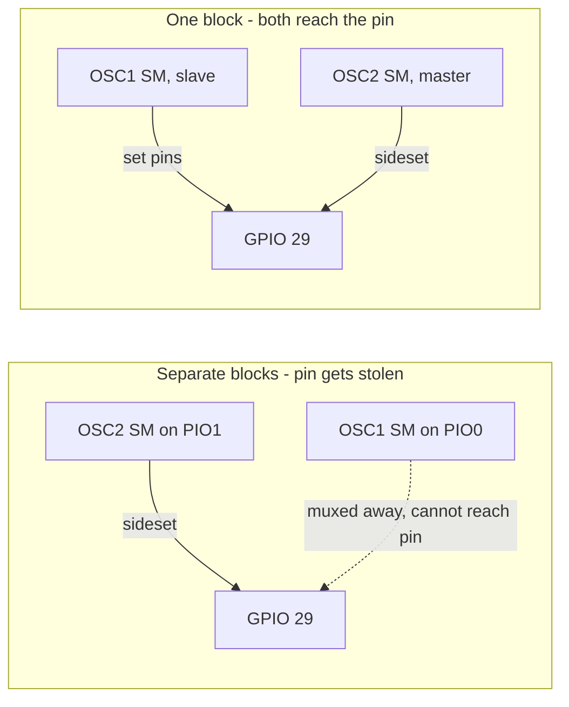
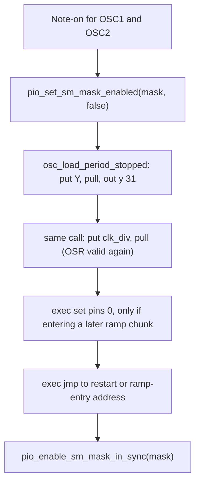

# DCO PIO Oscillators, Sync and Phase Align

How the three oscillator cores are driven from PIO: the resident programs, the state machine
topology, the period arithmetic, the two sync flavours, phase align, and the sub-oscillator.

**Live source of truth for the programs:** [`pico-dco.pio.h`](../pico-dco.pio.h) — *not* the
`.pio` source, see section 4.
**Live source of truth for the wiring and roles:** [`state_machines.ino`](../state_machines.ino).
**Live source of truth for the timing constants:** the "PIO Program Timing Constants" block in
[`globals.h`](../globals.h).

Related: [`PINOUT.md`](PINOUT.md) (pin and block map), [`AUTOTUNE.md`](AUTOTUNE.md) (how the
reset pulse interacts with gap measurement and amp-comp), [`ENGINE_OPTIONS.md`](ENGINE_OPTIONS.md)
(which voice engine computes the dividers).

---

## 1. What the PIO actually does

Each oscillator is a Juno-style DCO. A current source, set by that oscillator's RANGE PWM,
charges an integrator capacitor into a linear ramp. The PIO does exactly one job: it asserts a
**reset pulse** on the oscillator's RESET pin at precisely the right moment, which closes an
analog switch, dumps the capacitor, and starts the next ramp.

So the PIO is not synthesising a waveform. It is a very accurate one-shot timer, repeated
forever, and pitch is entirely determined by how many system clock cycles pass between reset
pulses.

```
        ramp (integrator charges)              reset
   /|                                          pulse
  / |                                         |‾‾‾|
 /  |                                         |   |
/   |_________________________________________|   |____
    <------------- one period ---------------->
```

Two consequences shape everything below:

- **Period accuracy is pitch accuracy.** A one-cycle error at 225 MHz is 4.4 ns; whether that
  matters depends entirely on how long the period is (section 5).
- **The reset pulse is dead time.** It is part of the period but contributes no ramp, so it
  affects waveform shape and amplitude, not just timing (section 2).

---

## 2. The analog core and where `pioPulseLength` comes from

```c
static constexpr uint32_t sysClock_Hz = 225000000;
uint32_t pioPulseLength = 1600;  // cycles; runtime via PARAM_DEBUG_COMMAND 160 ∈ [200, 50000]
```

`pioPulseLength` is the reset pulse width in system clock cycles, held in the state machine's
**Y** register. At 225 MHz, 1600 cycles is **~7.1 us**. It is not persisted; the Calibration
tab in `dco_control` sends unsigned 16-bit values 200–50000 on id 160 to change it live
(small opcodes 1–30 stay below that range). Setting Y via debug 160 also requests
`pio_defer_request_reset_pulse_all()` so running SMs reload (stop / load Y / restart) and
voices resplit period.

### 2.1 Sizing the pulse

The pulse has to fully discharge the integrator capacitor, and no longer. From the design
discussion behind the current analog build:

| Quantity | Value | Why |
|----------|-------|-----|
| Integrator cap | 4.7 nF | Chosen with the 20 k range resistor for the target pitch range |
| Range resistor | 20 k | Sets the charging current per RANGE PWM level |
| Discharge series R | ~180 R | Limits peak switch current inside the DG411's pulsed rating |
| Discharge time constant | ~846 ns | `180 R x 4.7 nF` |
| Pulse needed for full discharge | **~7.5 us (~1700 cycles)** | About 9 time constants; residual charge is negligible |

**RESET pad polarity.** PIO programs always use logical `1` = assert / discharge and `0` = ramp.
If the analog switch is **active-low** (DG411: IN low closes the discharge path), define
`ENABLE_PIO_RESET_INVERT` in [`DCO.ino`](../DCO.ino). `start_voice_sms()` then applies GPIO
`OUTOVER` + `INOVER` invert on every `RESET_PINS[]` entry so the pad is active-low while
soft-sync `jmp pin`, hard-sync sideset, phase-align `set pins, 0`, and the sub-oscillator
`wait` on OSC1 RESET all keep the same logical sense. Leave the flag undefined for
active-high / direct FET discharge.

> **Open item.** The constant is **3000** cycles (13.3 us), roughly 1.8x the ~1700 the RC
> analysis calls for. See section 13 before changing it — it is not simply a spare-margin
> decision, because the amp-comp calibration is measured *with* the current pulse width.

### 2.2 Why the pulse is a fixed absolute time, not a fraction of the period

The engine computes the ramp as "period minus pulse minus overhead", so as pitch rises the ramp
shrinks while the pulse stays put. The pulse is therefore a **growing fraction** of the cycle:

| Note | Period | Pulse at 3000 | Pulse at 1700 |
|------|--------|---------------|---------------|
| 12 Hz | 18.75 M cycles | 0.016% | 0.009% |
| 1 kHz | 225 k cycles | 1.3% | 0.76% |
| 7 kHz | 32.1 k cycles | **9.3%** | 5.3% |

Making the pulse proportional to the period would hold the duty constant, but it would require
rewriting Y on every control frame, which is unsafe on a running state machine (section 6), and
it would invalidate the amp-comp tables. Fixed is the right call; the open question is only the
*value*.

The absolute ceiling is `pioPulseLength + overhead` = 3012 cycles = **74.7 kHz**, so the pulse
is nowhere near limiting playable pitch. What it costs at the top of the range is ramp
amplitude, which the amp-comp tables compensate.

---

## 3. Block and pin topology

### 3.1 All three oscillators must live on PIO0

```c
static constexpr uint8_t VOICE_TO_PIO[NUM_OSCILLATORS] = { 0, 0, 0 };
```

A GPIO's function select can name **exactly one** PIO block. Hard sync works by having two state
machines drive the *same* reset pin, which is only possible when both are in the same block,
because state machines within a block share the pin's function select.

This is the bug the layout was fixed to solve. With `VOICE_TO_PIO = {0,1,2}`, calling
`pio_gpio_init(pio[1], 29)` to let OSC2 reach OSC1's reset pin silently re-pointed GPIO 29 from
PIO0 to PIO1 — so OSC1's own state machine could no longer drive its own core. OSC1 stopped
being a synced slave and became a pitch clone of OSC2.



`pio_topology_report()` checks this at runtime by reading each RESET pin's function select back
(section 12).

### 3.2 Block budget

| Block | Contents | Instructions used |
|-------|----------|-------------------|
| **PIO0** | `frequency_sync_4_jumps` + one of `frequency_sync_poll{,_2,_3}` | 25–27 of 32 |
| **PIO1** | `noise_lfsr` (origin 0, SM1) + `subosc_div2` + `subosc_div4` (SM0) | 24 of 32 |
| **PIO2** | reserved for `ENABLE_PIO_MIDI` | 0 |

Only one soft-sync poll image is resident at a time. Changing `softSyncChunks` among 1/2/3
reloads that image via `pio_remove_program` / `pio_add_program` (section 7.4).

### 3.3 Pins

| Signal | GPIO | Direction |
|--------|------|-----------|
| OSC1 RESET | 29 | PIO0 out |
| OSC2 RESET | 27 | PIO0 out |
| OSC3 RESET | 19 | PIO0 out |
| Sub-osc square | 8 | PIO1 out (`SUBOSC_PIN`) |

---

## 4. Resident and legacy programs

| Program | Length | Loaded by `init_pio()` | Weight | Overhead | Role |
|---------|--------|------------------------|--------|----------|------|
| `frequency_sync_4_jumps` | 12 | **yes**, PIO0 | 4 | 12 | Free-running and hard-sync oscillator |
| `frequency_sync_poll` | 13 | one of three, PIO0 | 5 | 13 | Soft-sync slave, N=1 (~40%) |
| `frequency_sync_poll_2` | 14 | one of three, PIO0 | 6 | 14 | Soft-sync slave, N=2 (~67%) |
| `frequency_sync_poll_3` | 15 | one of three, PIO0 | 7 | 15 | Soft-sync slave, N=3 (~86%) |
| `noise_lfsr` | 12 | **yes**, PIO1 @ origin 0, SM1 | — | — | White LFSR → RX FIFO + optional GP2 bit out |
| `subosc_div2` | 4 | **yes**, PIO1 | — | — | Divide OSC1 by 2 |
| `subosc_div4` | 8 | **yes**, PIO1 | — | — | Divide OSC1 by 4 |
| `frequency` | 18 | no | — | — | Legacy 8-chunk oscillator |
| `frequency_sync` | 20 | no | — | — | Legacy sync experiment |
| `frequency_pulse1` | 5 | no | — | — | Legacy PW generator |

`noise_lfsr` must be added **before** the sub-osc programs: it requires instruction
memory origin 0 (`out pc, 1` XORs via absolute addresses 0/1). SM1 JOIN_RX supplies one
seed word per `update_noise_gens()`; CPU xorshift-fills a white buffer, then Voss pink /
leaky brown run from that buffer with no further MMIO. With `ENABLE_NOISE_OUT`, `mov pins, isr`
also drives **GP2** at ~80 kHz bit rate for listen/scope.

### 4.1 The `.pio.h` file is hand-maintained

Arduino **never runs `pioasm`**. The checked-in [`pico-dco.pio.h`](../pico-dco.pio.h) is the
actual build input; [`pico-dco.pio`](../pico-dco.pio) is documentation of intent. Adding or
changing a program means hand-assembling the instruction words and keeping both files in step.

The encoding is documented inline above `frequency_sync_poll` in the header. In brief:

```
bits [15:13] opcode      000 JMP   001 WAIT   101 MOV   111 SET
bit  [12]    sideset enable        (side_set 1 opt reserves 2 bits)
bit  [11]    sideset data
bits [10:8]  delay
bits [7:0]   operand
```

JMP puts its condition in operand bits `[7:5]`: `010` = `x--`, `110` = `pin`. `pio_add_program`
relocates JMP targets by the load offset, so addresses in the tables are program-relative.

> **Trap.** [`pico-dco.pio`](../pico-dco.pio) has drifted from the header and **would not
> assemble as-is**: it declares `.program frequency` twice (lines 1 and 234) and defines
> `init_sm_pin` with two different signatures. The header has one of each. Do not assume the
> `.pio` file can be fed to `pioasm` without cleanup first.

### 4.2 `frequency_sync_4_jumps`, annotated

```
addr                                cycles        note
 0   lp0:  jmp x-- lp0              Y + 1         reset pulse asserted, X = Y
 1         mov x, OSR               1             load chunk count
 2         set pins, 0   side 0     1             release reset, ramp begins
 3   lp1:  jmp x-- lp1              clk_div + 1   chunk 1
 4         mov x, OSR               1             re-read: picks up a new clk_div
 5   lp2:  jmp x-- lp2              clk_div + 1   chunk 2
 6         mov x, OSR               1
 7   lp3:  jmp x-- lp3              clk_div + 1   chunk 3
 8         mov x, OSR               1
 9   loop_final: jmp x-- loop_final clk_div + 1   chunk 4
10         mov x, y                 1             X = Y for the next reset
11         set pins, 1   side 1     1             assert reset, wraps to lp0
```

`mov x, OSR` is a **non-destructive** re-read, so the OSR keeps holding `clk_div` and every chunk
reloads the same value. That is what lets the CPU change pitch mid-period (section 6).

### 4.3 Soft-sync poll programs

Three variants differ only in how many **trailing** chunks use the 2-cycle poll loop. N=1
(`frequency_sync_poll`) is identical to the free program for addresses 0–8; the final chunk
gains a poll:

```
 9   loop_final: jmp pin, do_sync   1     branch if master's reset is high
10         jmp x-- loop_final       1     otherwise keep counting
11   do_sync: mov x, y              1     sync branch and count-expired converge here
12         set pins, 1   side 1     1
```

N=2 / N=3 (`frequency_sync_poll_2` / `_3`) convert successive trailing chunks the same way and
share one `do_sync` tail. Lengths are 13 / 14 / 15 instructions; restart addresses are 11 / 12 / 13.
Phase-align ramp entries for N=2 are `{0,4,6,9}` and for N=3 `{0,4,7,10}` (see `PIO_RAMP_ENTRY_SYNC_*`
in [`globals.h`](../globals.h)).

Both the sync branch and the ordinary count-expired fall-through land on `do_sync`. Each polled
chunk costs **2 cycles per iteration**, so weight = `4 + N`.

`sm_config_set_jmp_pin` points the slave at the master's reset GPIO. PIO input sampling reads the
pad regardless of function select, so a slave can read a pin another state machine drives.

---

## 5. The period model

```
period = Y + weight * clk_div + overhead
```

| Program | weight | overhead |
|---------|--------|----------|
| `frequency_sync_4_jumps` (chunks 0) | 4 | 12 |
| `frequency_sync_poll` (chunks 1) | 5 | 13 |
| `frequency_sync_poll_2` (chunks 2) | 6 | 14 |
| `frequency_sync_poll_3` (chunks 3) | 7 | 15 |

Tables: `PIO_RAMP_WEIGHT_BY_CHUNKS[]` / `PIO_PERIOD_OVERHEAD_BY_CHUNKS[]` in [`globals.h`](../globals.h).
`PIO_RAMP_WEIGHT_SYNC` / `PIO_PERIOD_OVERHEAD_SYNC` remain aliases for the N=1 row.

### 5.1 Where overhead = 12 comes from

`jmp x-- lp` executes **X + 1** times: it jumps while X is non-zero, then burns one more cycle
falling through when X reaches 0. All five delay loops pay that extra cycle. Summing the
annotated listing in 4.2:

```
five loop fall-throughs        5
set pins,1 / set pins,0        2
five mov instructions          5
                              ---
overhead                       12
```

Each polled chunk adds one extra fall-through cycle (the 2-instruction loop falls through both
instructions), so overhead is `12 + N` for N trailing polled chunks.

**This corrected a real tuning error.** The old constants were `T_HIGH_OVERHEAD_CYCLES = 2` plus
`T_LOW_OVERHEAD_CYCLES = 5`, totalling 7 — short by exactly the five loop fall-throughs. Every
note ran 5 cycles fast. That is proportionally worse as pitch rises: about **0.27 cents sharp at
7 kHz**, and it was larger than the chunk quantisation error the remainder trick was introduced
to fix.

### 5.2 Two solvers, and when each applies

Both live in [`globals.h`](../globals.h).

**`pio_period_split(total, weight, overhead)` — exact.** Used at note-on only.

```c
uint32_t ramp = total_cycles - overhead - pioPulseLength;
p.clk_div = ramp / weight;
p.y       = pioPulseLength + (ramp % weight);   // remainder rides in the reset pulse
```

The division remainder is parked in the reset pulse instead of being discarded, so
`y + weight*clk_div + overhead == total_cycles` **exactly**. The pulse jitters by 0 to
`weight - 1` cycles, at most 13 ns, which is nothing against a 13 us pulse.

**`pio_clk_div_for_y(total, y, weight, overhead)` — rounded.** Used every control frame.

```c
uint32_t ramp = total_cycles - overhead - y;
return (ramp + weight / 2u) / weight;
```

Solves for `clk_div` against the Y the state machine is **already holding**, so the pulse and the
ramp always describe the same period. Rounded rather than exact, so the error is bounded at
`+/- weight/2`, i.e. **+/- 2 cycles**.

### 5.3 Resulting accuracy

| Situation | Error |
|-----------|-------|
| Note-on / held note | 0 cycles (exact) |
| During glide, vibrato, modulation | +/- 2 cycles (~0.11 cents at 7 kHz, less below) |
| Before this rework | -5 cycles systematic, plus +/- 2 quantisation |

---

## 6. Chunk structure: update latency versus the OSR race

### 6.1 Why four chunks

The ramp is split into four equal chunks, each re-reading `clk_div` from the OSR. A pitch change
written to the OSR takes effect at the **next chunk boundary**, not the next period. At the
bottom of the range that matters enormously: a 12 Hz note is 83 ms long, so waiting for a period
boundary would make low notes feel broken. Four chunks cut worst-case update latency to ~21 ms.

This is why the programs use `mov x, OSR` and **not** `pull`. Do not "improve" this by adding
`pull noblock` to make updates atomic per period — that reintroduces the latency the chunks exist
to remove.

### 6.2 The OSR race, and why Y is only written at note-on

This is the central constraint of the whole design, and the reason the remainder trick is not
applied on every control frame.

**Y can only be loaded through the OSR.** There is no instruction that writes a 3000-ish
immediate into Y, so the sequence is `pio_sm_put(y)`, `pull`, `out y, 31`. But the OSR
*simultaneously* holds `clk_div` for the four `mov x, OSR` chunk reads.

So on a **running** state machine there is a window where the OSR holds the pulse width instead
of the divider. If a chunk executes `mov x, OSR` inside that window, it latches ~3000 as its ramp
count instead of ~7000 — a chunk that finishes in a fraction of the expected time. That is a very
audible glitch, and with four chunks per period at a ~1 kHz control rate it would land every few
seconds.



Stopping the SM closes the window entirely, and note-on is the natural place to do it: the
envelope is at the start of its attack, so the phase discontinuity is inaudible.

Hence the split in 5.2 — exact at note-on, rounded while running. Held notes and new notes are
perfectly tuned; only active modulation falls back to +/- 2 cycles, which is inaudible and no
worse than before.

> **Invariant.** Never write Y to a running state machine. Use
> `osc_load_period_stopped()` between a disable and an enable, or `osc_set_reset_pulse()` which
> handles the stop/start itself.

### 6.3 Writing Y consumes the OSR

`out y, 31` shifts the OSR out. After it, the OSR no longer holds a valid divider, so the next
`mov x, OSR` would read shifted-out zeros and the oscillator would scream at ~74 kHz for a
control frame.

Every Y write must therefore be followed by re-pushing `clk_div`. That is the entire reason
`osc_last_clk_div[NUM_OSCILLATORS]` exists: callers that only want to change the pulse width
(`osc_set_reset_pulse()`, `start_voice_sms()`) need a divider to restore, and they take the last
one the engine pushed.

---

## 7. Sync modes

### 7.1 Roles

`syncMode` selects which oscillator is the slave. OSC3 is always free-running.

| `syncMode` | Master | Slave | Meaning |
|------------|--------|-------|---------|
| 0 | — | — | All three independent |
| 1 | OSC2 | OSC1 | OSC2's sideset drives OSC1's reset pin |
| 2 | OSC1 | OSC2 | OSC1's sideset drives OSC2's reset pin |

Resolved by `sync_slave_osc()` / `sync_master_osc()` in
[`state_machines.ino`](../state_machines.ino).

### 7.2 The state machine index invariant

When two state machines write the same pin on the same cycle, **the higher-numbered one wins**.
If the master were numbered below its slave, then every time the master's reset assertion
coincided with the slave's release, the master would lose and the sync edge would vanish — an
occasional click with no obvious cause.

`assign_sm_mapping()` therefore rewrites `VOICE_TO_SM` so the slave always sits **below** its
master:

| `syncMode` | `VOICE_TO_SM` | Result |
|------------|---------------|--------|
| 0 | `{0, 1, 2}` | Irrelevant, nothing shares a pin |
| 1 | `{0, 1, 2}` | Slave OSC1 = SM0, master OSC2 = SM1 |
| 2 | `{1, 0, 2}` | Slave OSC2 = SM0, master OSC1 = SM1 |

This is why `VOICE_TO_SM` is **mutable**, unlike `VOICE_TO_PIO`. The mapping is always a
permutation of `{0,1,2}`, so `start_voice_sms()` reconfiguring all three always covers every SM.

### 7.3 Hard sync versus soft sync

Selected by `softSyncChunks` (parameter `PARAM_SOFT_SYNC`, id 36).

| | Hard sync (`softSyncChunks` = 0) | Soft sync (`softSyncChunks` = 1..3) |
|---|---|---|
| Mechanism | Master's sideset also drives the slave's reset pin | Slave polls master's pin with `jmp pin` |
| Program on slave | `frequency_sync_4_jumps` | `frequency_sync_poll` / `_2` / `_3` |
| Weight | 4 | 5 / 6 / 7 |
| Effect on slave | Discharges the capacitor only; the slave's counter keeps running | Restarts the slave's own count |
| Character | Analog-cap-only reset, as on DCO4 | Textbook hard/soft sync |
| Receptive window | Always | Last ~40% / ~67% / ~86% of the ramp |

They sound different and both are worth having. Hard sync leaves the slave's schedule intact, so
its counter and its actual output disagree until the next wrap. Soft sync genuinely restarts the
slave.

In soft-sync mode the master leaves its sideset on **its own** pin — otherwise both mechanisms
would fire at once.

### 7.4 Soft-sync thresholds

Polling only trailing chunks means master edges arriving earlier in the slave's cycle are
ignored, which is exactly what makes sync "soft". Because each polled chunk runs at 2 cycles per
iteration, N trailing chunks occupy `2N / (4+N)` of the ramp time:

| Polled chunks | Weight | Receptive window | Program length | Resident with free |
|---------------|--------|------------------|----------------|--------------------|
| 1 | 5 | ~40% (`2/5`) | 13 | 25/32 |
| 2 | 6 | ~67% (`4/6`) | 14 | 26/32 |
| 3 | 7 | ~86% (`6/7`) | 15 | 27/32 |

All three are implemented. PIO0 cannot hold free + every poll variant at once (12+13+14 = 39),
so `ensure_soft_sync_program()` keeps **exactly one** poll image beside `frequency_sync_4_jumps`
and swaps it when `softSyncChunks` changes among 1/2/3. Hard sync leaves the current poll image
resident unused.

---

## 8. Phase align

`phaseAlignOSC2` (degrees, via `PARAM_OSC_SYNC_MODE`) offsets OSC2's phase relative to OSC1 at
note-on. It applies only when `oscSync > 1`.

That one parameter carries three regimes, because `oscSync` also gates the note-on restart
itself in [`voices.ino`](../voices.ino):

| `oscSync` | At note-on |
|-----------|------------|
| 0 | Nothing. The oscillators run straight through, so their phase relationship at note-on is whatever it happens to be — free running |
| 1 | OSC1 and OSC2 are stopped and restarted together, with no offset |
| 2..8 | The same restart, plus a fixed OSC2 offset of 45 to 315 degrees in 45 degree steps |
| >8 | The same restart, with the offset in degrees being `oscSync * 2` |

When `oscSync >= 1`, `note_retrig_mode` selects how that restart loads period state (`PARAM_DEBUG_COMMAND` **26** / **27**, or `NOTE_RETRIG_MODE_DEFAULT` in `DCO.ino`):

| Mode | Value | Behavior |
|------|------:|----------|
| `EXACT_Y` | 0 (default) | disable → apply stashed `pio_period_split` via `osc_load_periods_stopped_noclear` → jmp → `enable_in_sync` |
| `SYNC_JMP` | 1 | jmp (or phase ramp-entry) only on **running** SMs — no disable / Y load / `enable_in_sync` |

On EXACT_Y note-on frames, `pio_period_split` runs next to `phase align`, then the note-on
block applies the stash. Load uses fused **noclear** (frame already did PIO put+pull so TX
is empty); boot/topology still use `osc_load_period_stopped` with FJOIN clear. Profiler:
`retrig period split` under `voice_task_fixed_point`; `retrig SM apply` + `retrig RANGE PWM` under
`note-on retrigger` (one SM-apply probe — do not slice disable/load/jmp/enable). See
[`BENCHMARKING.md`](BENCHMARKING.md).

`SYNC_JMP` is for A/B listening (near-sync from consecutive `exec`s, no no-RESET window). Static tuning may differ slightly vs exact-Y (same idea as free-run never getting the §5.2 rewrite).

Worth knowing when comparing 0 against the rest: with `EXACT_Y`, the exact-Y rewrite
(`osc_load_periods_stopped_noclear`) runs only inside that gated block, so free running never
receives the exact-period Y rewrite from 5.2 and keeps the rounded `clk_div` path for its
whole life.

### 8.1 The problem with the old approach

Previously the whole offset went into a widened reset pulse: `y_val2 = pioPulseLength +
phaseDelay`, loaded for the entire note. Because Y is asserted every cycle, that did not offset
the phase once — it held the integrator discharged on **every** cycle. At 180 degrees on a 12 Hz
note that is 41 ms of flat zero per cycle, a waveform shape neither the amp-comp tables nor
`find_gap` model.

### 8.2 Coarse offset by ramp entry point

Instead, the coarse offset is a one-shot jump **into a later ramp chunk**, so OSC2's first cycle
simply starts partway up its ramp. Steady-state cycles are untouched.

```c
// Free / poll-1; poll-2 uses {0,4,6,9}, poll-3 uses {0,4,7,10}
static constexpr uint8_t PIO_RAMP_ENTRY_FREE[4] = { 0, 4, 6, 8 };
```

| Advance | Entry address | Chunks remaining |
|---------|---------------|------------------|
| 0% | restart (10 or 11) | 4, full cycle |
| 25% | 4 | 3 |
| 50% | 6 | 2 |
| 75% | 8 | 1 |

Addresses 4, 6 and 8 are all `mov x, OSR`, and the OSR still holds a valid `clk_div` from
`osc_load_period_stopped()`, so the chunk count loads correctly.

> **Trap.** Entries at 4/6/8 skip `set pins, 0` at address 2, which is what releases the reset
> pin. The caller must drive it low explicitly first:
> ```c
> pio_sm_exec(pioN_B, smBN, pio_encode_set(pio_pins, 0));
> pio_sm_exec(pioN_B, smBN, pio_encode_jmp(osc_ramp_entry_target(DCO_B, phaseQuarters)));
> ```
> Omit the `set` and OSC2 starts its ramp with the reset switch still closed.

### 8.3 Residual

Degrees are split into whole quarters plus a remainder:

```c
uint16_t deg          = phaseAlignOSC2 % 360u;
uint8_t  phaseQuarters = deg / 90u;                       // coarse: ramp entry jump
uint16_t residualDeg  = deg - phaseQuarters * 90u;        // fine: widens Y
phaseDelay = (total_cycles2 * residualDeg + 180u) / 360u;
```

The residual still widens Y, so some held-reset distortion remains — but it is now capped at
**25% of a period** instead of approaching 100%. Pitch stays correct because the widening is
compensated in `clk_div`: the split is computed on `total_cycles2 - phaseDelay`, then `phaseDelay`
is added back to Y, so the period sums exactly.

---

## 9. Sub-oscillator

Four instructions on PIO1 turn OSC1's reset pin into a 50% square one or two octaves down. Each
master cycle presents one rising and one falling edge, so a `wait 1` / `wait 0` pair consumes
exactly one master cycle.

```
.program subosc_div2
    wait 1 pin 0    side 0     ; output low
    wait 0 pin 0
    wait 1 pin 0    side 1     ; output high
    wait 0 pin 0
```

`subosc_div4` uses four wait pairs per half-cycle for a second sub-octave. Selected by
`subOscDivide` (0 = off, 2, 4) through `PARAM_SUBOSC_DIVIDE` (id 37).

> **Trap.** `subosc_init()` points `sm_config_set_in_pins` at `RESET_PINS[0]` but must **not**
> call `pio_gpio_init` on it. That would move GPIO 29's function select to PIO1 and steal the
> output away from PIO0 — the same class of bug described in section 3.1. Input sampling reads
> the pad directly and needs no function select change.

Output is on `SUBOSC_PIN` = GP8, freed when the SerialPIO screen UART was removed. **This is
inaudible until the carrier board gives GP8 a mixer input.**

---

## 10. Function reference

### 10.1 [`state_machines.ino`](../state_machines.ino)

| Function | Purpose | Called from | Preconditions |
|----------|---------|-------------|---------------|
| `sync_slave_osc()` / `sync_master_osc()` | Resolve `syncMode` into oscillator indices, or -1 | `assign_sm_mapping()`, `start_voice_sms()`, `pio_topology_report()` | none |
| `assign_sm_mapping()` | Rewrite `VOICE_TO_SM` so the slave sits below its master | `init_pio()`, `setSyncMode()` | Call **before** `start_voice_sms()` |
| `init_pio()` | Load free + one poll image into PIO0 and both sub-osc programs into PIO1, then start everything | `setup1()` | Boot only |
| `ensure_soft_sync_program(n)` | Swap the resident poll image to N trailing chunks (1..3) | `init_pio()`, `start_voice_sms()` | SMs must be stopped |
| `start_voice_sms()` | Ensure poll image; choose each SM's program, pins; apply RESET polarity; preload Y; start all three on one cycle | `init_pio()`, `setSyncMode()` | Safe to re-call whenever topology changes |
| `pio_reset_pin_apply_polarity(pin)` | OUTOVER+INOVER invert/clear for `ENABLE_PIO_RESET_INVERT` | `start_voice_sms()` | RESET pins only |
| `osc_load_period_stopped(osc, y, clk_div)` | Push Y then `clk_div` (with FJOIN clear) | `start_voice_sms()`, `osc_set_reset_pulse()` | **SM must already be stopped.** |
| `osc_load_periods_stopped_noclear(...)` | Dual-osc Y + clk_div, no FJOIN | Both engine note-on EXACT_Y paths | After frame put+pull (TX empty); caller disable/enable |
| `osc_set_reset_pulse(osc, y)` | Change only Y, restoring `osc_last_clk_div[osc]` | `apply_param_osc_sync_mode()` | Stops and restarts the SM itself; parameter path, not audio path |
| `pio_topology_report()` | Print sync roles and verify every RESET pin reads back as PIO0 | Bench / diagnostics | Serial up |
| `pio_period_probe(osc, clk_div)` | Park an oscillator at a fixed divider and print the predicted period | Bench | Disturbs the oscillator |
| `pio_solve_period_model(...)` | Back-solve weight and overhead from two frequency readings | Bench | Two distinct dividers, same Y |
| `set_subosc_divide(divide)` | (Re)configure the sub-oscillator; 0 stops it | `init_pio()`, `apply_param_subosc_divide()` | none |

### 10.2 [`globals.h`](../globals.h) inlines

These live in `globals.h` rather than `state_machines.h` because they read state declared there,
and `globals.h` is included first.

| Inline | Returns |
|--------|---------|
| `osc_program_base(osc)` | Load offset of the program that oscillator is running |
| `osc_restart_target(osc)` | Absolute address of `mov x, y` — jump here to retrigger a cycle (10 free; 11/12/13 for poll N=1/2/3) |
| `osc_ramp_entry_target(osc, quarters)` | Absolute address of a ramp chunk entry, for phase advance (program-dependent for poll-2/3) |
| `osc_ramp_weight(osc)` | 4, or 5/6/7 from `softSyncChunks` when the slave runs a poll program |
| `osc_period_overhead(osc)` | 12, or 13/14/15 likewise |
| `pio_period_split(total, w, k)` | Exact `{clk_div, y}` split; note-on only |
| `pio_clk_div_for_y(total, y, w, k)` | Rounded `clk_div` for a fixed Y; every frame |

### 10.3 Per-oscillator state

| Variable | Meaning |
|----------|---------|
| `VOICE_TO_PIO[]` | Always `{0,0,0}`. Do not change (section 3.1) |
| `VOICE_TO_SM[]` | Mutable; permuted by `assign_sm_mapping()` |
| `osc_uses_sync_program[]` | Which resident program each SM runs; drives all the weight/address helpers |
| `osc_last_y[]` | Y currently loaded; `pio_clk_div_for_y()` solves against it |
| `osc_last_clk_div[]` | Last divider pushed, so a Y write can restore it (section 6.3) |
| `softSyncChunks` | 0 = hard sync; 1..3 = soft sync trailing polled chunks |
| `pio_loaded_sync_chunks` | Which poll image is currently in pio0 instruction memory (1..3) |
| `subOscDivide` | 0 / 2 / 4 |

---

## 11. Invariants

Everything here is a trap that has already bitten, or would bite the next change.

1. **All oscillators stay on PIO0.** Hard sync depends on two SMs sharing one pin's function
   select. Splitting them across blocks silently breaks sync (section 3.1).
2. **Never `pio_gpio_init` an oscillator pin from another block.** It steals the pin. Reading a
   pin as input needs no function select change (sections 3.1, 9).
3. **Never write Y to a running state machine.** The OSR is shared with the chunk reads
   (section 6.2).
4. **Always re-push `clk_div` after writing Y.** `out y, 31` consumes the OSR (section 6.3).
5. **The slave's SM index stays below its master's.** Higher SM wins a same-cycle pin write
   (section 7.2).
6. **Keep `.pio` and `.pio.h` in step by hand.** Arduino never runs `pioasm`, and the `.pio`
   source currently would not assemble (section 4.1).
7. **Do not add `pull noblock` to the chunk loop.** It would restore the low-note update latency
   the chunks exist to eliminate (section 6.1).
8. **Entering a ramp chunk requires an explicit `set pins, 0` first** (section 8.2).
9. **Changing `pioPulseLength` invalidates amp-comp calibration.** It is baked into the measured
   gap tables (sections 2.1, 13). Runtime changes via debug 160 may need an amp-comp redo after
   large Y moves.

---

## 12. Bench and verification

### 12.0 How to invoke these

Nothing in the firmware calls the three helpers below, so on a running board they are
reached through `PARAM_DEBUG_COMMAND` (id 160): `1` runs the topology report, `2` and `3`
run period probes at a low and a high divider. Values **200–50000** (unsigned 16-bit on the
wire) set `pioPulseLength` instead of running an opcode. See `apply_param_debug_command()` in
[`params.ino`](../params.ino).

The easiest way to send that is the bench controller in
[`tools/dco_control`](../tools/dco_control/README.md), which has a button for each on its
Oscillators tab (Sync section) and shows the board's replies in a log pane. It also drives
`PARAM_SOFT_SYNC` and `PARAM_SUBOSC_DIVIDE`, which have no Input-board UI, so it is the only
way to exercise soft sync and the sub-oscillator.

### 12.1 Confirm the sync fix

```c
pio_topology_report();
```

Expect every RESET pin to report PIO0 and the summary line:

```
  reset pin ownership: OK (all PIO0)
```

Anything else means a pin has been stolen and sync cannot work, whatever it sounds like. The
report also checks the master/slave SM ordering from section 7.2.

Then listen: enable sync and sweep OSC1's detune. A **timbral formant sweep** means hard sync is
working. If the pitch simply tracks with no change in character, the slave is being cloned rather
than synced.

Scoping the shared reset pin should show reset edges at both oscillators' rates.

### 12.2 Confirm the period model

`overhead = 12` is derived by instruction counting (section 5.1). To confirm it on hardware,
probe at two widely separated dividers with the same Y and back-solve.

> **Run this with no note playing.** `pio_period_probe()` parks the oscillator at a fixed
> `clk_div`, but `voice_task_main()` pushes a fresh divider every frame for a held note, so the
> probe's value survives only until the next control frame. With all voices released the
> voice task skips the oscillator entirely and the probe holds.

```c
pio_period_probe(0, 2000);    // read the frequency counter on the RESET pin
pio_period_probe(0, 20000);   // read it again

pio_solve_period_model(2000, hz_a, 20000, hz_b, pioPulseLength);
```

It prints the measured weight and overhead against the expected constants. Weight should come out
very close to an integer; a fractional result means the two readings were taken with different Y
values or different programs.

### 12.3 Confirm tuning

With `DCO_DEBUG_REPORT 1` in [`voices.ino`](../voices.ino), note-on prints the target period, the
Y actually used including remainder, the divider, and the resulting frequency. Target and
generated frequency should agree to the displayed precision.

---

## 13. Open items

| Item | Detail |
|------|--------|
| **`pioPulseLength` = 3000 vs ~1700** | The RC analysis (section 2.1) calls for ~7.5 us; the constant is 13.3 us. Reducing it would recover ramp amplitude at the top of the range, but the amp-comp tables and `find_gap` calibration were measured with 3000, so it needs a full recalibration pass, not just a constant edit. |
| **`.pio` source drift** | Duplicate `.program frequency`, two `init_sm_pin` signatures (section 4.1). Worth cleaning so the file could be assembled again as a cross-check on the hand-written header. |
| **Hard-sync listening check** | The static and runtime checks pass, but the detune-sweep listening test in 12.1 has not been performed on hardware. |
| **Sub-oscillator** | Firmware complete; GP8 needs a mixer input on the carrier before it is audible. |
| **Soft-sync thresholds** | N=1/2/3 implemented via poll-program swap (section 7.4). Listening comparison across thresholds still open. |
| **Legacy programs** | `frequency`, `frequency_sync`, `frequency_pulse1` are still in the header but never loaded. Removing them would free nothing at runtime, but would reduce confusion. |
