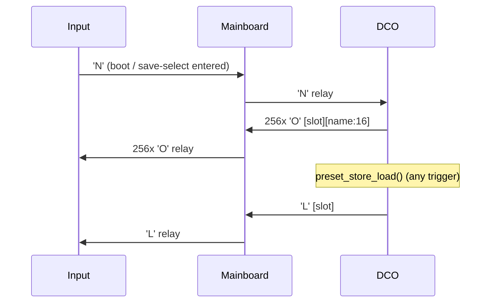

# MCU Preset Store & Calibration Dump

LittleFS-backed **256-slot presets** on the DCO board, plus host dump/restore for
presets and the five calibration tables. Host UI:
[`tools/dco_control`](../tools/dco_control/README.md) (shared with DCO3-MONOSYNTH,
model-aware — see its README §0). Serial how-to:
[`README_serial_and_params.md`](README_serial_and_params.md). Topology:
[`SYSTEM_OVERVIEW.md`](SYSTEM_OVERVIEW.md), [`MAINBOARD_REINTEGRATION.md`](MAINBOARD_REINTEGRATION.md).

**Source of truth:** [`preset_store.h`](../preset_store.h) / [`preset_store.ino`](../preset_store.ino).
Record format and host protocol are **identical to DCO3-MONOSYNTH**; what differs
here is the calibration table sizes (8 oscillators / 4 PW channels) and the fact that
the Serial2 peer is the STM32 Mainboard, which **relays** the preset frames to and
from the Input board instead of being the panel itself.

These 256 slots are the **only** preset storage in the instrument. The Input board has
no filesystem: it keeps a RAM-only cache of the 256 slot names and asks the DCO to
refill it (§4). Panel save / load, MIDI program change, boot recall and
`dco_control` all end up in the same records.

---

## 1. What is stored

A **preset** is a snapshot of:

| Domain | How it is captured |
|--------|--------------------|
| Persistable `'p'` ParamIds | Shadowed in `presetParamShadow[]` + set-bitmap by `update_parameters()` → `preset_shadow_capture()` |
| EnvVCA / EnvVCF / EnvDCO times (`'a'`/`'b'`/`'c'`) | Read from ADSR globals at save time |
| Filter block (`'d'`) | `CUTOFF`, `RESONANCE`, `ADSR2toVCF`, `LFO2toVCF` |
| Name | Last `'q'` frame (16 chars → `presetName[16]`), copied verbatim into the record. Panel edits arrive relayed by the Mainboard |

**Not in a preset:** calibration tables, autotune / store-cal pulses, `PARAM_DEBUG_COMMAND`,
PIO pulse length, Character diagnostic jitters, or other DCO-local bench ids.

`preset_param_is_persistable()` (in `preset_store.h`) is the shared filter for shadow
capture and for `serial_echo_persistable_param16()` (USB/MIDI → Serial2 mirror).

---

## 2. LittleFS layout (chunked)

Arduino-Pico LittleFS uses **4096-byte blocks**. One file per 598-byte record would
waste most of each block and would not fit 256 slots even in a 512 KB partition.
Instead, slots are packed **4 records per chunk file**:

| File | Size | Role |
|------|-----:|------|
| `pb00` … `pb63` | 2392 B each (= 4 × 598) | Chunk: slots `chunk*4 + 0..3` |
| `pstLast` | 1 B | Slot recalled at boot / last save-load |
| `voiceTables` | 1408 B | Amp-comp bank (`FSBankSize`, **8 osc** × 22 pairs) |
| `PWCenter` / `PWHighLimit` / `PWLowLimit` | 8 B each | `FSPWBankSize` (**4 PW channels**) |
| `ManualOffset` | 8 B | `FSManualOffsetBankSize` (one `int8` per oscillator) |

**Addressing:** `chunk = slot >> 2`, `offset = (slot & 3) * 598`.

**Why 4/file:** 4 × 598 = 2392 B fits in one 4096-byte block. An in-place save
(`"r+"` + `seek` + `write`) stays inside that one block, so LittleFS does not
copy a long file tail (mid-file writes otherwise rewrite the remainder of the CTZ
skip-list). Empty slots are all-zero records (fail magic validation = "unused").

**Partition:** flash with `flash=4194304_524288` (4 MB flash, **512 KB** LittleFS =
128 blocks). Budget ~64 chunk data blocks + metadata + `voiceTables` (~1 block);
small cal files/`pstLast` stay under the 256-byte inline limit. See
[`BUILD_FLAGS.md`](BUILD_FLAGS.md).

**Create path:** `File::seek()` refuses past-EOF, so a missing/wrong-size chunk is
created with `"w"` in one pass writing all four records (target real, others zeroed).
Subsequent saves use `"r+"`. Write return values are checked; a full FS reports
`reason=nospace` / `reason=write`.

**Migration / repartition:** Changing the FS size moves `_FS_start`/`_FS_end` and
reformats the filesystem. Back up calibration + presets with `dco_control`
(Calibration tab → *Save to file*, preset browser → *Pull from board* / bank export)
before flashing, then restore after.

---

## 3. Preset record (598 bytes, LE)

| Offset | Size | Field |
|-------:|-----:|-------|
| 0 | 1 | Magic `0xA5` |
| 1 | 1 | Version `1` |
| 2 | 16 | Name (ASCII, zero-padded) |
| 18 | 32 | Param set-bitmap (bit *id* set ⇒ value at that ParamId was captured) |
| 50 | 512 | 256 × `int16` ParamId values |
| 562 | 32 | 16 × `uint16` block fields (order below) |
| 594 | 4 | CRC32 (IEEE / zlib) over bytes `[0 .. 594)` |

**Block field order** (wire / exp domain for A/D/R):

0–3 EnvVCA A D S R · 4–7 EnvVCF · 8–11 EnvDCO (`ADSR1_*`) · 12–15 filter
`CUTOFF`, `RESONANCE`, `ADSR2toVCF`, `LFO2toVCF`.

On load, only bitmap-set persistable params are replayed through `update_parameters()`;
blocks write globals + dirty flags. EnvVCA/EnvVCF/filter blocks are also mirrored to the
**Mainboard** over Serial2 (`serial_send_adsr_*_block_to_mb()` /
`serial_send_filter_block_to_mb()`) so its analog VCA/VCF CVs follow; EnvDCO stays local.

---

## 4. Host ↔ board protocol

### Commands (host or panel → DCO, slim inner frames)

| Path | Meaning |
|------|---------|
| `'p'` `PARAM_PRESET_SAVE` (170) = slot | Snapshot live state → chunk file, update `pstLast` |
| `'p'` `PARAM_PRESET_LOAD` (171) = slot | Recall slot (also MIDI PC + Bank Select; see §5) |
| `'p'` `PARAM_PRESET_DUMP` (172) = −1 | Directory listing (`[pdir]` lines) |
| `'p'` `PARAM_PRESET_DUMP` (172) = 0..255 | Hex dump of that slot record |
| `'p'` `PARAM_CAL_DUMP` (173) | 0/−1 = all five cal files; 1..5 = one (`CAL_DUMP_*`) |
| `'q'` | 16-char name before SAVE (board stores `presetName[16]`) |
| `'B'` | Bulk chunk: `[target][slot][offset:u16 LE][32 data]` → staging RAM |
| `'C'` | Bulk commit: `[target][slot][size:u16 LE][crc32 LE]` → verify + LittleFS write |

`SERIAL_INNER_MAX_PAYLOAD` is **36** on the DCO (`Serial.h`) so `'B'` fits.
`PRESET_BULK_STAGING_SIZE` is **1440** here (DCO3: 608) because the largest bulk
target is the 1408-byte `voiceTables` bank.

### Front-panel directory sync (`'N'`/`'O'`/`'L'`)

The Input board has no LittleFS bank of its own; it holds a RAM-only
`presetDir[256][16]` name cache (`INPUT-CONTROLLER/presetStorage.ino`) and refills it
from the DCO. Three binary frames carry that, and every one of them crosses the
**Mainboard**, which relays them verbatim:

| Path | Direction | Payload | Meaning |
|------|-----------|---------|---------|
| `'N'` | Input → MB → DCO | 1 unused/padding byte | "Send me the whole directory" |
| `'O'` | DCO → MB → Input | `[slot:u8][name:16]` (17 B) | One directory entry; 256 sent per `'N'`, blank name = unused slot |
| `'L'` | DCO → MB → Input | `[slot:u8]` | "I just finished loading this slot" |



`preset_store_send_directory_to_mb()` returns immediately if `Serial2` TX is not
writable (USB-only bench with no Mainboard attached), then opens each of the 64 chunk
files once, reads the four record heads for their names, and emits four `'O'` frames
per chunk — 64 opens for 256 slots, blocking `Serial2` writes. It runs once per Input
boot / save-select entry, never per encoder tick. A slot whose record head fails the
`0xA5` magic check is sent as an all-zero name.

`serial_send_preset_loaded_to_mb()` fires `'L'` once at the end of every successful
`preset_store_load()`, so the panel and Screen follow the DCO's actual current slot for
loads Input did not trigger: boot recall, MIDI program change, a `dco_control` command,
as well as a panel-initiated load. It is a notification, not an acknowledgement — there
is no retry.

`'N'`'s payload is 1 byte, not 0, even though the byte itself carries no information:
`serial_parser_dispatch()` / `serial_parser_process_byte()` treat `payload_len == 0` as
"unregistered command" in both RAW and COBS framing, so a true zero-length frame can
never dispatch.

**Every relayed byte needs its own Mainboard LUT row.** `'N'` is registered in
`inputSerial8Commands[]` and `'O'`/`'L'` in `mainSerial2Commands[]`
([`../../MAINBOARD-CONTROLLER/Serial.ino`](../../MAINBOARD-CONTROLLER/Serial.ino)); an
unregistered command byte is dropped silently in transit, with no error on either end.
On the DCO side `'N'` is handled by `input_handle_preset_dir_request()` in
`mainboardSerialCommands[]` (the Serial2 LUT) — it is **not** in the USB LUT, so
`dco_control` cannot request a directory push; the host uses `'p'`
`PARAM_PRESET_DUMP` / `[pdir]` text instead.

**Bulk targets** (`PresetBulkTarget`): `0` preset record, `1` voiceTables, `2` PWCenter,
`3` PWHighLimit, `4` PWLowLimit, `5` ManualOffset. Calibration commits call
`write_fs_bank()` then `init_FS()` (and amp-comp precompute for voiceTables).

**Calibration dump sizes are clamped, not raw file sizes.** `dump_fs_file()` always
sends the compile-time bank size (`FSBankSize` / `FSPWBankSize` /
`FSManualOffsetBankSize`, per target), the same leading bytes `init_FS()` reads at
boot — never the LittleFS file's actual on-disk size. A cal file can be larger than
that on flash (e.g. a leftover from a firmware build with a different
`NUM_OSCILLATORS`); the extra trailing bytes are unused and are not sent. If the
on-disk file is *smaller* than expected, the dump aborts with `reason=short`.
`fileformats.decode_cal_table()` on the host truncates an over-length payload with
a warning and raises on under-length.

### Answers (DCO → host, plain USB CDC text)

```
[pdir] begin
[pdir] slot=005 name="BassPluck"
[pdir] end count=1

[dump] begin target=preset slot=5 size=598
[dump] d 0000 A501...
[dump] end target=preset crc=XXXXXXXX

[dump] begin target=voiceTables size=1408
...
[dump] err target=ManualOffset reason=missing|open|short

[preset] saved slot=3 name="MyName          "
[preset] loaded slot=3 name="MyName          "
[preset] err slot=4 reason=empty|corrupt|open|write|seek|nospace

[bulk] ok target=preset slot=9
[bulk] ok target=PWCenter
[bulk] err target=preset reason=crc|size|record|open|write|seek|nospace|target
```

CRC on dump/commit is zlib-compatible IEEE CRC32.

---

## 5. Recall paths

| Trigger | Code path |
|---------|-----------|
| MIDI Bank Select + Program Change | CC 0 or 32 latches `midiPresetBank` (0/1); PC → `preset_store_load(bank*128 + program)` |
| `'p'` 171 — USB host, or the panel via the Mainboard's `apply_param_preset_load` → `forward_dco()` | `apply_param_preset_load` → `preset_store_load` |
| Boot | `preset_store_boot_task()` from `loop()` after ~1.5 s, once, if `pstLast` exists and `!calibrationFlag` |

All three end in `preset_store_load()`, so all three emit `'L'` towards Input (§4).

MIDI Program Change alone addresses slots 0..127 (bank 0). Nonzero CC 0 or CC 32
selects bank 1 (slots 128..255). Either bank CC is accepted for controller
compatibility (two banks only).

No `pstLast` → firmware defaults stay. Boot recall requires a successful 1-byte
read of `pstLast` (slot 255 is valid; there is no `0xFF` "empty" sentinel).

Everything runs on **Core 0** (serial / MIDI / boot one-shot). Flash writes briefly stall
the other core, same as existing calibration FS writers.

---

## 6. Host file formats (`tools/dco_control/fileformats.py`)

Tagged JSON so patch / bank / cal files cannot be mixed up:

| `"format"` | Contents |
|------------|----------|
| `dco4-patch` | One slot: `name`, `params`, `blocks` (linear ADSR fader domain) |
| `dco4-bank` | Full 256-slot bank (`version`, `current`, `slots`) |
| `dco4-cal` | Decoded tables: `amp_comp` (8 osc), `pw_center` / `pw_high_limit` / `pw_low_limit` (4 ch), `manual_offset` (8) |

Patch/bank files share one param numbering with DCO3-MONOSYNTH and load on either
model; cal files are strictly per-model (sizes differ). Host ↔ MCU record codec
converts ADSR A/D/R between UI linear 0..4095 and the exp wire domain 0..25000
(`lin_to_exp` / `exp_to_lin`).

---

## 7. Related files

| File | Role |
|------|------|
| `preset_store.h` / `.ino` | Record layout, CRC, chunked save/load/dump, bulk, boot recall, `'O'` directory push |
| `FS.h` / `.ino` | Cal banks; `write_fs_bank()` shared with bulk restore |
| `params_def.h` | ParamIds 170–173 (canonical superset, byte-identical on every board) |
| `params.ino` | `apply_param_preset_*` / `apply_param_cal_dump`; shadow in `update_parameters` |
| `Serial.h` / `.ino` | `'B'`/`'C'` handlers; block-echo helpers after load; `'N'` handler; `serial_send_preset_loaded_to_mb()` |
| `serial_input_protocol.h` | Command bytes / payload lengths for `'q'`, `'B'`, `'C'`, `'N'`, `'O'`, `'L'` |
| `midi.ino` / `globals.h` | Bank Select CC 0/32 + Program Change → load |
| `../../MAINBOARD-CONTROLLER/Serial.ino` | Relay tables: `'q'`/`'N'` Input→DCO, `'O'`/`'L'` DCO→Input |
| `../../INPUT-CONTROLLER/presetStorage.ino` | Input's RAM-only `presetDir[256]` cache; `'N'`/`'O'`/`'L'` client side |
| `tools/dco_control/mcu_link.py` | Queued dump/bulk ops over CDC text |
| `tools/dco_control/fileformats.py` | JSON + binary codecs (model-aware) |
