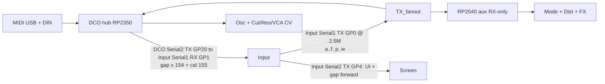

# DCO4-REBORN System Overview

DCO4-REBORN is a **fully digitally controlled analog polysynth**, forked from DCO3-MONOSYNTH and restored to **old DCO4 voicing**: digital control and calibration drive analog DCO / filter / VCA hardware. The goal includes patch saving for all parameters.

The shipping instrument is **three firmwares** (Mainboard absorbed into DCO). Board-specific details live in each board folder / docs.

**DCO board:** RP2040 or RP2350 (**A** with helper, or **B** solo), **4 MIDI voices × 2 oscillators**, freq on PIO (pio0+pio1, 8 SMs), amp via RANGE HW PWM (no dither), EnvDCO/VCA/VCF, LFOs. RP2350: 4 sub-osc SMs on pio2 (pins TBD). Opt-in CV PWM / mux is **not live** (DCO3 leftover collides with 8-osc pins). Autotune stack retained (PW center/limits + amp-comp).

**Dual MCU (concept):** RP2350A + helper RP2040 sharing Input TX — see [`DUAL_MCU.md`](DUAL_MCU.md). `DCO/` keeps full IO code for a later RP2350B-only build.

**Absorption:** STM32 Mainboard firmware is archived under [`../../_archived/Mainboard/`](../../_archived/Mainboard/). History: [`MAINBOARD_ABSORPTION.md`](MAINBOARD_ABSORPTION.md).

---

## Boards and ownership

| Board | Repo / folder | MCU | Owns |
|-------|---------------|-----|------|
| **DCO (voice + hub)** | `DCO/` | RP2040 or RP2350A/B | MIDI, 4×2 PIO DCOs, EnvDCO/VCA/VCF, LFOs, cal, LittleFS; Input UART (panel + gap). Cut/Res/VCA CV + osc wave/level **code** retained but not live until pin remap. Full dist/mode/FX **code** for solo-B |
| **Voice aux** | [`VOICE-AUX/`](../../VOICE-AUX/) | RP2040 | RX-only on Input TX; AS3320 mode, dist Drive/Mix, FX stubs — [`DUAL_MCU.md`](DUAL_MCU.md) |
| **Input controller** | `INPUT-CONTROLLER/` | RP2040 | Front panel, presets; UART to voice (fanout to DCO ± aux); relays gap `'x'` 154 → Screen |
| **Screen controller** | `SCREEN-CONTROLLER/` | RP2040 | ILI9488 + LVGL; UI from Input; gap relayed by Input |
| ~~Mainboard~~ | [`_archived/Mainboard/`](../../_archived/Mainboard/) | STM32 | *Archived* — no firmware path remains on any board |

**ParamId space:** shared `params_def.h` across boards. Do not renumber IDs.

---

## Inter-board links (default — three boards; optional voice aux)

### Link details (hub default)

| Link | Baud | Peers | Role |
|------|------|-------|------|
| DCO `Serial1` | 31250 | DIN MIDI | MIDI in (RX1 / TX0) — interim HW; PIO MIDI later |
| DCO `Serial2` **RX GP21** | 2.5M | Input `Serial1` **TX GP0** | Panel in (slim `'a'`–`'d'`, `'p'`, `'q'`; LE, no finish). Input firmware still sends the old BE format until updated. Same TX may fan out to RP2040 aux RX ([`DUAL_MCU.md`](DUAL_MCU.md)) |
| DCO `Serial2` **TX GP20** | 2.5M | Input `Serial1` **RX GP1** | Gap/offset `'x'` 154 / 155 out (DCO only — aux never TX) |
| Input `Serial2` **TX GP4** | 2.5M | Screen `Serial1` **RX GP13** | UI frames / preset names + forwarded gap `'x'` 154 |

On a Pico the silkscreen `UART0` is GP0/GP1 and is Arduino-Pico's `Serial1`; `UART1` is `Serial2`.

The DCO↔Input link is one two-way UART pair on each side: the DCO's `Serial2` (TX GP20 / RX GP21) against the Input's `Serial1` (TX GP0 / RX GP1). The Input reaches the Screen on its other UART, `Serial2` TX GP4, whose RX (GP5) has no conductor since the Screen never transmits.

Gap (`PARAM_GAP_FROM_DCO` 154) and cal offsets (`PARAM_MANUAL_CALIBRATION_OFFSET_FROM_DCO` 155) both TX out the DCO's `Serial2` TX, the DCO's only peer link. Input receives them on its `Serial1` RX, keeps 155 and forwards 154 verbatim to Screen. The DCO has no Screen port and no PIO software UART: `serial_read_from_dco()` on Input is the sole relay.

Note edges never leave the DCO. `noteStart[]` / `noteEnd[]` drive EnvDCO/EnvVCA/EnvVCF locally, so the old `'n'`/`'o'` note frames are gone.

---

## Feature flags (`DCO.ino`)

| Flag | Default | Role |
|------|---------|------|
| `ENABLE_CV_OUTS` / `WAVE_MUX` | off | Hardware CV / mux / level PWM writers |

The serial topology is no longer switchable: Serial1 is DIN MIDI, Serial2 is the Input link. The old `ENABLE_INPUT_UART`, `ENABLE_SCREEN_UART` and `ENABLE_LEGACY_MAINBOARD_LINK` flags were removed with the Mainboard and SerialPIO paths.

Pin map: [`PINOUT.md`](PINOUT.md). Mod matrix: [`MOD_MATRIX.md`](MOD_MATRIX.md). Wave mux: [`WAVE_MUX.md`](WAVE_MUX.md).
