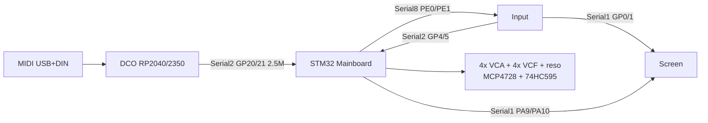

# DCO4-REBORN System Overview

DCO4-REBORN is a **digitally controlled analog polysynth** on **classic DCO4 PCB wiring**: STM32 Mainboard in the UART middle, **4 MIDI voices × 2 oscillators**. Control math is DCO3-style (Q15/Q24, bake-on-write, slim LE serial, jump-table ParamIds).

Board-specific detail lives in each folder’s `docs/`. Reintegration contract: [`MAINBOARD_REINTEGRATION.md`](MAINBOARD_REINTEGRATION.md) and [`../../MAINBOARD-CONTROLLER/docs/MAINBOARD_REINTEGRATION.md`](../../MAINBOARD-CONTROLLER/docs/MAINBOARD_REINTEGRATION.md).

---

## Boards and ownership

| Board | Folder | MCU | Owns |
|-------|--------|-----|------|
| **DCO** | `DCO/` | RP2040 / RP2350 | MIDI (USB+DIN), voice alloc (mono/poly/stack), PIO pitch, RANGE/PW PWM, amp-comp, autotune, LittleFS, Character pitch/PW jitter, per-osc **pitch** drift |
| **Mainboard** | `MAINBOARD-CONTROLLER/` | STM32 | EnvVCA ×4, EnvVCF ×4, EnvDCO ×4, LFO1/LFO2, VCF drift, mod matrix, VCA/VCF/reso PWM, MCP4728, 74HC595, Input RX, DCO peer |
| **Input** | `INPUT-CONTROLLER/` | RP2040 | Panel scan, presets, Screen UI frames; relays gap 154 |
| **Screen** | `SCREEN-CONTROLLER/` | RP2040 | LVGL UI |
| Voice aux | `VOICE-AUX/` | RP2040 | Optional Dist / filter-mode helper |

OSC3 ParamIds (33–35, 38, 87–89) stay in the enum for presets. Analog 4×2 has SQR1 / SQR2 / Sub only — OSC3 level dest is a no-op on Mainboard. Dist 52–53 is stubbed unless that analog exists.

**ParamId space:** canonical copy is DCO `params_def.h` (synced to Mainboard/Input). Do not renumber.

---

## Inter-board links (classic DCO4 PCB)

| Link | Baud | Peers | Role |
|------|------|-------|------|
| DCO `Serial1` | 31250 | DIN MIDI | MIDI in |
| DCO `Serial2` GP20/21 | 2.5M | Mainboard `Serial2` PD5/PD6 | `'n'`/`'o'`/`'e'`/`'x'`/`'p'` DCO→MB; `'m'`/`'p'` MB→DCO |
| Input `Serial2` GP4/5 | 2.5M | Mainboard `Serial8` PE0/PE1 | slim `'a'`–`'d'`/`'p'`/`'q'` Input→MB; `'x'`/`'p'` MB→Input |
| Input `Serial1` GP0 | 2.5M | Screen `Serial1` GP13 | UI frames + relayed gap 154 |
| Mainboard `Serial1` | 2.5M | Screen (optional second feed) | unused if Input already mirrors UI |

Protocol is **slim little-endian**, no finish byte. PW = `'p'` 210, ADSR1→VCA = `'p'` 222. Do not restore BE `'p'` or Input `'e'`/`'f'` blocks.

Gap 154 / cal 155: DCO `'x'` → Mainboard → Input → Screen (154 only on Screen).

---

## Feature flags (`DCO.ino`)

| Flag | Default | Role |
|------|---------|------|
| `ENABLE_MAINBOARD_LINK` | on | Serial2 = Mainboard peer |
| `ENABLE_MB_MOD_STREAM` | on | Consume `'m'`; skip local LFO1/2 + EnvDCO clocks |
| `ENABLE_CV_OUTS` / `WAVE_MUX` | off | Analog writers stay compiled-out on this board |
| `ENABLE_USB_CONTROL` | on | USB CDC Input-style frames for bench |

Pin map: [`PINOUT.md`](PINOUT.md). Mod matrix (DCO depth apply): [`MOD_MATRIX.md`](MOD_MATRIX.md).
