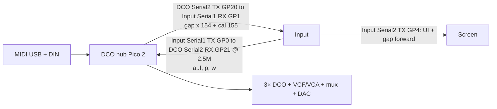

# DCO3-MONOSYNTH System Overview

DCO3-MONOSYNTH is a **fully digitally controlled analog monosynth**, forked from DCO4: digital control and calibration drive analog DCO / filter / VCA hardware. The goal includes patch saving for all parameters.

The shipping instrument is **three firmwares** (Mainboard absorbed into DCO). Board-specific details live in each board folder / docs.

**DCO board:** Raspberry Pi Pico 2, **1 voice × 3 oscillators**, freq on PIO0/1/2 SM0, amp via RANGE PWM, EnvDCO/VCA/VCF, LFOs, opt-in CV PWM / mux / MCP4728. Autotune stack retained (PW center/limits + amp-comp).

**Absorption:** STM32 Mainboard firmware is archived under [`../../_archived/Mainboard/`](../../_archived/Mainboard/). History: [`MAINBOARD_ABSORPTION.md`](MAINBOARD_ABSORPTION.md).

---

## Boards and ownership

| Board | Repo / folder | MCU | Owns |
|-------|---------------|-----|------|
| **DCO (voice + hub)** | `DCO/` | RP2350 Pico 2 | MIDI, 1×3 PIO DCOs, EnvDCO/VCA/VCF, LFOs, cal, LittleFS; Input UART (panel + gap); CV outs (flags) |
| **Input controller** | `INPUT-CONTROLLER/` | RP2040 | Front panel, presets; UART to DCO hub; relays gap `'x'` 154 → Screen |
| **Screen controller** | `SCREEN-CONTROLLER/` | RP2040 | ILI9488 + LVGL; UI from Input; gap relayed by Input |
| ~~Mainboard~~ | [`_archived/Mainboard/`](../../_archived/Mainboard/) | STM32 | *Archived* — no firmware path remains on any board |

**ParamId space:** shared `params_def.h` across boards. Do not renumber IDs.

---

## Inter-board links (default — three boards)

### Link details (hub default)

| Link | Baud | Peers | Role |
|------|------|-------|------|
| DCO `Serial1` | 31250 | DIN MIDI | MIDI in (RX1 / TX0) — interim HW; PIO MIDI later |
| DCO `Serial2` **RX GP21** | 2.5M | Input `Serial1` **TX GP0** | Panel in (`'a'..'f'`, `'p'`/`'w'`) |
| DCO `Serial2` **TX GP20** | 2.5M | Input `Serial1` **RX GP1** | Gap/offset `'x'` 154 / 155 out |
| Input `Serial2` **TX GP4** | 2.5M | Screen `Serial1` **RX GP13** | UI frames / preset names + forwarded gap `'x'` 154 |

On a Pico the silkscreen `UART0` is GP0/GP1 and is Arduino-Pico's `Serial1`; `UART1` is `Serial2`.

The DCO↔Input link is one two-way UART pair on each side: the DCO's `Serial2` (TX GP20 / RX GP21) against the Input's `Serial1` (TX GP0 / RX GP1). The Input reaches the Screen on its other UART, `Serial2` TX GP4, whose RX (GP5) has no conductor since the Screen never transmits.

Gap (`PARAM_GAP_FROM_DCO` 154) and cal offsets (`PARAM_MANUAL_CALIBRATION_OFFSET_FROM_DCO` 155) both TX out the DCO's `Serial2` TX, the DCO's only peer link. Input receives them on its `Serial1` RX, keeps 155 and forwards 154 verbatim to Screen. The DCO has no Screen port and no PIO software UART: `serial_read_from_dco()` on Input is the sole relay.

Note edges never leave the DCO. `noteStart[]` / `noteEnd[]` drive EnvDCO/EnvVCA/EnvVCF locally, so the old `'n'`/`'o'` note frames are gone.

---

## Feature flags (`DCO.ino`)

| Flag | Default | Role |
|------|---------|------|
| `ENABLE_CV_OUTS` / `WAVE_MUX` / `MCP4728` | off | Hardware CV writers |

The serial topology is no longer switchable: Serial1 is DIN MIDI, Serial2 is the Input link. The old `ENABLE_INPUT_UART`, `ENABLE_SCREEN_UART` and `ENABLE_LEGACY_MAINBOARD_LINK` flags were removed with the Mainboard and SerialPIO paths.

Pin map: [`PINOUT.md`](PINOUT.md).
