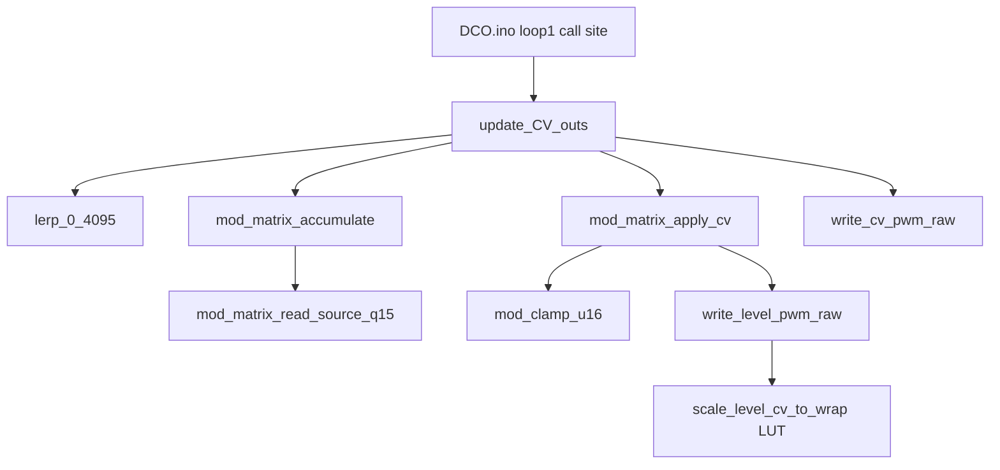

# `update_CV_outs` Hot-Path Code Dump

Readable map of the ~10 kHz CV path after the dual-MCU optimization.

**Always-on (both MCUs):** Q15 mod matrix, `lerp_0_4095` (`>>12`), keytrack `note-60`, integer reso comp, PWM `level_wrap_for_slice` LUT.

**Flag-gated:** `USE_FLOAT_CV_OUTS` — float VCA/VCF/keytrack/drift (RP2350 default) vs fixed Q15 path (RP2040 default). See [`ENGINE_OPTIONS.md`](ENGINE_OPTIONS.md).

## Call graph



---

## 1. Call site — `DCO.ino`

```cpp
        BENCH_BEGIN(loop1_cv_outs);
        update_CV_outs();
        BENCH_END(loop1_cv_outs);
```

---

## 2. Hot path — `cv_out.ino`

Source of truth: [`../cv_out.ino`](../cv_out.ino).

- `lerp_0_4095` — always-on
- `cv_update_mod_formulas` / `cv_update_vcf_drift_scale` — float vs `_q15` under `USE_FLOAT_CV_OUTS`
- `update_CV_outs` — `#ifdef USE_FLOAT_CV_OUTS` … `#else` … fixed integer VCA/VCF combine

---

## 3. Matrix — `mod_matrix.h` / `mod_matrix.ino`

- Sources returned as **Q15** (`mod_matrix_read_source_q15`)
- Accumulate: `(src_q15 * depth) >> 15` into `dest_sums[]`
- Noise: pass-through `noiseLevel[]` (already Q15)
- VOICE-AUX mirrors Q15 random + accumulate for dist apply

---

## 4. PWM writers — `PWM.ino` (`ENABLE_CV_OUTS`)

- `level_wrap_for_slice[8]` filled in `init_level_pwm()`
- `scale_level_cv_to_wrap` — O(1) lookup; still `/ DIV_COUNTER_CV` when scaling
- `write_level_pwm_raw` / `write_cv_pwm_raw`

---

## 5. Soft CV state — `cv_state.h`

Under `USE_FLOAT_CV_OUTS`: float formulas, keytrack, velocity, `VCF_DRIFT`.

Else: `*_formula_q15`, `VCFKeytrackPerVoice_q15[]`, `velocityTo*_q15`, `vcf_drift_scale_q15`, `int16_t VCF_DRIFT[]`.
