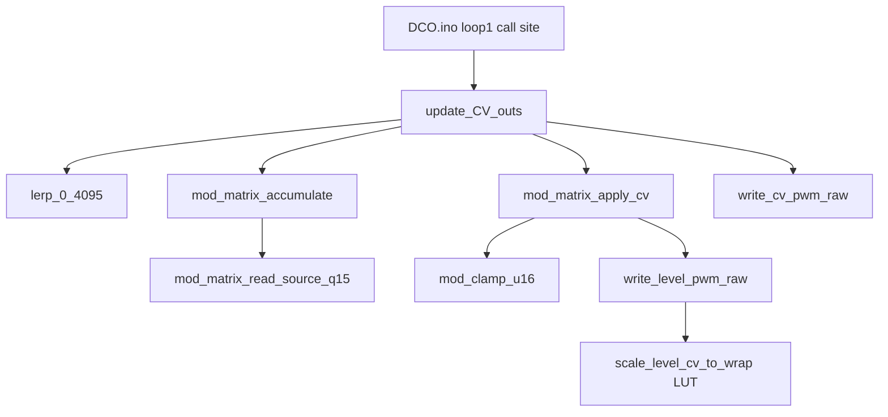

# `update_CV_outs` Hot-Path Map

Readable map of the ~10 kHz CV path after the dual-MCU optimization. Live source of truth is the `.ino` / `.h` files linked below — this doc does not paste full bodies.

**Always-on (both MCUs):** Q15 mod matrix, `lerp_0_4095` (`>>12`), keytrack `note - 60`, integer reso comp `(span * 36) >> 8`, PWM `level_wrap_for_slice` LUT.

**Flag-gated:** `USE_FLOAT_CV_OUTS` — float VCA/VCF/keytrack/drift/velocity (A/B only) vs fixed Q15 / integer path (**default off** on both MCUs → `cv=FIXED`). See [`ENGINE_OPTIONS.md`](ENGINE_OPTIONS.md). LFO/ADSR mod sources are Q15 pass-through.

**RP2040 A/B (directional, 250 MHz):** post-opt `update_CV_outs` mean ~27 µs with `cv=FIXED` vs ~53 µs with `cv=FLOAT`; keep FIXED for shipping. Details / reading rules: [`BENCHMARKING.md`](BENCHMARKING.md).

## Call graph



---

## 1. Call site — [`../DCO.ino`](../DCO.ino)

```cpp
        BENCH_BEGIN(loop1_cv_outs);
        update_CV_outs();
        BENCH_END(loop1_cv_outs);
```

Bench banner prints `cv=FLOAT|FIXED` from `USE_FLOAT_CV_OUTS`.

---

## 2. Hot path — [`../cv_out.ino`](../cv_out.ino)

- `lerp_0_4095` — always-on (divide by 4096 via `>>12`)
- 1 ms block: integer reso compensation; keytrack / drift under `#ifdef USE_FLOAT_CV_OUTS`
- `cv_update_mod_formulas` / `cv_update_vcf_drift_scale` — float vs `_q15` under the same flag
- `update_CV_outs` body — `#ifdef USE_FLOAT_CV_OUTS` … `#else` … fixed integer VCA/VCF combine + `cv_clamp_u12`
- Fixed path keeps `matrix_cutoff` as `int32_t` through the VCF sum (no float promote)

---

## 3. Matrix — [`../mod_matrix.h`](../mod_matrix.h) / [`../mod_matrix.ino`](../mod_matrix.ino)

- Sources as **Q15** via `mod_matrix_read_source_q15`
- Accumulate: `(src_q15 * depth) >> 15` into `dest_sums[]` (`memset` zero)
- Noise: pass-through `noiseLevel[i]` for `MOD_SRC_NOISE0` / `NOISE1` only
- Fleet is two gens ([`../noise.h`](../noise.h): `NUM_NOISE_GENS == 2`). `MOD_SRC_NOISE2` / `NOISE3` (IDs 14/15) stay reserved for panel/protocol stability and read as **0**
- VOICE-AUX mirrors Q15 random + accumulate for dist apply

---

## 4. PWM writers — [`../PWM.ino`](../PWM.ino) (`ENABLE_CV_OUTS`)

- `level_wrap_for_slice[8]` filled in `init_level_pwm()`
- `scale_level_cv_to_wrap` — O(1) lookup; still `/ DIV_COUNTER_CV` when scaling shared wraps
- `write_level_pwm_raw` / `write_cv_pwm_raw` — gated by `ENABLE_CV_OUTS` (soft CV math still runs when off)

---

## 5. Soft CV state — [`../cv_state.h`](../cv_state.h)

Under `USE_FLOAT_CV_OUTS`: float `*_formula`, `VCFKeytrackModifier` / `VCFKeytrackPerVoice[]`, `velocityToVCA/VCF`, `float VCF_DRIFT[]`.

Else: `*_formula_q15`, `VCFKeytrackPerVoice_q15[]`, `velocityTo*_q15`, `vcf_drift_scale_q15`, `int16_t VCF_DRIFT[]`.
