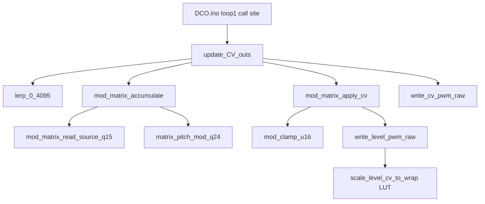

# `update_CV_outs` Hot-Path Map

Readable map of the ~10 kHz CV path after the dual-MCU optimization. Live source of truth is the `.ino` / `.h` files linked below — this doc does not paste full bodies.

**How to read this doc:** call graph and file map below; **live combine formulas** in [§ Hot-path math](#hot-path-math-fixed--shipping); **mod depth baking** (`/512` vs `/1024`, when to call bakers) in [`CV_MOD_SCALES.md`](CV_MOD_SCALES.md).

**Always-on (both MCUs):** Q15 mod matrix, `lerp_0_4095` (`>>12`), keytrack `note - 60`, integer reso comp `(span * 36) >> 8`, PWM `level_wrap_for_slice` LUT.

**Flag-gated:** `USE_FLOAT_CV_OUTS` — float VCA/VCF/keytrack/drift/velocity (A/B only) vs fixed Q15 / integer path (**default off** on both MCUs → `cv=FIXED`). See [`ENGINE_OPTIONS.md`](ENGINE_OPTIONS.md). LFO/ADSR mod sources are Q15 pass-through.

**RP2040 A/B (directional, 250 MHz):** latest `cv=FIXED` `update_CV_outs` mean ~13 µs / ~7%win (earlier post-opt FIXED was ~27 µs / ~13%win; `cv=FLOAT` A/B ~53 µs / ~20%win). Keep FIXED for shipping. Details / reading rules: [`BENCHMARKING.md`](BENCHMARKING.md).

## Call graph



`mod_matrix_accumulate` also publishes `matrix_pitch_mod_q24` for the voice pitch path (not a CV PWM write).

---

## 1. Call site — [`../DCO.ino`](../DCO.ino)

```cpp
        BENCH_BEGIN(loop1_cv_outs);
        update_CV_outs();
        BENCH_END(loop1_cv_outs);
```

Bench banner prints `cv=FLOAT|FIXED` from `USE_FLOAT_CV_OUTS`. Manual calibration runs `update_CV_outs_manual_calibration()` instead (wide-open filter, muted mix except cal stage).

---

## 2. Hot path — [`../cv_out.ino`](../cv_out.ino)

- File roles: helpers + 1 ms block + per-tick VCA/VCF combine + matrix apply + optional `write_cv_pwm_raw`
- Mod depth bakers / peak math / when to call: **[`CV_MOD_SCALES.md`](CV_MOD_SCALES.md)**
- Live identities: [§ Hot-path math](#hot-path-math-fixed--shipping) below
- Fixed path keeps `matrix_cutoff` as `int32_t` through the VCF sum (no float promote)

---

## Hot-path math (fixed / shipping)

Identities match the `#else` path in [`cv_out.ino`](../cv_out.ino) (`USE_FLOAT_CV_OUTS` off). Q15 multiply: `(a * b) >> 15`. Clamp: `cv_clamp_u12` → 0..4095 (`CV_U12_MAX`). Divisors use `CV_U12_SCALE=4096` (`>>12` / Q15→u12).

### Helpers

```text
lerp_0_4095(x, y0, y1) = y0 + ((y1 - y0) * x) >> 12
                         // x in 0..4095; divide by 4096 not 4095
```

### 1 ms block (`timer1msFlag`)

**Resonance → VCA compensation** (`RESONANCEAmpCompensation`):

```text
DEFAULT_COMP = 100
MIN_RESO = 50, MAX_RESO = 2300, MAX_COMP = 315

if disabled:
  VCAResonanceCompensation = DEFAULT_COMP
else:
  reso = min(RESONANCE, MAX_RESO)
  if reso < MIN_RESO:
    VCAResonanceCompensation = MAX_COMP
  else:
    // ≈ * 0.14f
    VCAResonanceCompensation = MAX_COMP - (((reso - MIN_RESO) * 36) >> 8)
```

**Keytrack** (per voice):

```text
if VCFKeytrack == 0:
  VCFKeytrackPerVoice_q15[i] = 32768          // ×1.0
else:
  dn = VOICE_NOTES[i] - 60                    // was map(note,0,150,-60,90)
  VCFKeytrackPerVoice_q15[i] = 32768 + VCFKeytrackModifier_q15 * dn
```

**Drift** (monosynth: osc-0 LFO only, copied to all voices):

```text
vcf_drift_scale_q15 = analogDrift   // set at boot / drift-amount param
if analogDrift != 0:
  VCF_DRIFT[i] = (LFO_DRIFT_LEVEL[0] * vcf_drift_scale_q15) >> 15
else:
  VCF_DRIFT[i] = 0
```

### Per-tick modulation terms

Depth scales baked on knob/CC write — see [`CV_MOD_SCALES.md`](CV_MOD_SCALES.md).

```text
LFO1_mod   = (LFO1Level * LFO1toVCA_scale_q15) >> 15
LFO2_mod   = (LFO2Level * LFO2toVCF_scale_q15) >> 15
ADSR_mod   = (ADSR_VCF_Level_q15  * ADSR2toVCF_scale_q15) >> 15   // filter 0
ADSR2_mod  = (ADSR_VCF2_Level_q15 * ADSR2toVCF_scale_q15) >> 15   // filter 1
matrix_cutoff = mod_sums[MOD_DEST_VCF_CUTOFF]   // from accumulate
```

**Domain note:** EnvVCA silent-gate uses **`ADSR_VCA_Level_q15`**. Export to u12 is `(q15 * 4096) >> 15` (`CV_U12_SCALE`, ≡ `q15 >> 3`) then LFO1 (CV-scaled) is added. Clamps stay **`CV_U12_MAX = 4095`**. EnvVCF uses Q15 taps. DCO ships `ADSR_BEZIER_NATIVE_Q15=1`.

### VCA (each voice)

```text
if ADSR_VCA_Level_q15[i] == 0:
  LFO1_current = 0                    // mute LFO into VCA when env idle
else:
  LFO1_current = LFO1_mod

env_u12 = (ADSR_VCA_Level_q15[i] * CV_U12_SCALE) >> 15   // SCALE=4096
vca_pre = env_u12 + LFO1_current

if velocityToVCAVal == 0:
  vca_vel_q15 = 32768
else:
  vca_vel_q15 = max(0, 32768 - velocityToVCA_q15 * (127 - velocity[i]))

VCA_Calculated = clamp_u12( (vca_pre * vca_vel_q15) >> 15 )

VCA_PWM[i] = lerp_0_4095(
               AS2164_VCA_linearize_table[VCA_Calculated],
               VCAResonanceCompensation,
               4095 - VCALevel )
```

### VCF (dual filters; computed when `i == 0`)

```text
if velocityToVCFVal == 0:
  vcf_vel_q15 = 32768
else:
  vcf_vel_q15 = max(0, 32768 - velocityToVCF_q15 * (127 - velocity[0]))

combined0 = ADSR_mod  + LFO2_mod + CUTOFF + VCF_DRIFT[0] + matrix_cutoff
combined1 = ADSR2_mod + LFO2_mod + CUTOFF + VCF_DRIFT[0] + matrix_cutoff

scaled0 = (combined0 * vcf_vel_q15) >> 15
scaled0 = (scaled0 * VCFKeytrackPerVoice_q15[0]) >> 15
scaled1 = (combined1 * vcf_vel_q15) >> 15
scaled1 = (scaled1 * VCFKeytrackPerVoice_q15[0]) >> 15

VCF_PWM[0] = 4095 - clamp_u12(scaled0)   // inverted soft cutoff CV
VCF_PWM[1] = 4095 - clamp_u12(scaled1)
```

Filter 0 uses EnvVCF; filter 1 uses EnvVCF2. Same LFO2, CUTOFF, drift, and matrix cutoff on both.

### Side effects / branches

- **Pitch:** `mod_matrix_accumulate` → `matrix_pitch_mod_q24 = mod_matrix_pitch_to_q24(dest_pitch)` for the voice engine.
- **Cal:** if `manualCalibrationFlag`, matrix sums and pitch mod are zeroed here; PWM writers use `update_CV_outs_manual_calibration` on the cal branch instead of this function’s normal path.
- **Dist / levels / reso PWM:** `mod_matrix_apply_cv` (unless cal) then optional `write_cv_pwm_raw` under `ENABLE_CV_OUTS`. Soft math still runs when HW PWM is off.

### Float A/B (`USE_FLOAT_CV_OUTS`)

Same structure: Env + LFO + CUTOFF + drift + matrix, then × velocity × keytrack. Differences: float scales/factors; EnvVCF still **u12** × `ADSR2toVCF_scale`; keytrack `1 + modifier*(note-60)`; drift `LFO_DRIFT_LEVEL[0] * analogDrift / 32767`. Not the shipping path.

---

## 3. Matrix — [`../mod_matrix.h`](../mod_matrix.h) / [`../mod_matrix.ino`](../mod_matrix.ino)

- Sources as **Q15** via `mod_matrix_read_source_q15`
- Accumulate: `(src_q15 * depth) >> 15` into `dest_sums[]` (`memset` zero)
- Noise: pass-through `noiseLevel[i]` for `MOD_SRC_NOISE0` / `NOISE1` only
- Fleet is two gens ([`../noise.h`](../noise.h): `NUM_NOISE_GENS == 2`). `MOD_SRC_NOISE2` / `NOISE3` (IDs 14/15) stay reserved for panel/protocol stability and read as **0**
- VOICE-AUX mirrors Q15 random + accumulate for dist apply
- Deep reference: [`MOD_MATRIX.md`](MOD_MATRIX.md)

---

## 4. PWM writers — [`../PWM.ino`](../PWM.ino) (`ENABLE_CV_OUTS`)

- `level_wrap_for_slice[8]` filled in `init_level_pwm()`
- `scale_level_cv_to_wrap` — O(1) lookup; still `/ DIV_COUNTER_CV` when scaling shared wraps
- `write_level_pwm_raw` / `write_cv_pwm_raw` — gated by `ENABLE_CV_OUTS` (soft CV math still runs when off)

---

## 5. Soft CV state — [`../cv_state.h`](../cv_state.h)

Under `USE_FLOAT_CV_OUTS`: float `*_scale`, `VCFKeytrackModifier` / `VCFKeytrackPerVoice[]`, `velocityToVCA/VCF`, `float VCF_DRIFT[]`.

Else: `*_scale_q15`, `VCFKeytrackPerVoice_q15[]`, `velocityTo*_q15`, `vcf_drift_scale_q15`, `int16_t VCF_DRIFT[]`.
